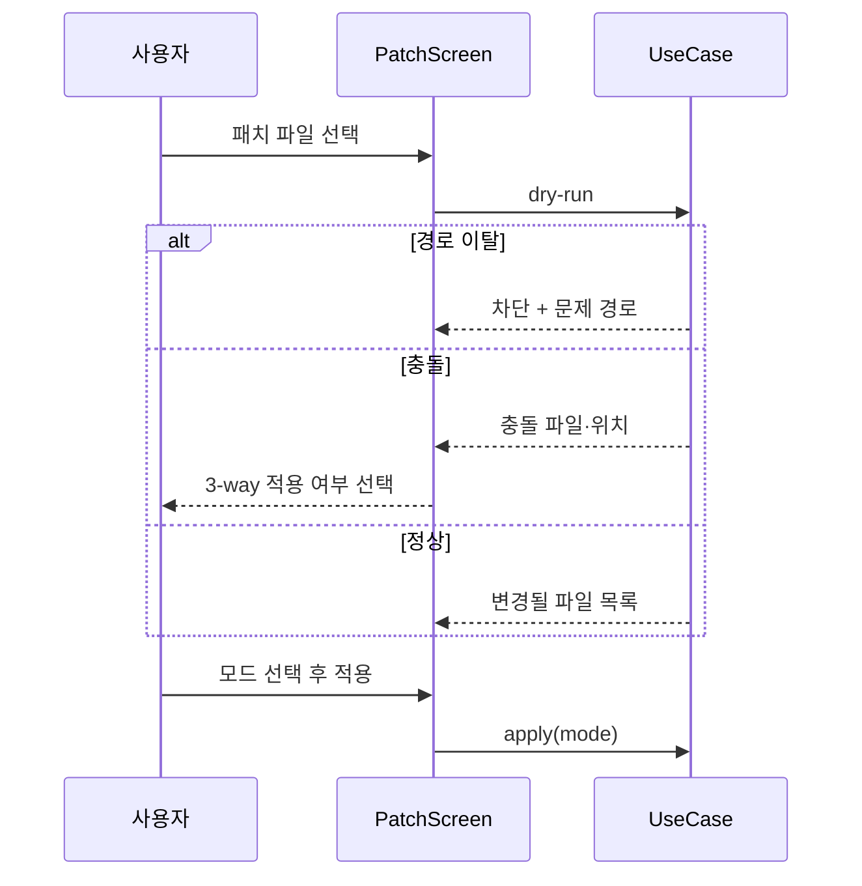
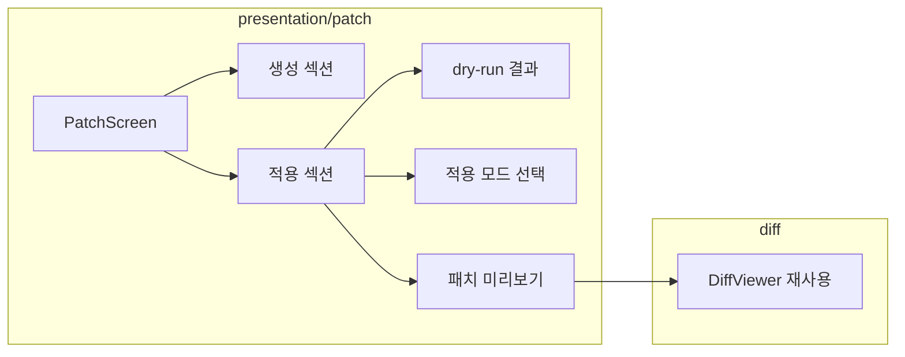

# [UND-47] Patch 화면

> wave 8 · 사이즈 M · 의존 UND-10, UND-60 · 소유 `presentation/patch/`

## 작업 내용 (설계 의도)
패치를 만들고 적용하는 화면이다.

**생성**: 커밋 선택 또는 현재 변경을 대상으로, 출력 형태(커밋당 파일 / 단일 통합)와 저장 위치를
고른다. 생성 전에 **포함될 파일 목록과 총 크기를 보여준다** — 의도치 않게 큰 패치를 만드는 걸 막는다.

**적용**: 파일 선택 또는 드래그&드롭으로 받는다. 적용 전에 UND-60 의 **dry-run 결과를 화면에 보여준다.**

| dry-run 결과 | 화면 |
|---|---|
| 전부 적용 가능 | 변경될 파일 목록 + 적용 버튼 |
| 일부 충돌 | 충돌 파일과 위치 표시 + 3-way 적용 여부 선택 |
| 경로 이탈 포함 | 적용 차단 + 문제 경로 표시 |

**적용 모드를 화면에서 명확히 고르게 한다** — 워킹트리만 / 인덱스까지 / 커밋까지.
기본값은 가장 안전한 "워킹트리만" 이다. 사용자가 결과를 확인한 뒤 스테이징하면 된다.

패치 내용을 diff 뷰어와 같은 형태로 **미리 볼 수 있게** 한다. 적용 전에 무엇이 들어오는지
읽지 않고 적용하는 건 위험하다.

**롤백**: 적용 전 dry-run 으로 검증하고, 기본 모드(워킹트리만)는 인덱스·이력을 건드리지 않아 되돌리기가 쉽다 — 커밋 모드로 적용한 결과는 revert 로 되돌린다.

## 다이어그램

### 처리 흐름

### 클래스 의존

## 테스트 케이스

- 패치 생성 전 포함 파일 목록과 총 크기가 표시된다
- 커밋당 파일과 단일 통합 형태를 선택할 수 있다
- 패치를 드래그&드롭으로 받을 수 있다
- 적용 전 dry-run 결과가 화면에 표시된다
- 경로 이탈이 포함된 패치는 적용이 차단되고 문제 경로가 표시된다
- 충돌 시 3-way 적용 여부를 선택할 수 있다
- 적용 모드 기본값이 '워킹트리만' 이다
- 패치 내용을 적용 전에 diff 형태로 미리 볼 수 있다
- 빈 패치 파일은 변경 없음으로 안내된다
