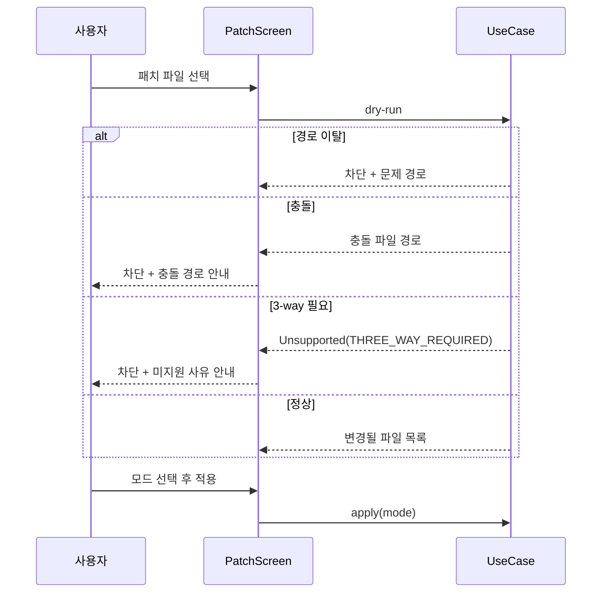
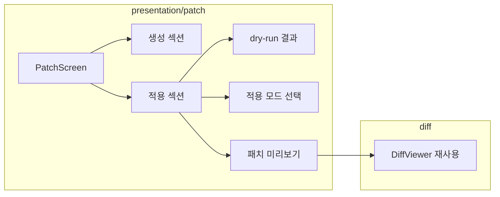

# [UND-47] Patch 화면

> wave 8 · 사이즈 M · 의존 UND-10, UND-60, UND-63
> 소유 `presentation/patch/` · `application/patch/` · `presentation/i18n/PatchStrings.kt`
> 배선 포함 — `AppDestination.PATCH` 등록 · DI 조립 · i18n 목록 등록.
> 원래 배선 주인이던 UND-51 이 이 티켓을 의존으로 걸고 먼저 머지돼 주인이 없어졌기 때문이다.

## 작업 내용 (설계 의도)
패치를 만들고 적용하는 화면이다.

**생성**: 커밋 선택 또는 현재 변경을 대상으로, 출력 형태(커밋당 파일 / 단일 통합)와 저장 위치를
고른다. 생성 전에 **포함될 파일 목록과 총 크기를 보여준다** — 의도치 않게 큰 패치를 만드는 걸 막는다.

**적용**: 파일 선택 또는 드래그&드롭으로 받는다. 적용 전에 UND-60 의 **dry-run 결과를 화면에 보여준다.**

| dry-run 결과 | 화면 |
|---|---|
| 전부 적용 가능 | 변경될 파일 목록 + 적용 버튼 |
| 일부 충돌 | 충돌 파일 경로 표시 + **적용 차단** |
| 3-way 필요 (`Unsupported(THREE_WAY_REQUIRED)`) | 미지원 사유 표시 + **적용 차단** |
| 경로 이탈 포함 | 적용 차단 + 문제 경로 표시 |

> **3-way 적용 선택지는 없다.** UND-60 의 `PatchGateway` 가 3-way 를 제공하지 않고
> (JGit 표준 API 에 조상 blob 기반 경로가 없다) 워킹트리에 충돌 표식도 남기지 않으므로,
> 화면이 고를 대상이 존재하지 않는다. 충돌·미지원은 **안내하고 차단**한다.

**적용 모드를 화면에서 명확히 고르게 한다** — 워킹트리만 / 인덱스까지 / 커밋까지.
기본값은 가장 안전한 "워킹트리만" 이다. 사용자가 결과를 확인한 뒤 스테이징하면 된다.

패치 내용을 diff 뷰어와 같은 형태로 **미리 볼 수 있게** 한다. 적용 전에 무엇이 들어오는지
읽지 않고 적용하는 건 위험하다.

**저장소 결속**: 화면 상태는 활성 `RepositorySessionKey` 에 묶는다. 저장소 A 에서 검증한
dry-run 결과가 B 에 적용되면 안 된다 — 세션이 바뀌면 선택·미리보기·결과를 폐기한다.

**진행 중 차단**: 적용·저장이 도는 동안 화면 이동과 저장소 열기·닫기를 **같은 사유**로 막는다.
새 차단 표면을 만들지 않고 기존 `CommandAvailability.Blocked` 에 싣는다. 읽기·미리보기·dry-run 은
저장소를 바꾸지 않으므로 막지 않는다.

**저장 실패 알림**: 되돌리기 실패 여부와 **정리되지 않은 임시 파일 경로**를 화면에 표시한다.
지우는 것은 사용자 몫이므로 남았다는 사실을 알려야 한다.

**롤백**: 적용 전 dry-run 으로 검증하고, 기본 모드(워킹트리만)는 인덱스·이력을 건드리지 않아 되돌리기가 쉽다 — 커밋 모드로 적용한 결과는 revert 로 되돌린다.

## 다이어그램

### 처리 흐름

### 클래스 의존

## 테스트 케이스

- 패치 생성 전 포함 파일 목록과 총 크기가 표시된다
- 커밋당 파일과 단일 통합 형태를 선택할 수 있다
- 패치를 드래그&드롭으로 받을 수 있다
- 적용 전 dry-run 결과가 화면에 표시된다
- 경로 이탈이 포함된 패치는 적용이 차단되고 문제 경로가 표시된다
- 충돌 시 충돌 파일 경로가 표시되고 적용이 차단된다
- 3-way 가 필요한 패치는 미지원 사유가 표시되고 적용이 차단된다
- 적용 모드 기본값이 '워킹트리만' 이다
- 패치 내용을 적용 전에 diff 형태로 미리 볼 수 있다
- 빈 패치 파일은 변경 없음으로 안내된다
