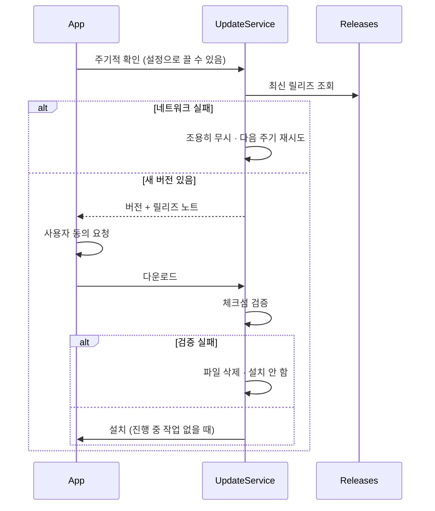
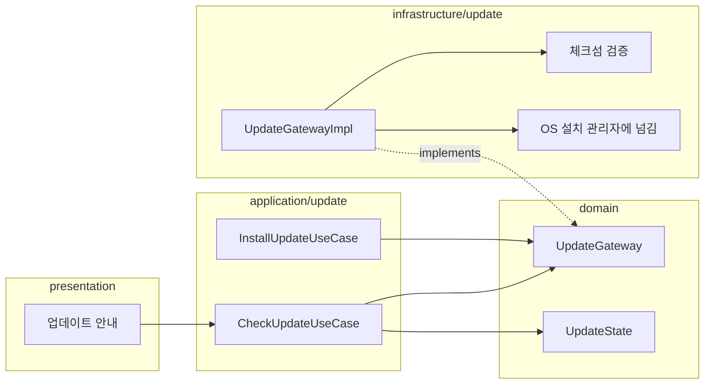

# [UND-48] 자동 업데이트

> wave 8 · 사이즈 M · 의존 UND-25, UND-63, UND-64 · 소유 `domain/update/` · `application/update/` · `infrastructure/update/` · `di/AppComponent.kt` · `presentation/App.kt` · `presentation/update/` · `presentation/i18n/UpdateStrings.kt` · `presentation/preferences/UpdateCheckPreferenceRows.kt` · `app/build.gradle.kts` · 배선(`presentation/preferences/GeneralPreferencesContent.kt` · `presentation/preferences/PreferencesScreen.kt` · `presentation/i18n/BuiltInStrings.kt` 등록)

## 작업 내용 (설계 의도)
새 버전을 확인하고 사용자 동의 하에 설치한다. 개인 도구라도 직접 받아 설치하게 두면 사실상 갱신되지 않는다.

확인·다운로드·설치는 **infrastructure Gateway** 가 수행하고, application UseCase 가 그 결과를
상태로 반환하며, presentation 이 그 상태를 읽어 안내·동의 UI 를 그린다 — infrastructure 가
화면을 직접 호출하지 않는다 ([`architecture-layers`](../.agent/rules/architecture-layers.md)).

**릴리즈 확인**은 GitHub Releases 를 조회한다 (UND-25 가 만든 산출물이 태그에 붙어 있다).
확인 주기는 설정으로 조절하고, **끌 수 있어야 한다**.

세 가지가 안전의 핵심이다.

1. **무결성 검증.** 다운로드한 파일의 체크섬을 릴리즈 메타데이터와 대조한다.
   검증 실패면 설치하지 않고 파일을 지운다. 검증 없는 자동 업데이트는 공급망 공격 표면이다.
2. **동의 없이 설치하지 않는다.** 확인은 자동이어도 설치는 사용자가 누른다.
   작업 중 앱이 재시작되면 안 된다.
3. **실패해도 기존 설치본을 남긴다.** 결정 D12 로 **우리가 앱을 교체하지 않는다** — 검증을 통과한
   설치 파일을 OS 기본 동작으로 열어 설치 관리자에게 넘긴다. 교체 경로가 없으므로 이 보장이 절차가
   아니라 구조로 성립하고, 보관할 이전 버전도 생기지 않는다.

진행 중인 Git 작업이 있으면 업데이트 설치를 미룬다.

릴리즈 노트를 화면에 보여준다 — 무엇이 바뀌는지 모르고 업데이트하게 하지 않는다.

네트워크 실패는 조용히 무시한다(다음 주기에 재시도). 매번 오류를 띄우면 오프라인 사용자에게 소음이다. 단
**"확인 실패" 와 "업데이트 없음" 을 같은 값으로 만들지 않는다** (D6) — 합치면 몇 달째 확인이 실패하는
앱이 계속 "최신입니다" 를 보여 준다. 화면 표현만 조용하고 내부 상태는 갈라 둔다.

**미검증 면적 (PR 본문에 명시할 것 — D10)**: 이 저장소에는 아직 릴리즈가 0건이라 **클라이언트가
실제 GitHub 응답을 읽어 본 적이 없다.** 계약 해석은 `packaging/RELEASE-CONTRACT.md` 를 기준으로
가짜 응답으로만 검증했다. UND-61 의 `git-lfs` 미검증과 같은 취급이다.

**롤백**: 업데이트 실패 시 기존 설치본을 유지한다 — 우리가 설치본을 건드리지 않으므로(D12) 되돌릴
대상 자체가 없다. 검증 실패면 받은 임시 파일 하나만 지우고 아무것도 열지 않는다.

**자동 확인 설정은 일반(General) 탭에 행 두 개로 붙인다** (D13·D17) — 업데이트 전용 화면·탭을 만들지
않고, 안내는 `AppRoot` 의 전역 배너 자리에 형제로 얹는다 (D16).

## 다이어그램

### 처리 흐름

### 클래스 의존

## 테스트 케이스

- 새 버전이 있으면 버전과 릴리즈 노트가 안내된다
- 사용자 동의 없이 설치되지 않는다
- 체크섬이 맞지 않으면 설치하지 않고 파일을 삭제한다
- 설치 실패 시 기존 설치본이 그대로 유지된다
- 진행 중인 Git 작업이 있으면 설치를 미룬다
- 네트워크 실패 시 오류를 띄우지 않고 다음 주기에 재시도한다
- 자동 확인을 설정에서 끄면 확인이 수행되지 않는다
- 404(릴리즈 없음)·계약 위반·네트워크 실패가 "업데이트 없음" 과 서로 다른 상태로 남는다
- OS 기본 열기에 실패해도 검증을 통과한 파일은 남고 위치가 안내된다

> **"이전 버전이 한 세대 보관된다" 는 뺐다** — 결정 D12 로 우리가 설치본을 교체하지 않으므로 보관할
> 이전 버전이 생기지 않는다. 검증할 동작이 없는 케이스다.
