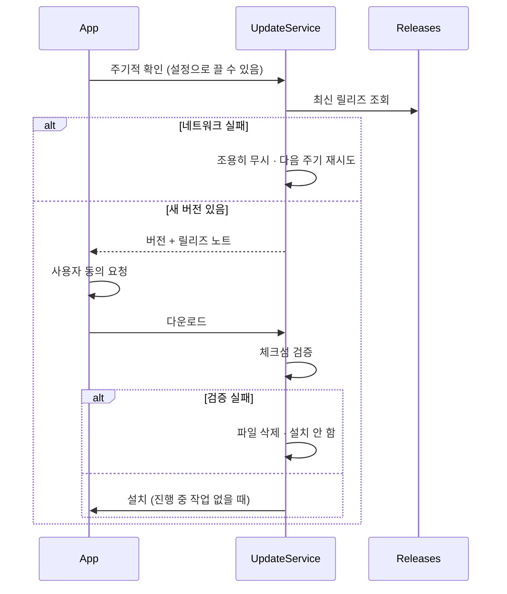
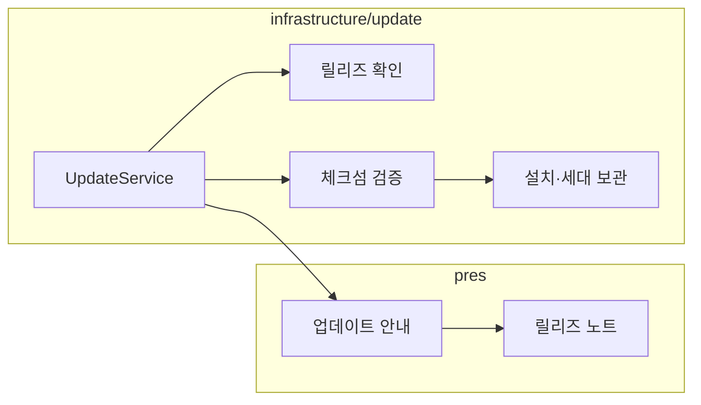

# [UND-48] 자동 업데이트

> wave 8 · 사이즈 M · 의존 UND-25 · 소유 `infrastructure/update/` · `build.gradle.kts`

## 작업 내용 (설계 의도)
새 버전을 확인하고 사용자 동의 하에 설치한다. 개인 도구라도 직접 받아 설치하게 두면 사실상 갱신되지 않는다.

**릴리즈 확인**은 GitHub Releases 를 조회한다 (UND-25 가 만든 산출물이 태그에 붙어 있다).
확인 주기는 설정으로 조절하고, **끌 수 있어야 한다**.

세 가지가 안전의 핵심이다.

1. **무결성 검증.** 다운로드한 파일의 체크섬을 릴리즈 메타데이터와 대조한다.
   검증 실패면 설치하지 않고 파일을 지운다. 검증 없는 자동 업데이트는 공급망 공격 표면이다.
2. **동의 없이 설치하지 않는다.** 확인은 자동이어도 설치는 사용자가 누른다.
   작업 중 앱이 재시작되면 안 된다.
3. **실패해도 기존 설치본을 남긴다.** 교체는 검증 성공 후에만, 이전 버전은 한 세대 보관한다.

진행 중인 Git 작업이 있으면 업데이트 설치를 미룬다.

릴리즈 노트를 화면에 보여준다 — 무엇이 바뀌는지 모르고 업데이트하게 하지 않는다.

네트워크 실패는 조용히 무시한다(다음 주기에 재시도). 매번 오류를 띄우면 오프라인 사용자에게 소음이다.

**롤백**: 업데이트 실패 시 기존 설치본을 유지한다 — 교체는 검증 성공 후에만 수행하고, 이전 버전을 한 세대 보관한다.

## 다이어그램

### 처리 흐름

### 클래스 의존

## 테스트 케이스

- 새 버전이 있으면 버전과 릴리즈 노트가 안내된다
- 사용자 동의 없이 설치되지 않는다
- 체크섬이 맞지 않으면 설치하지 않고 파일을 삭제한다
- 설치 실패 시 기존 설치본이 그대로 유지된다
- 진행 중인 Git 작업이 있으면 설치를 미룬다
- 네트워크 실패 시 오류를 띄우지 않고 다음 주기에 재시도한다
- 자동 확인을 설정에서 끄면 확인이 수행되지 않는다
- 이전 버전이 한 세대 보관된다
