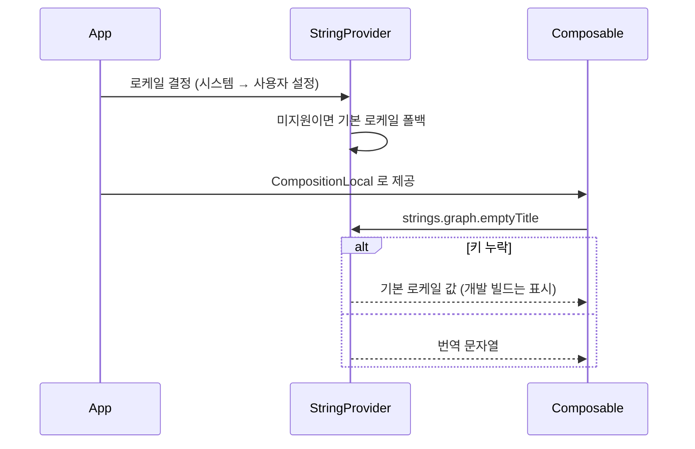
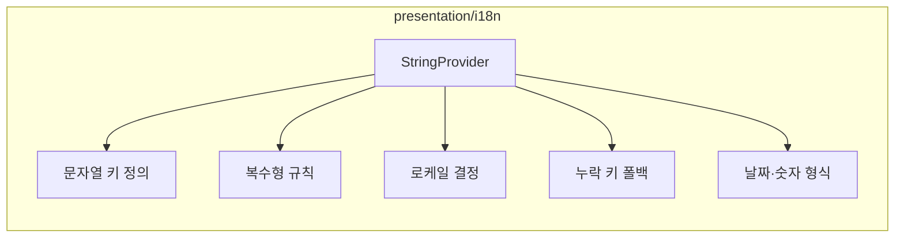

# [UND-49] i18n 문자열 리소스 기반

> wave 2 · 사이즈 M · 의존 UND-01 · 소유 `presentation/i18n/`

## 작업 내용 (설계 의도)
**모든 UI 티켓이 처음부터 참조할 문자열 리소스 체계**를 wave 2 에 세운다.

> **왜 wave 2 인가.** i18n 을 나중에 넣으면 이미 작성된 모든 화면의 문자열을 추출해야 해서
> 전 presentation 파일을 건드리는 거대한 단일 티켓이 된다. 구현 착수 전인 지금 선행 티켓으로 두면
> 각 UI 티켓이 처음부터 리소스를 쓰므로 retrofit 비용이 0 이다. 독립 병목이라
> 다른 wave 2 티켓과 파일이 겹치지 않는다.

제공할 것:

1. **리소스 키 체계** — 화면·컴포넌트 단위 네임스페이스(`graph.empty.title`). 평면 키는 금방 충돌한다.
2. **조회 API** — Composable 에서 `strings.graph.emptyTitle` 형태로 접근. 키 문자열을 화면에
   직접 쓰지 않게 해 오타를 컴파일 시점에 잡는다.
3. **복수형·인자 치환** — "커밋 1개" / "커밋 3개" 처럼 언어마다 규칙이 다르다. 문자열 이어붙이기 금지.
4. **로케일 결정** — 시스템 로케일 → 사용자 설정 순. 미지원 로케일은 기본(한국어)으로 폴백.
5. **누락 키 처리** — 번역이 없으면 크래시하지 않고 기본 로케일 값을 쓰되, 개발 빌드에서는 눈에 띄게 표시한다.

초기 로케일은 한국어와 영어 둘이다. 세 번째 언어를 추가할 때 코드를 고치지 않아도 되는 구조여야 한다.

**날짜·숫자 형식도 로케일을 따른다** — 상대 시각("3일 전")은 언어마다 표현이 다르다.

## 다이어그램

### 처리 흐름

### 클래스 의존

## 테스트 케이스

- 정의된 키로 현재 로케일의 문자열이 조회된다
- 로케일을 전환하면 조회 결과가 해당 언어로 바뀐다
- 미지원 로케일에서 기본 로케일로 폴백된다
- 번역 키가 누락되면 크래시하지 않고 기본 로케일 값이 반환된다
- 복수형 규칙이 수량에 따라 올바른 형태를 반환한다
- 인자 치환이 문자열 이어붙이기 없이 동작한다
- 상대 시각 표현이 로케일에 맞게 형식화된다
- 새 로케일을 추가할 때 조회 코드 변경이 필요 없다
