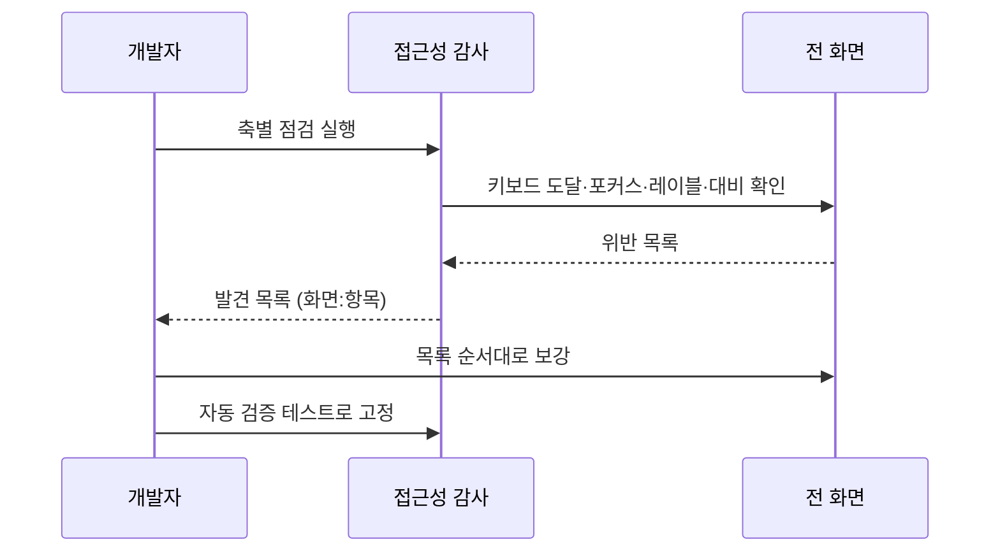
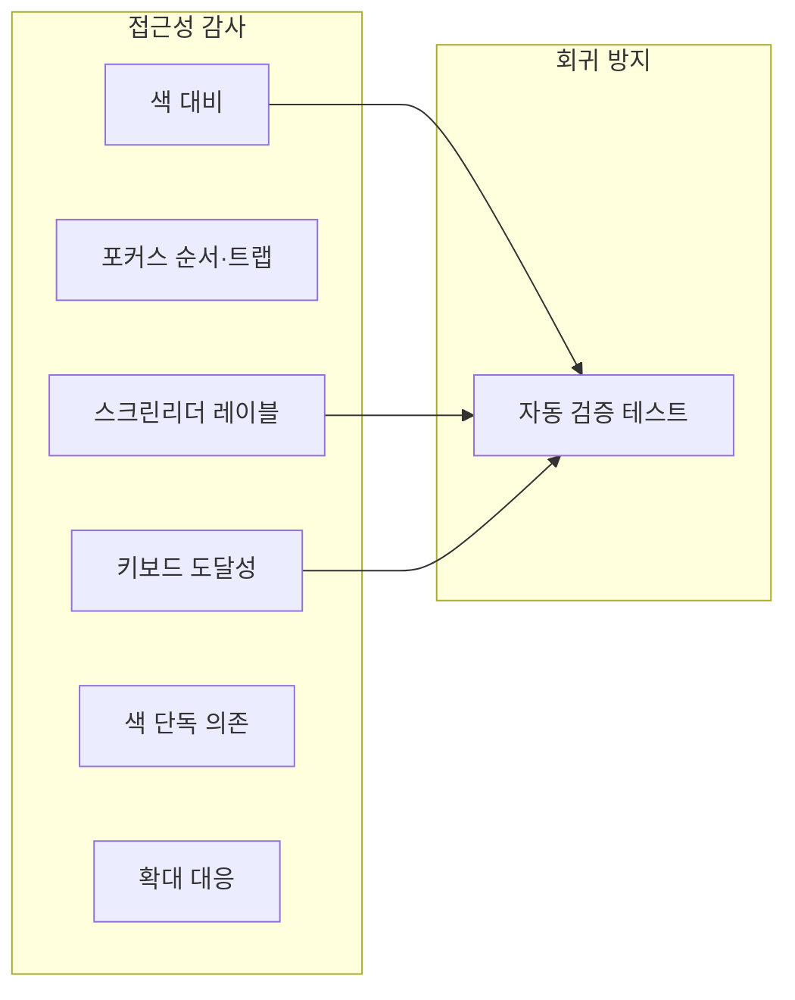

# [UND-50] 접근성 감사 · 보강

> wave 10 · 사이즈 M · 의존 UND-40, UND-41, UND-42, UND-43, UND-44, UND-45, UND-46, UND-47, UND-51 · 소유 `presentation/**` (감사 결과 보강)

## 작업 내용 (설계 의도)
전 화면을 접근성 기준으로 감사하고 부족한 곳을 보강한다.
**새 화면을 만드는 티켓이 아니라 기존 화면을 고치는 티켓**이라 마지막에 둔다.
와이어업(UND-51) **이후** wave 에 두는 이유는 둘이다 — 조립된 앱을 감사해야 실제 포커스 순서·키보드
경로를 검증할 수 있고, 같은 wave 에 두면 `App.kt`·`palette/` 소유가 UND-51 과 겹쳐
Single Writer per File 이 깨진다.

감사 축:

| 축 | 기준 |
|---|---|
| 키보드 도달성 | 마우스로만 되는 동작이 없는가 — 특히 드래그&드롭(UND-42) |
| 포커스 순서 | Tab 이동이 시각적 순서와 일치하는가, 포커스 표시가 보이는가 |
| 포커스 트랩 | 대화상자 안에서 포커스가 갇히고 ESC 로 빠져나오는가 |
| 스크린리더 레이블 | 아이콘 전용 버튼에 의미 있는 레이블이 있는가 |
| 색 대비 | 텍스트·경계가 라이트/다크 양쪽에서 대비 기준을 만족하는가 |
| 색 단독 의존 | diff 추가/삭제, 상태 배지가 색 외 단서를 갖는가 |
| 최소 클릭 영역 | 조밀한 목록의 행·버튼이 충분히 큰가 |
| 확대 대응 | 시스템 글꼴 확대 시 레이아웃이 깨지지 않는가 |

**감사 결과를 먼저 목록으로 산출**하고, 그 목록을 고치는 순서로 진행한다.
발견 없이 "보강했다" 로 끝내면 무엇이 좋아졌는지 알 수 없다.

특히 **UND-42 드래그&드롭은 배타적 입력**이다. 컨텍스트 메뉴·커맨드 팔레트 대체 경로가
실제로 모든 드래그 동작을 덮는지 하나씩 대조한다.

자동으로 잡히는 것(대비·레이블 누락)은 테스트로 고정해 회귀를 막는다.

## 다이어그램

### 처리 흐름

### 클래스 의존

## 테스트 케이스

- 모든 주요 동작에 키보드 경로가 존재한다 (드래그 전용 동작 0건)
- Tab 이동 순서가 시각적 배치 순서와 일치한다
- 대화상자에서 포커스가 갇히고 ESC 로 닫힌다
- 아이콘 전용 버튼에 스크린리더 레이블이 있다
- 라이트·다크 양쪽에서 텍스트 대비 기준을 만족한다
- diff 추가/삭제와 상태 배지가 색 외 단서를 갖는다
- 시스템 글꼴 확대 시 레이아웃이 깨지지 않는다
- 감사 발견 목록이 산출물로 남는다
- 대비·레이블 위반이 자동 테스트로 고정된다
