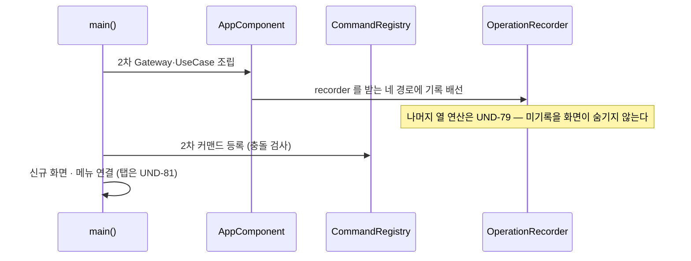
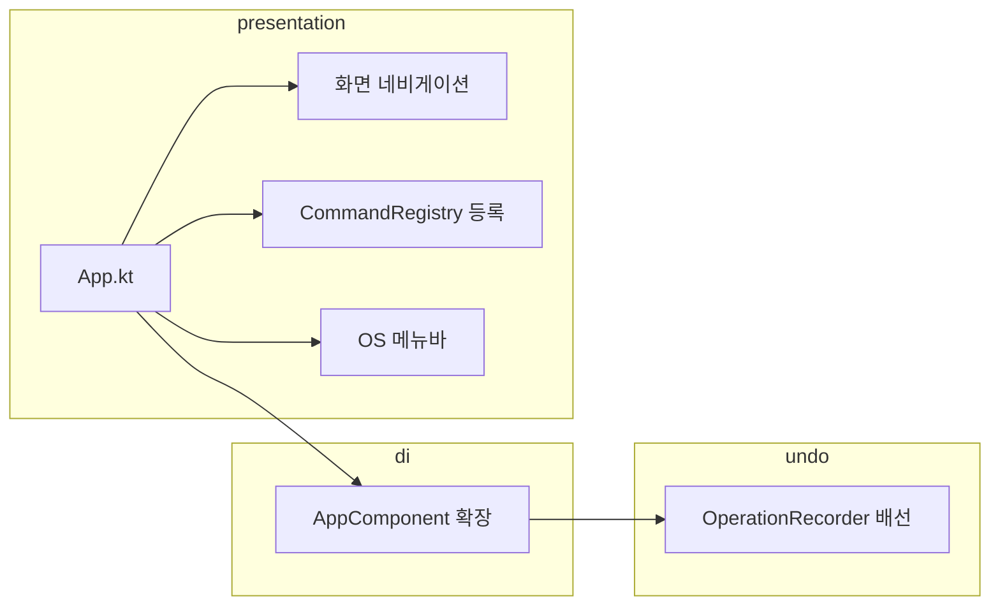

# [UND-51] 2차 통합 와이어업

> wave 9 · 사이즈 M · 의존 UND-22, UND-26, UND-38, UND-40, UND-41, UND-42, UND-43, UND-45, UND-46, UND-65, UND-66, UND-67, UND-68, UND-69, UND-70 · 소유 `presentation/App.kt` · `presentation/` 루트의 배선 전용 파일 · `di/` · `presentation/palette/` (등록)

## 작업 내용 (설계 의도)
2차 기능들을 하나의 앱으로 연결한다. UND-26 이 1차에 한 일을 2차 범위에 대해 반복한다.

wave 7~8 티켓들이 공통 파일(`App.kt`·DI 배선·커맨드 레지스트리)을 건드리지 않도록 미뤄 둔
수정을 여기서 단독으로 처리한다 (Single Writer per File).

하는 일:

1. **신규 Gateway·UseCase 조립** — cherry-pick·blame·reflog·submodule·worktree·bisect·
   서명·identity·undo·외부 도구를 DI 그래프에 넣는다. **patch 와 자동 업데이트는 넣지 않는다** —
   배선할 화면·계약이 없다 (결정 G22: 눌러도 아무 일이 없는 항목은 없는 것보다 나쁘다).
2. **신규 화면 연결** — 설정·blame·Undo 이력·Submodule/Worktree·Reflog/Bisect 화면을 셸과
   네비게이션에 붙인다.
3. **탭 구조 반영은 UND-81 이 한다** — UND-44 의 "저장소 하나 → 여러 개" 전제를 잇는 배선은
   Undo 범위·세션 직렬화와 함께 설계돼야 해서 분리했다. 이 티켓은 **활성 저장소 하나**를 전제로
   화면을 배선하고 `AppShellSlots.tabs` 는 비운다.
4. **커맨드 등록** — 2차 기능의 동작을 UND-22 레지스트리에 등록한다. 단축키 충돌 검사가 여기서 발동한다.
5. **Undo 기록 배선** — 이미 `OperationRecorder` 를 생성자로 받는 **네 경로**(graphops ·
   reflog/bisect 복구 · submodule · worktree)에 조립된 기록기 하나를 넘긴다. 기록 실패를 성공으로
   숨기지 않는다. **나머지 열 가지 연산의 기록 경로 확장은 UND-79 범위**다 — 각 UseCase 의 생성자와
   실행 경로를 고쳐야 해서 배선이 아니라 재작성이 된다 (결정 G21).
6. **Undo 범위는 활성 저장소의 것이다** — 저장소를 바꾸거나 닫으면 범위를 새로 만들어 이전 이력을
   버린다. 판단 기준은 `baseline`(브랜치+HEAD)이 아니라 저장소 정체성이다 — baseline 은 clone
   사이에서 같을 수 있어, 남겨 두면 이전 저장소의 되돌리기가 지금 저장소를 바꾼다 (결정 G29).
7. **메뉴 구성** — OS 메뉴바에 이 배선이 닿게 한 것만 배치한다 (결정 G22).

**Undo 배선의 위험은 "어디까지 기록되는가" 다.** 사용자는 모든 동작이 되돌려진다고 믿게 되는데,
네 경로만 기록된다는 사실을 화면이 가리면 되돌리려는 순간에 알게 된다 — 표시 방식은 UND-79 가 정한다.
실행 세션 보존(락 획득 전 저장소 전환)은 **UND-80** 이 닫는다.

**롤백**: 와이어업은 단일 커밋으로 유지해 revert 로 통째로 되돌린다.

## 다이어그램

### 처리 흐름

### 클래스 의존

## 테스트 케이스

- 설정·blame·Undo 이력·Submodule/Worktree·Reflog/Bisect 화면이 네비게이션으로 도달 가능하다
- 2차 커맨드가 레지스트리에 등록되고, 저장된 단축키 오버라이드가 시작 시 얹히며 충돌은 앱 기동을
  막지 않고 적용 실패 목록으로 드러난다
- recorder 를 받는 네 경로의 기록이 같은 Undo 이력 한 곳에 쌓인다
- 저장소를 바꾸면 이전 저장소의 Undo 이력이 따라오지 않는다 (같은 브랜치·HEAD 인 clone 포함)
- 탭 슬롯이 비어 있고 메뉴에 탭 전환 항목이 없다
- OS 메뉴바에서 주요 기능에 도달할 수 있고 patch·자동 업데이트 항목이 없다
- 신규 Gateway 가 DI 그래프에서 정상 해결된다
- 설정 변경이 관련 화면에 즉시 반영된다
- 앱 시작 시 배선 누락이 있으면 실패한다 (조용한 통과 없음)
