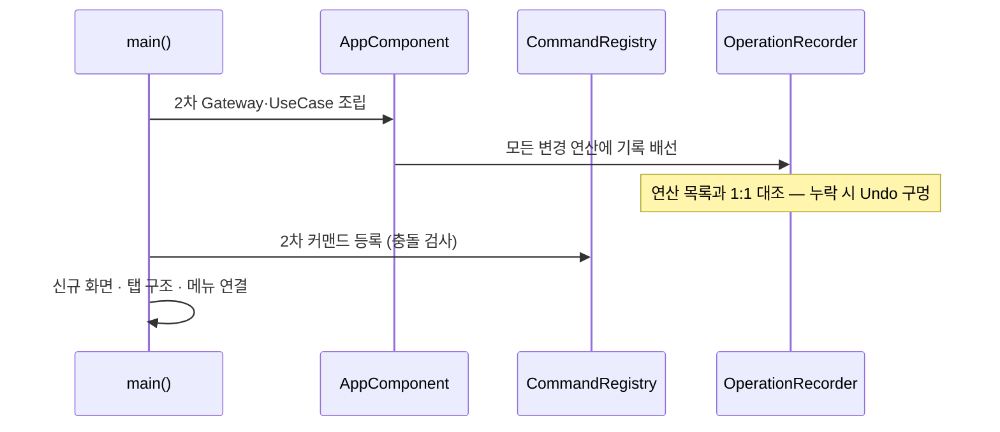
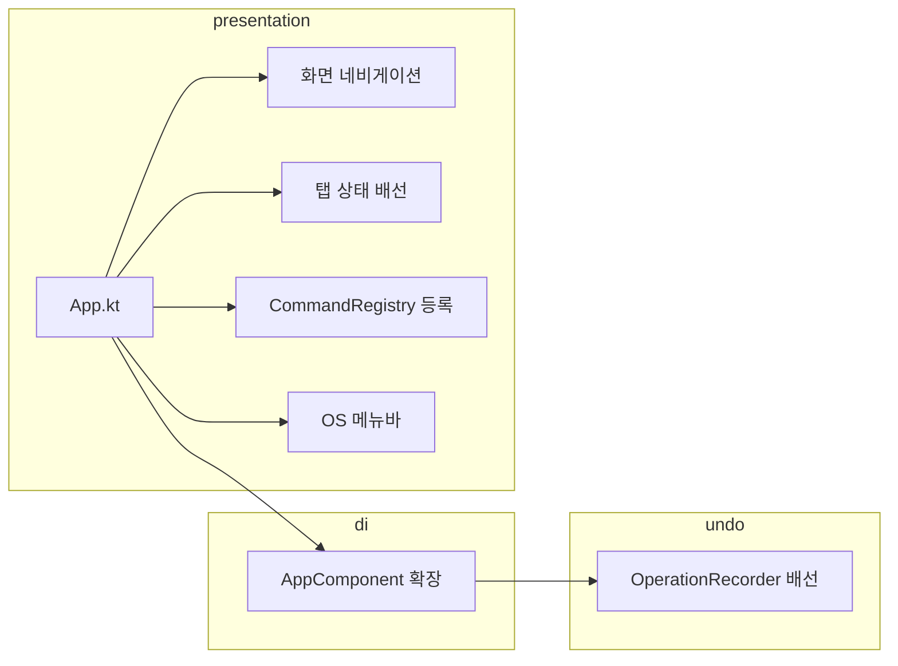

# [UND-51] 2차 통합 와이어업

> wave 9 · 사이즈 M · 의존 UND-40, UND-41, UND-42, UND-43, UND-44, UND-45, UND-46, UND-47, UND-48 · 소유 `presentation/App.kt` · `di/` · `presentation/palette/` (등록)

## 작업 내용 (설계 의도)
2차 기능들을 하나의 앱으로 연결한다. UND-26 이 1차에 한 일을 2차 범위에 대해 반복한다.

wave 7~8 티켓들이 공통 파일(`App.kt`·DI 배선·커맨드 레지스트리)을 건드리지 않도록 미뤄 둔
수정을 여기서 단독으로 처리한다 (Single Writer per File).

하는 일:

1. **신규 Gateway·UseCase 조립** — cherry-pick·blame·reflog·patch·submodule·LFS·worktree·bisect·
   서명·identity·undo·외부 도구를 DI 그래프에 넣는다.
2. **신규 화면 연결** — 설정·blame·복구·패치 화면을 셸과 네비게이션에 붙인다.
3. **탭 구조 반영** — UND-44 가 바꾼 "저장소 하나 → 여러 개" 전제를 기존 화면들이 따르게 한다.
   각 화면이 활성 탭의 상태를 참조하도록 배선한다.
4. **커맨드 등록** — 2차 기능의 동작을 UND-22 레지스트리에 등록한다. 단축키 충돌 검사가 여기서 발동한다.
5. **Undo 기록 배선** — 모든 변경 연산이 UND-38 `OperationRecorder` 를 거치도록 연결한다.
   **하나라도 빠지면 Undo 스택에 구멍이 생긴다** — 연산 목록과 배선을 1:1로 대조한다.
6. **메뉴 구성** — OS 메뉴바에 기능을 배치한다.

**Undo 배선 누락이 이 티켓의 최대 위험**이다. 사용자는 모든 동작이 되돌려진다고 믿게 되는데,
일부만 기록되면 그 믿음이 깨지는 순간이 가장 나쁜 시점이다.

**롤백**: 와이어업은 단일 커밋으로 유지해 revert 로 통째로 되돌린다.

## 다이어그램

### 처리 흐름

### 클래스 의존

## 테스트 케이스

- 설정·blame·복구·패치 화면이 네비게이션으로 도달 가능하다
- 2차 커맨드가 레지스트리에 등록되고 단축키 충돌이 없다
- 모든 변경 연산이 Undo 스택에 기록된다 (연산 목록 1:1 대조 테스트)
- 탭을 전환하면 모든 화면이 활성 탭의 저장소를 참조한다
- OS 메뉴바에서 주요 기능에 도달할 수 있다
- 신규 Gateway 가 DI 그래프에서 정상 해결된다
- 설정 변경이 관련 화면에 즉시 반영된다
- 앱 시작 시 배선 누락이 있으면 실패한다 (조용한 통과 없음)
