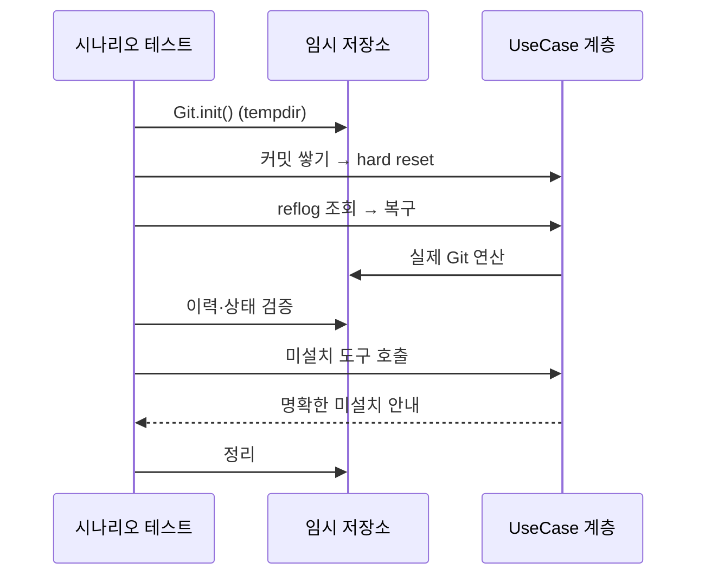
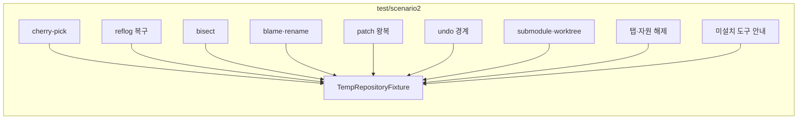

# [UND-52] 2차 E2E 시나리오 테스트

> wave 10 · 사이즈 M · 의존 UND-51 · 소유 `app/src/test/kotlin/.../scenario2/`

## 작업 내용 (설계 의도)
2차 기능을 실제 임시 저장소로 처음부터 끝까지 검증한다. UND-27 이 1차에 한 일의 2차 판이다.

**Mock 을 쓰지 않는다** ([`testing`](../.agent/rules/testing.md) 규칙 1). 외부 프로세스가 필요한 기능
(LFS·외부 도구·서명)은 **미설치 환경에서의 동작**을 검증한다 — 설치를 강제하면 테스트가 환경에 묶인다.

시나리오:

| # | 흐름 |
|---|---|
| 1 | 브랜치 A 커밋 → 브랜치 B 로 cherry-pick → 이력 반영 확인 |
| 2 | 커밋 → 잘못된 hard reset → reflog 로 복구 → 커밋 복원 확인 |
| 3 | 버그 커밋 심기 → bisect 로 탐색 → 원인 커밋 확정 확인 |
| 4 | 파일 수정 이력 쌓기 → blame → rename 후 이력 연속성 확인 |
| 5 | 커밋 → patch 내보내기 → 다른 클론에 적용 → 결과 일치 확인 |
| 6 | 커밋 → undo → 상태 복구 확인 → push 후 undo 불가 확인 |
| 7 | 서브모듈 추가 → 상태 전이(미초기화→최신→수정됨→어긋남) 확인 |
| 8 | worktree 추가 → 같은 브랜치 중복 체크아웃 거부 확인 → 제거 |
| 9 | 저장소 2개 탭으로 열기 → 전환 → 각 탭 상태 독립 확인 → 닫을 때 자원 해제 |
| 10 | 외부 도구·LFS·서명 미설치 환경에서 각각 명확한 안내가 나오는지 확인 |

시나리오 6 의 **"push 후 undo 불가"** 가 특히 중요하다 — Undo 의 경계를 검증하는 유일한 테스트다.

각 시나리오는 독립 임시 저장소를 쓰고 종료 시 정리한다. 시간·난수에 의존하지 않는다.

## 다이어그램

### 처리 흐름

### 클래스 의존

## 테스트 케이스

- cherry-pick 한 커밋이 대상 브랜치 이력에 반영된다
- hard reset 후 reflog 로 잃은 커밋이 복구된다
- bisect 가 심어 둔 버그 커밋을 정확히 지목한다
- rename 을 거친 파일의 blame 이력이 끊기지 않는다
- patch 를 내보내 다른 클론에 적용하면 결과가 일치한다
- 커밋 후 undo 로 복구되고, push 후에는 undo 가 거부된다
- 서브모듈 상태가 4단계로 정확히 전이한다
- 같은 브랜치를 두 worktree 에 체크아웃하면 거부된다
- 탭 2개의 상태가 독립적이고 닫을 때 자원이 해제된다
- 외부 도구·LFS·서명이 미설치일 때 각각 명확한 안내가 반환된다
- 각 시나리오가 독립 임시 저장소를 쓰고 종료 시 정리된다
