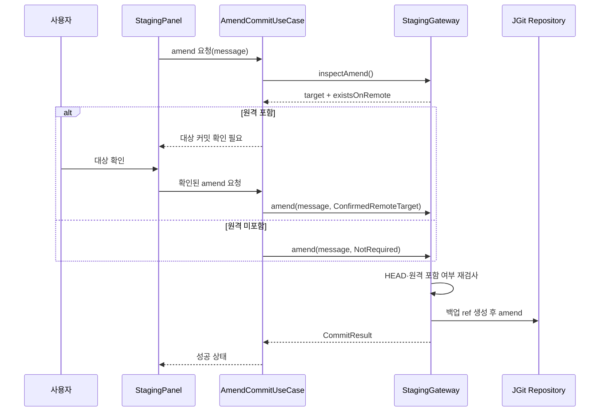
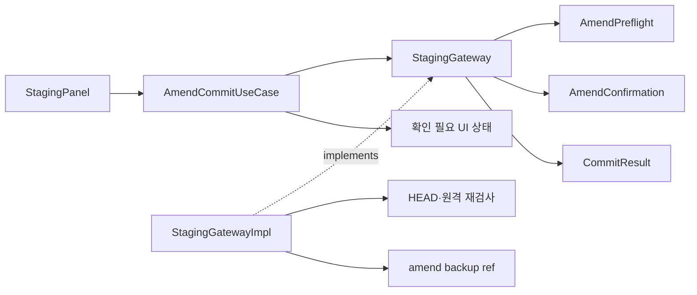

# [UND-53] amend 사전 확인 계약 · 실행 가드

> wave 3 · 사이즈 M · 의존 UND-06 · 소유 `domain/`(StagingGateway·CommitResult·amend 예외) · `infrastructure/git/staging/` · `application/staging/`

## 작업 내용 (설계 의도)

amend를 일반 커밋과 별도 경로로 분리한다. 일반 커밋은 확인 인자를 받지 않고 실행하며,
amend는 먼저 대상 HEAD와 원격 포함 여부를 조회한 뒤 실행한다.

사전 조회 결과는 amend 대상 커밋과 원격 포함 여부를 함께 제공한다. 원격 포함 amend는 사용자의
명시적 확인과 동일한 대상 커밋을 가진 확인 값을 받아야만 실행한다. 확인이 없거나 조회 이후 HEAD가
바뀌면 Gateway가 HEAD를 다시 쓰기 전에 거부한다.

`AmendCommitUseCase`가 조회 → 확인 필요 상태 반환 → 확인 뒤 실행을 조율한다. presentation은
UseCase에 사용자 의사만 전달하며 Gateway를 직접 호출하지 않는다. Gateway 구현은 실행 직전에
현재 HEAD와 원격 포함 여부를 재검사해 UseCase 밖의 호출과 stale preflight도 방어한다.

원격 포함 여부는 커밋 결과가 아니라 amend preflight 결과로 이동한다. 따라서 커밋 완료 뒤 경고하는
`CommitResult.existsOnRemote`는 제거한다.

`tickets/UND-06-staging-commit.md`의 "원격 존재 여부를 반환해 UI가 경고" 서술과
`tickets/UND-17-staging-commit-panel.md`의 대응 서술은 이 티켓이 함께 갱신한다.

이 티켓은 UND-26 와이어업 전에 완료되어야 한다.

**롤백**: amend 전 원본 커밋을 `refs/undine/amend-backup/...`에 계속 기록한다. 사전 확인은 실행
허가를, 백업 ref는 확인된 amend를 포함한 모든 amend의 복구 지점을 담당한다. 백업 ref 생성에 실패하면
amend를 실행하지 않는다.

## 다이어그램

### 처리 흐름

### 클래스 의존

## 테스트 케이스

- 로컬 전용 HEAD의 preflight 뒤 `NotRequired`로 amend하면 새 커밋이 생성되고 HEAD가 새 커밋을 가리킨다.
- 원격 tracking ref에 포함된 HEAD를 preflight한 뒤 같은 대상에 대한 명시적 확인으로 amend하면 성공하고 원본 커밋의 백업 ref가 남는다.
- 원격 포함 HEAD에서 확인 없이 amend하면 확인 필요 도메인 실패가 발생하고 HEAD·인덱스·워킹트리가 바뀌지 않는다.
- 원격 포함 preflight 뒤 다른 커밋으로 HEAD가 바뀌면 이전 대상에 대한 확인으로 amend할 수 없고, 새 preflight를 요구한다.
- preflight 시 원격 미포함이었더라도 실행 직전 원격 포함으로 판정되면 `NotRequired` amend를 거부하고 HEAD를 바꾸지 않는다.
- HEAD가 없는 저장소에서 amend preflight 또는 amend를 요청하면 상태 위반으로 거부하고 ref를 만들지 않는다.
- 백업 ref 생성이 실패하면 확인 여부와 무관하게 amend를 실행하지 않고 HEAD·인덱스·워킹트리를 보존한다.
