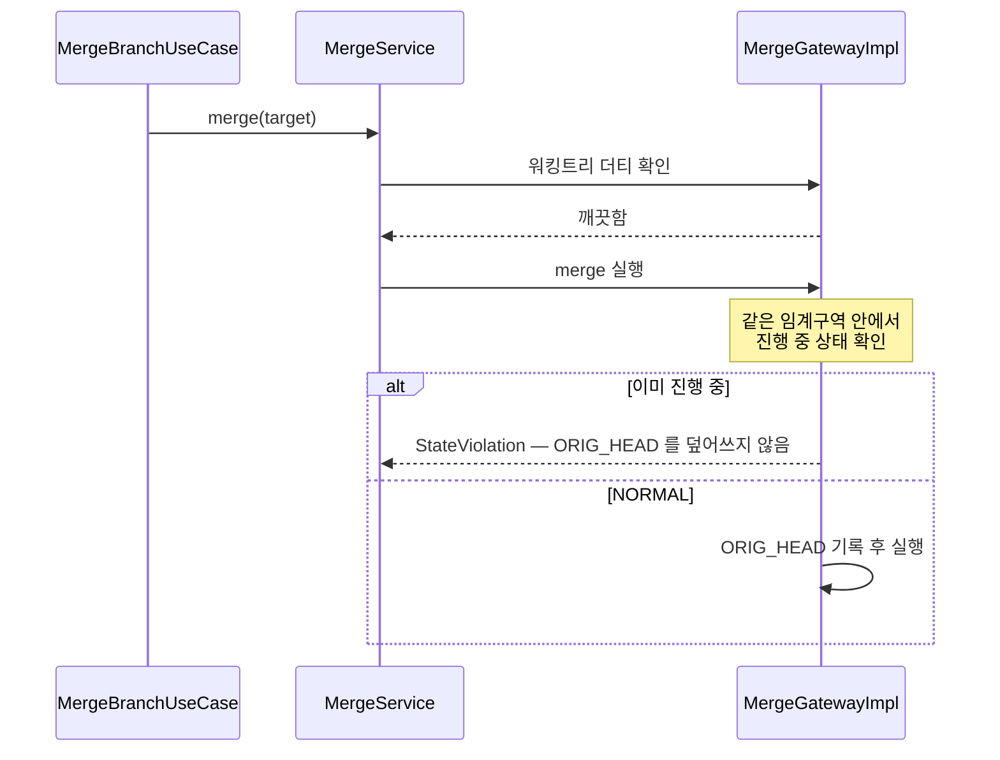
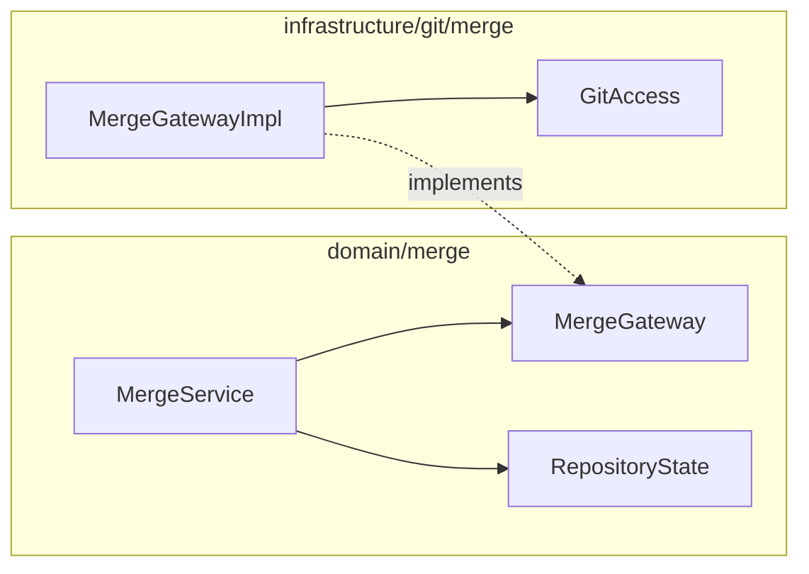

# [UND-54] merge/rebase 시작 경로 상태 가드 완결

## 작업 내용 (설계 의도)

### 변경 사항

UND-21 이 파괴적 연산(`abort`·`skip`)에 **확인 토큰 + 실행 임계구역 내 상태 가드**를 세웠다.
같은 가드를 **시작 경로**(`merge`·`rebase`)에는 아직 적용하지 않았고, 그 결과 다음이 남아 있다.

`MergeGatewayImpl` 의 `rememberStartPoint()` 는 진행 중 상태를 거부하지 않는다. 병합·리베이스가
이미 진행 중인데 새 `merge`/`rebase` 를 시작하면 `ORIG_HEAD` 가 **부분 진행 HEAD** 로 덮어써져,
그 뒤의 `abort` 가 되돌릴 지점을 잃는다. `MergeService` 는 시작 전 워킹트리 더티만 보고 진행 중
상태는 보지 않으므로(충돌 해결 중 워킹트리는 항상 더티라 그 검사가 통과한다) 서비스도 이를 막지 못한다.

되돌릴 지점을 잃는 것은 **복구 불가**라, 시작 경로도 `abort`·`skip` 과 같은 기준으로 닫는다:
진행 중이면 시작하지 않고, 검사와 `ORIG_HEAD` 기록을 **같은 `GitAccess` 임계구역** 안에 둔다.

함께 보강할 회귀 커버리지:
- `continueMerge`·`continueRebase`·`skipRebaseCommit` 의 실행 시점 상태 가드를 **Gateway 직접 호출**로
  검증한다 (NORMAL·반대 진행 상태 조합). UND-21 은 `abort` 두 경로만 실제 저장소로 덮었다.

**롤백**: 가드 추가이므로 되돌리면 이전 동작(진행 중에도 시작 허용)으로 돌아간다. 데이터 이전 없음.

## 의존

- UND-21 (`domain/merge`·`infrastructure/git/merge` 계약과 가드 패턴이 선행)

## 다이어그램

### 처리 흐름

### 클래스 의존

## 테스트 케이스

- 병합이 진행 중인데 `merge` 를 시작하면 거부하고 `ORIG_HEAD` 가 그대로다
- 리베이스가 진행 중인데 `rebase` 를 시작하면 거부하고 `ORIG_HEAD` 가 그대로다
- 진행 중 시작을 거부한 뒤 `abort` 하면 원래 시작 지점으로 복구된다 (덮어쓰기가 없었음을 증명)
- 진행 중이 아닐 때는 시작이 그대로 되고 `ORIG_HEAD` 가 갱신된다
- `continueMerge` 를 NORMAL·REBASING 에서 직접 호출하면 거부하고 저장소가 변하지 않는다
- `continueRebase` 를 NORMAL·MERGING 에서 직접 호출하면 거부하고 저장소가 변하지 않는다
- `skipRebaseCommit` 을 NORMAL·MERGING 에서 직접 호출하면 거부하고 저장소가 변하지 않는다
