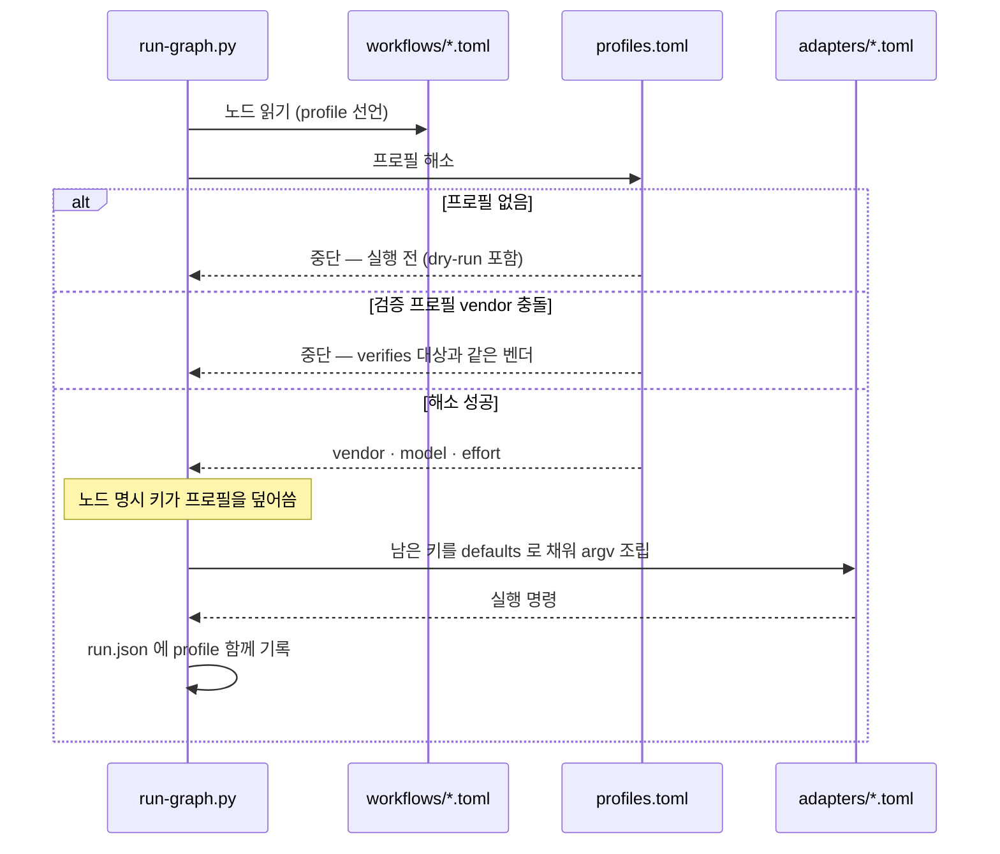
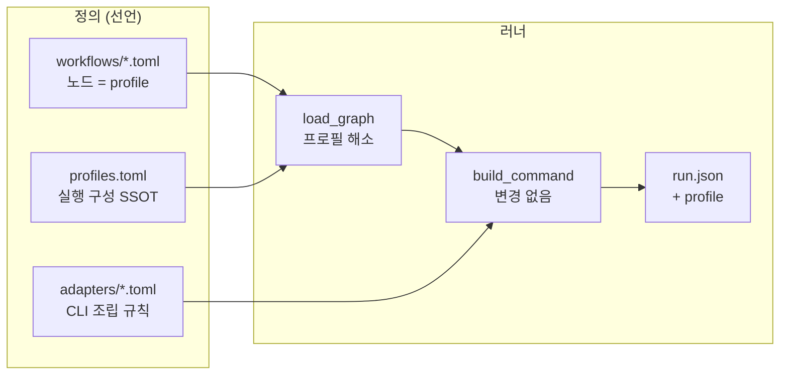

# [UND-55] 오케스트레이션 실행 구성 라우팅 테이블

> 하네스 (앱 wave DAG 밖) · 사이즈 S · 의존 없음 · 소유 `.agent/orchestration/profiles.toml`(신규) · `.agent/orchestration/runner/run-graph.py` · `.agent/orchestration/workflows/*.toml`

## 작업 내용 (설계 의도)

### 변경 사항

**측정이 먼저다.** 현재 `workflows/*.toml` 7개 파일의 LLM 노드 36개가 `vendor` + `model` 을 각자
하드코딩하는데, 그렇게 표현하는 **구성은 3종뿐**이다 — `gpt-5.6-terra` 31 · `opus` 4 · `sonnet` 1.
축 하나의 모델을 올리려면 파일 6개를 손대야 하고, 어디가 같은 역할인지는 파일을 다 열어야 안다.

`effort` 는 더 심하다. 전체 40개 노드 중 8곳만 선언하고 (`harness-audit` 3 · `ticket-review` 5),
**develop 계열 5개 워크플로우는 0곳**이다. `runs/` 의 성공 노드 158개에서 `effort=None` 이 148건인
것이 그 결과다 — 축별 추론 예산에 의도가 없고, 벤더 기본값이 조용히 그 자리를 채운다.

그래서 노드가 실행 구성을 직접 들지 않게 한다. 노드는 **역할(`profile`)** 만 선언하고,
프로필 → 구성 해소는 신규 `orchestration/profiles.toml` 한 파일이 맡는다.

**LLM 이 고르지 않는다 — 결정적 조회다.** `runs/` 실측에서 노드 하나의 최소 소요가 48초(p10 67초)
이고, 구성을 판단하는 노드는 다운스트림 전체의 배리어가 된다. 반면 구성 선택으로 아낄 수 있는
최대치는 wave 당 약 72초다 (`pipeline-tuning.md` §4 의 "축을 더 빠른 모델로 → wave 당 약 30%",
wave 대기 약 240초 기준). 판단 자체가 절감분을 먹으므로, 유연성은 테이블로 얻고 비용은 0 으로 둔다.

**해소 우선순위** — 이 순서로 고정한다 (결정적, 위가 이긴다):

1. 노드에 명시한 키 — 프로필을 덮어쓰는 탈출구
2. 프로필의 키
3. 어댑터 `[defaults]` (지금 동작 그대로)

해소는 `run-graph.py#load_graph` 에서 끝낸다. `build_command` 는 손대지 않는다 — **러너에 벤더
분기를 두지 않는다**는 기존 원칙(`runner/adapters/README.md`)을 그대로 유지하고, 프로필은
어댑터보다 위층에서 노드 키를 채우는 역할만 한다.

**테이블이 강제하는 제약 2개** (지금은 관례일 뿐이라 새 노드에서 조용히 깨진다):

- **검증 프로필은 대상 프로필과 vendor 가 달라야 한다.** 구현과 검증이 같은 벤더면 상관된 맹점이
  생긴다 — 현재 claude/opus 구현 → codex/terra 검증이 그 이유로 갈라져 있지만 어디에도 선언돼
  있지 않다. 프로필에 `verifies = "<프로필 id>"` 를 두고 러너가 로드 시점에 검사한다.
- **gate 노드에 `profile` 금지** — 지금 `vendor` 금지와 같은 규칙이다 (사람이 판단하는 노드다).

**기록**: `run.json` 의 노드에 `profile` 필드를 추가한다. 이미 `vendor`·`model`·`effort`·
`duration_s`·`cost_usd` 를 남기고 있으므로 이 한 필드로 **구성 ↔ 결과 대응**이 닫히고,
replay 대조와 이후 측정의 기준선이 생긴다.

**비범위** — 이 티켓에서 하지 않는다:

- 실행 시점 동적 선택 · LLM 기반 라우팅 (위 측정 근거로 하지 않는다)
- 구성 자동 튜닝 루프 (제안·반영)
- 원장 확장 — 심각도별 finding 수 · 오탐 기각 수 등 보상 신호 수집은 별도 티켓. 보상 신호 없이
  최적화 루프를 붙이면 "덜 찾는 구성"으로 수렴한다 (`pipeline-tuning.md` §4·§5)

**롤백**: `profile` 이 없는 노드는 우선순위 1 로 지금과 동일하게 동작하므로 전환이 하위 호환이다.
되돌릴 때는 `profiles.toml` 을 지우고 노드에 `vendor`/`model` 을 복원한다. 이전할 데이터는 없다.

## 의존

- 없음 — 앱 wave DAG 와 무관한 하네스 티켓이다. 앱 티켓을 막지도, 앱 티켓에 막히지도 않는다.

## 다이어그램

### 처리 흐름

### 구성 의존

## 테스트 케이스

- `profile` 만 선언한 노드가 프로필의 `vendor`·`model`·`effort` 로 조립된다
- 노드가 프로필과 같은 키를 선언하면 노드 값이 이긴다 (탈출구 동작)
- 프로필도 노드도 주지 않은 키는 어댑터 `[defaults]` 로 채워진다
- `profile` 이 없는 기존 노드 36개가 전환 전과 **동일한 argv** 로 조립된다 (하위 호환)
- 존재하지 않는 프로필을 참조하면 실행 전에 중단한다 — `--dry-run` 에서도 같이 걸린다
- `verifies` 로 선언한 프로필이 대상 프로필과 같은 vendor 면 로드 시점에 중단한다
- gate 노드에 `profile` 을 두면 중단한다
- 프로필이 어댑터가 지원하지 않는 키를 주면 노드 id 와 키 이름을 밝히고 중단한다
- failover 로 벤더가 바뀐 노드의 `run.json` 에 원래 `profile` 과 전환된 `vendor`·`model` 이 함께 남는다
