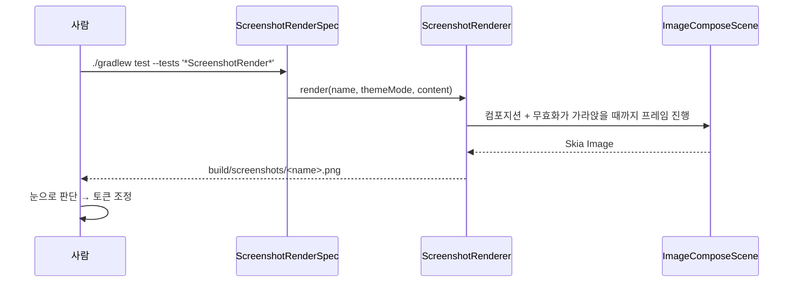
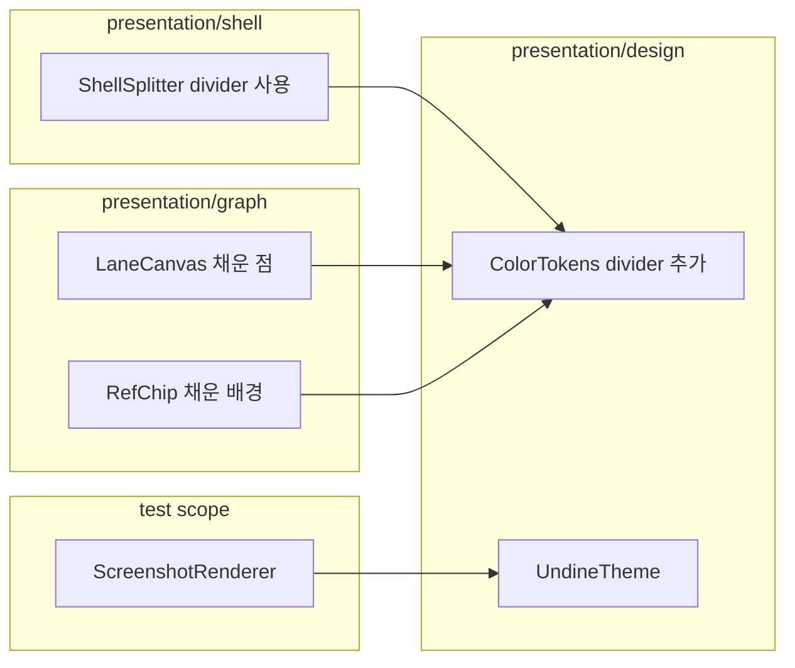

# [UND-56] GitKraken 계열 시각 튜닝 · 렌더 확인 수단

## 작업 내용 (설계 의도)

### 변경 사항

배선(UND-26)으로 화면이 창에 붙은 뒤, **시각 인상을 GitKraken 계열로 맞춘다.**
자체 디자인 토큰 체계(UND-10)는 유지한다 — 픽셀 복제가 아니라 같은 계열의 관용구를 따르는 것이 목표다.

**시각 결정은 빌드 통과로 검증되지 않는다.** 그래서 먼저 확인 수단을 만든다:
컴포저블을 PNG 로 렌더하는 테스트 스코프 도구(`ScreenshotRenderer`)를 두고, 사람이 결과를 보고
판단한다. 창을 띄워 화면을 캡처하는 방식은 창이 다른 디스플레이·Space 에 있으면 실패한다.

조정 항목:

| 항목 | 이전 | 이후 | 이유 |
|---|---|---|---|
| 앱 기본 테마 | 시스템 따름 | **다크** | 이력·diff 를 오래 보는 화면이고, 설정 화면(UND-40) 전까지 기본값이 유일한 선택이다 |
| 영역 분할선 | `border` 재사용 | **`divider` 신설** | 구획 표시가 상호작용 경계와 같은 밝기면 화면이 선으로 갈라져 보인다 |
| 그래프 레인 점 | 속 빈 링 | **채운 원** | 링만 남으면 레인 색이 눈에 들어오지 않는다 |
| 레인 점 주변 | (없음) | 배경 후광 **두지 않음** | 후광이 연결선을 끊어 선이 점선처럼 보인다 — 선이 점을 관통해야 이력의 연속성이 보인다 |
| 참조 칩 | 외곽선만 | **옅은 색 배경 + 경계** | 외곽선만 두면 칩이 배경에 묻혀 참조가 눈에 띄지 않는다 |

`divider` 는 **3:1 대비 검증 목록(`nonTextColorsOf`)에 넣지 않는다** — 읽는 대상이 아니라 구획 표시다.
상호작용하는 경계(칩·입력)는 계속 `border` 를 쓴다.

**범위에서 뺀 것**: 레인 팔레트 자체의 색 개편. 인접 쌍 3:1(순환 포함) 제약이 있어 값을 바꾸면
`ColorContrastSpec` 반복 조정이 필요하고, "GitKraken 색에 가까운가" 는 객관적 기준이 없다.
별도 결정이 필요하다.

**롤백**: 토큰 값·그리기 방식 변경이라 되돌리면 이전 인상으로 돌아간다. 데이터·계약 영향 없음.

## 의존

- UND-26 (배선 완료 — 화면이 창에 붙어야 시각 판단이 가능하다)
- UND-10 (디자인 토큰 체계)

## 다이어그램

### 처리 흐름

### 클래스 의존

## 테스트 케이스

- 셸 분할선이 `divider` 토큰 값으로 그려진다 (라이트·다크 각각)
- `divider` 가 라이트와 다크에서 서로 다른 값으로 전환된다
- `divider` 는 3:1 대비 검증 대상이 아니다 — 그 목록에 들어가면 밝아져 구획 표시 목적을 잃는다
- 렌더러가 셸·그래프를 PNG 로 남기고 파일이 비어 있지 않다
- 참조 칩 배경이 칩 색의 옅은 버전이고 글자는 칩 색 원본이다 (글자 대비 유지)
- 기존 색 대비 테스트(본문 4.5:1 · 경계 3:1 · 레인 인접 3:1)가 그대로 통과한다
