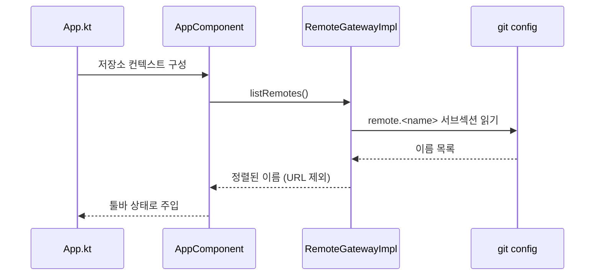
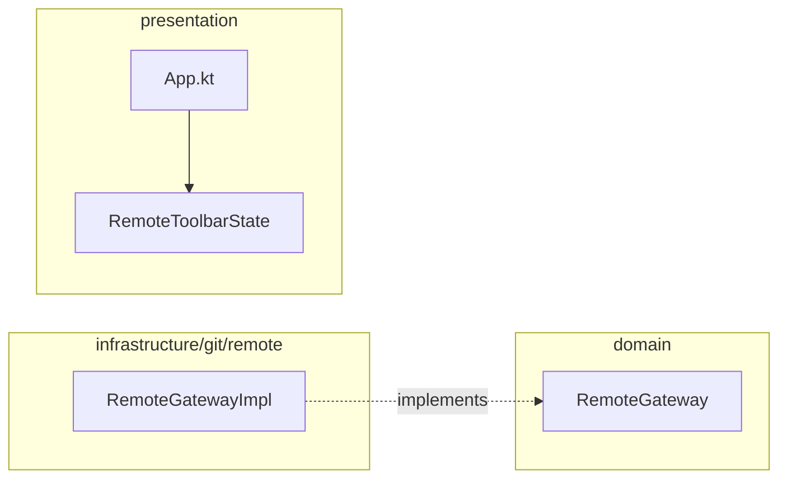

# [UND-57] 원격 목록 계약 · 툴바 활성화

## 작업 내용 (설계 의도)

### 변경 사항

**툴바의 fetch·pull·push 가 영구히 닫혀 있던 원인을 없앤다.**

UND-18(툴바)은 원격 목록을 배선이 주입한다는 전제로 만들어졌고, 결정문 A4 는 "원격 존재 여부는
계약을 늘리지 않고 UND-26 이 아는 목록을 주입한다" 로 정했다. 그런데 UND-26 을 실제로 배선해 보니
**UND-26 도 원격을 알 방법이 없었다** — `RemoteGateway` 에 원격을 열거하는 메서드가 없다.
결과는 툴바가 항상 `NO_REMOTE` 를 표시하고 원격 버튼이 닫힌 상태였다.

A4 는 "고쳐야 하면 구현하지 말고 보고한다" 로 못박아 두었고, 보고 후 **사람이 계약 확장을 승인**했다
(결정문 갱신 완료). 이 티켓이 그 한 줄을 넣는다.

- `RemoteGateway.listRemotes(): List<String>` 추가
- `RemoteGatewayImpl` 은 설정의 `remote.<name>` 서브섹션을 읽는다 — **네트워크를 타지 않는다.**
  진행률 콜백도 없다: 로컬 설정 조회는 초 단위 작업이 아니다
- **이름만 준다.** URL 은 자격증명이 섞일 수 있어 화면으로 내보내지 않는다
  ([`credential-handling`](../.agent/rules/credential-handling.md) 2항)
- 정렬해 돌려준다 — 설정 파일 순서가 화면 순서를 흔들지 않게 한다
- 원격이 없으면 빈 목록이며 **오류가 아니다**
- `AppComponent`·`App.kt` 가 저장소 컨텍스트에 원격 목록을 함께 세워 툴바에 넘긴다

**롤백**: 계약 추가이므로 되돌리면 툴바가 다시 `NO_REMOTE` 로 닫힌다. 데이터 영향 없음.

## 의존

- UND-18 (툴바가 이 목록을 소비한다)
- UND-26 (배선이 목록을 전달한다)

## 다이어그램

### 처리 흐름

### 클래스 의존

## 테스트 케이스

- 등록된 원격 이름을 정렬해 돌려준다
- 원격이 없으면 빈 목록이고 예외를 던지지 않는다
- URL 은 결과에 포함되지 않는다 (이름만)
- 툴바가 목록을 받으면 fetch·pull 이 활성화된다
- 업스트림이 그 목록에 없으면 push 는 여전히 닫힌다 (UND-18 규칙 유지)
