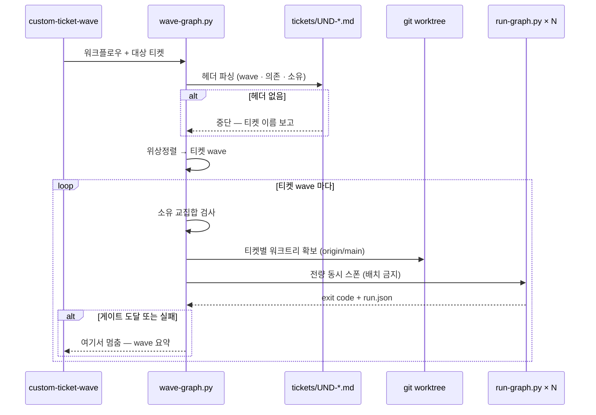
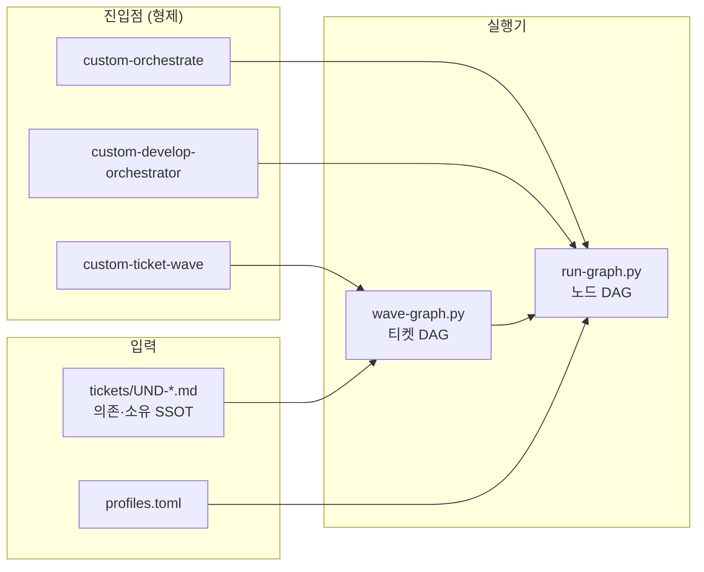

# [UND-58] 티켓 wave 실행기 — 티켓 DAG 병렬화

> 하네스 (앱 wave DAG 밖) · 사이즈 M · 의존 UND-55 · 소유 `.agent/orchestration/runner/wave-graph.py`(신규) · `.agent/skills/custom-ticket-wave/`(신규)

## 작업 내용 (설계 의도)

### 변경 사항

**DAG 병렬이 3층 중 1층만 기계화돼 있다.**

| 층 | 지금 |
|---|---|
| 노드 (워크플로우 1개 안) | ✅ `run-graph.py` 위상정렬 wave + `--max-parallel` |
| 워크플로우 (티켓 1건 7단계) | ❌ DAG 아님 — verdict 분기라 사람이 순차 선택 (의도된 공백) |
| **티켓** (wave 안 11건) | ❌ **러너에 개념 자체가 없음** |

`tickets/README.md` 가 10 wave · 너비 분포 `[1,11,11,4,1,1,12,9,1,2]` 까지 계산해 뒀는데
**어떤 기계도 그 DAG 를 소비하지 않는다.** 티켓 병렬은 `custom-develop-orchestrator` 의
"여러 티켓을 함께 돌릴 때 — 배치로 끊지 않는다" 라는 **문서화된 관행**뿐이고,
관행이라 지켜지지 않으면 그대로 손실이 난다. 실제로 두 번 났다:

- `pipeline-tuning.md` §2 원인 1 — wave 3 스펙 11건을 `4+4+3` 으로 끊어 돌려 노드 시간은
  같은데 벽시계만 **45분 → 15분** 차이가 났다.
- 2026-08-24 — "티켓 하나당 워크트리 하나" 도 관행이라, 여러 세션이 한 워크트리를 공유해
  브랜치가 두 번 바뀌고 한 티켓의 파일이 다른 티켓 커밋에 휩쓸렸다 (파일 소유 Rule 3 무력화).

그래서 티켓 수준 DAG 실행기를 `run-graph.py` **위**에 둔다.

**워크플로우 TOML 로는 표현할 수 없다** — 노드는 정적(`[[nodes]]`)이고 `cwd` 는 그래프당
하나이며 노드 타입은 LLM·gate 둘뿐이다. 티켓 N건 = 가변 실행 단위 + cwd N개다.
LLM 노드가 Bash 로 러너를 스폰하게 만드는 길은 **프로세스 오케스트레이션을 비결정적 판단에
맡기는** 것이라 택하지 않는다. 세 진입점은 포함 관계가 아니라 **형제**다.

```
/custom-orchestrate            워크플로우 1개  → run-graph.py × 1
/custom-develop-orchestrator   티켓 1건 7단계  → run-graph.py × 7 (순차, 게이트 2개)
/custom-ticket-wave  ⟵ 신규    티켓 N건 × 워크플로우 1개 → run-graph.py × N (프로세스 병렬)
```

**의존의 SSOT 는 티켓 md 헤더**다 (`> wave N · 사이즈 S · 의존 UND-06, UND-10 · 소유 ...`).
`tickets/README.md` 가 "둘이 어긋나면 티켓 헤더가 정본" 이라고 정해 뒀고, 실측으로 57건 중
54건이 파싱된다. **헤더가 없으면 의존 없음으로 가정하지 않고 티켓 이름과 함께 중단한다** —
파일 부재를 침묵으로 흘리면 근거 없는 실행이 된다 (`pipeline-tuning.md` 조치 3 과 같은 원칙).

**파일 소유 교집합을 실행 전에 막는다.** 같은 wave 두 티켓의 `소유` 경로가 겹치면 병렬 실행이
곧 머지 충돌이다. 지금은 `tickets/README.md` 에 사람이 수기로 대조한 표만 있다. 실행기가
헤더의 소유 선언을 대조해 겹치면 중단한다 (`--allow-overlap` 로만 해제).

**게이트에서 멈춘다.** 티켓 wave 안의 러너가 하나라도 게이트(exit 2)에 닿으면 그 wave 는
완료가 아니므로 **다음 티켓 wave 로 진행하지 않는다.** 사람이 wave 단위로 묶어 검토하고
재개한다 — "사람 게이트가 워크플로우 경계다" (CLAUDE.md) 를 티켓 층에서도 지킨다.

**롤백**: 신규 파일 2개(+스킬)이며 기존 러너·워크플로우를 수정하지 않는다. 되돌리면 종전의
수동 관행으로 돌아간다. 실행기가 만드는 워크트리는 지우지 않는다 (`git worktree remove` 를
호출하지 않는다 — 사람의 미커밋 변경을 삭제할 수 있다).

## 의존

- UND-55 (프로필 라우팅 — 실행기가 `run-graph.py` 의 `load_profiles`·`resolve_profile` 을
  재사용해 "이 워크플로우가 파일을 쓰는가" 를 판정한다. 해소 로직을 복제하지 않는다)

## 다이어그램

### 처리 흐름



### 구성 의존



## 테스트 케이스

- 티켓 3건을 주면 헤더 의존대로 위상정렬해 wave 로 나눈다
- 대상 집합 밖의 의존은 "이미 완료" 로 간주하고 그 사실을 출력한다 (부분 실행 허용)
- 헤더가 없는 티켓을 대상에 넣으면 티켓 이름과 함께 실행 전에 중단한다
- 존재하지 않는 티켓을 지정하면 실행 전에 중단한다
- 같은 wave 두 티켓의 소유 경로가 겹치면 중단하고, `--allow-overlap` 으로만 통과한다
- 의존 순환이 있으면 실행 전에 중단한다
- `--dry-run` 은 각 러너에 `--dry-run` 을 넘겨 LLM 호출 0 으로 wave 계획만 확인한다
- 쓰기 노드가 있는 워크플로우를 `--no-worktree` 로 돌리면 거부한다
- 러너 하나가 게이트(exit 2)에 닿으면 다음 티켓 wave 를 시작하지 않는다
- 러너 하나가 실패(exit 1)해도 같은 wave 의 나머지는 끝까지 돌고, 그 다음 wave 는 멈춘다
- `{ticket}` 자리표시자가 든 `--set-each` 값이 티켓별로 치환돼 전달된다
- 통합 매니페스트에 티켓별 exit code · run-dir · 워크트리 경로가 남는다
