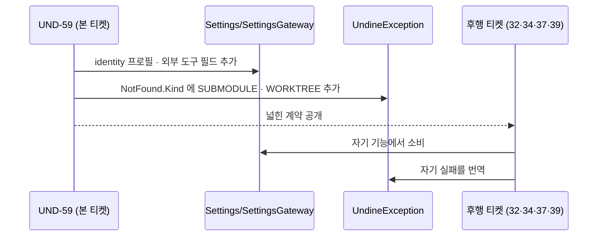
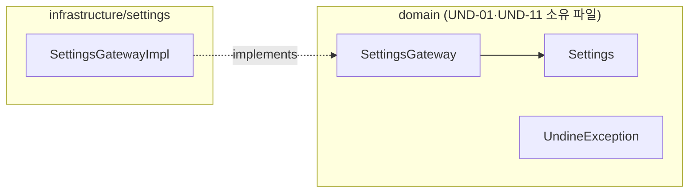

# [UND-59] wave 7 공통 계약 확장

> wave 7 · 사이즈 S · 의존 UND-01 · 소유 `domain/Settings.kt` · `domain/SettingsGateway.kt` · `domain/UndineException.kt` · `infrastructure/settings/`

## 작업 내용 (설계 의도)

### 왜 이 티켓이 있는가

wave 7 스펙 10건이 낸 미해결 질문 38건 중 **8건이 같은 원인**이었다 — 여러 티켓이 동시에
**UND-01·UND-11 소유의 공통 계약**을 넓혀야 하는데, 그 파일은 자기 소유가 아니라 손댈 수 없다.

`tickets/README.md` 의 분해 원칙이 이 상황에 답을 준다 — **연관 병목은 하나로 묶어 선행 wave 에
단독 배치**한다. 쪼개면 같은 파일을 여러 티켓이 만져 머지 충돌이 나고, 각자 하게 두면
Single Writer per File 이 깨진다.

이 티켓은 **계약만 넓히고 기능은 만들지 않는다.** 넓힌 계약의 소비자는 후행 티켓이다.

### 변경 사항

**1. `Settings` · `SettingsGateway` 확장**

UND-37(identity 프로필)·UND-39(외부 diff/merge 도구) 둘 다 "설정에 보관"이 요구사항인데
`Settings.kt` 는 `recentRepositories`·`theme`·`window` 만 갖고 있고, 그 파일의 주석은
**스키마 확장을 `SettingsGateway` 소유 티켓의 책임**으로 명시한다.

- identity 프로필 목록 — 이름·이메일·서명 키 ID·기본 인증 방식을 한 단위로. **키 본문·패스프레이즈는 담지 않는다** (UND-37 AC).
- 외부 도구 설정 — diff/merge 도구의 실행 파일과 인자 템플릿. Git 의 `diff.tool`·`merge.tool` 이
  없을 때만 쓰이는 **차선 값**이다 (UND-39 AC: Git 설정 우선).
- 두 필드 모두 **없을 수 있다** — 기존 설정 파일에 이 키가 없어도 로드가 깨지지 않아야 한다.
  UND-11 이 이미 `schemaVersion` 미상 시 원본 보존 규칙을 갖고 있으므로 그 규칙을 따른다.

**2. `UndineException.NotFound.Kind` 값 추가**

`SUBMODULE`(UND-32)·`WORKTREE`(UND-34). `NotFound` 는 이미 "찾는 대상이 없다"를 kind 로
구분하는 구조라 **새 하위 클래스가 아니라 enum 값 추가**로 충분하다.

### 하지 않는 것 (의도적으로 좁힌다)

- **새 `UndineException` 하위 클래스를 만들지 않는다.** UND-33(LFS CLI)·UND-36(서명)·UND-39(외부 도구)의
  실패는 *예외적 사고*가 아니라 **예상되는 결과**다 — 도구 미설치, agent 부재, 사용자가 저장 없이 종료.
  각 티켓이 자기 계약의 **결과 타입**으로 표현한다. UND-36·UND-39 스펙이 이미 그렇게 결정했다.
  기존 `UndineException` 의 설계 기준("화면이 취해야 할 행동이 다를 때만 하위 타입을 만든다")과도 맞는다.
- **`RepositoryState.BISECTING` 은 이 티켓이 하지 않는다.** `RepositoryState.kt` 의 주석이
  "bisect 처럼 뒤 wave 가 필요로 하는 상태는 **그 티켓이 추가한다**" 고 이미 위임했고,
  wave 7 에서 그 파일을 만지는 티켓은 UND-35 하나뿐이라 충돌이 없다.
- 화면·DI 배선·기능 구현 일체.

### 롤백

**설정 스키마 변경이다** (프로세스 게이트 4). `schemaVersion` 이 1 → 2 로 올라간다.

- **앞으로 되돌리기**: 기존 설정 파일에 새 키가 없어도 그대로 읽힌다(그 필드만 기본값). enum 값 추가도
  기존 값 해석에 영향이 없다.
- **구버전 앱으로 내려갈 때**: 스키마 1 앱은 이 파일을 "미래 스키마" 로 보고 저장 시점에
  `settings.json.newer-<epochMillis>` 로 **원본을 보존한 뒤** 스키마 1 파일을 새로 쓴다 (UND-11 기존 규칙).
- **다시 올라올 때**: 스키마 1 파일을 읽으면 구버전이 담을 수 없던 identity 프로필·외부 도구 설정을
  가장 최근 `newer-` 백업에서 **되살린다**. 구버전이 아는 필드(최근 저장소·테마·창)는 구버전 파일이
  이긴다 — 그 값은 사용자가 구버전에서 실제로 고쳤을 수 있다. 백업은 지우지 않는다.

## 의존

- UND-01

## 다이어그램

### 처리 흐름

### 클래스 의존

## 테스트 케이스

- identity 프로필과 외부 도구 설정을 담은 설정을 저장한 뒤 다시 읽으면 같은 값이 복원된다
- 두 필드가 **없는** 기존 설정 파일을 읽어도 로드가 실패하지 않고 나머지 값이 보존된다
- 프로필 목록이 0건인 설정을 저장·복원하면 빈 목록으로 돌아온다 (null 과 빈 목록을 구분한다)
- 서명 키 **본문**이나 패스프레이즈처럼 저장하면 안 되는 값이 설정 스키마에 존재하지 않는다
- 알 수 없는 `schemaVersion` 의 설정 파일은 새 필드를 덧쓰지 않고 원본을 보존한다 (UND-11 기존 규칙 회귀)
- `NotFound(Kind.SUBMODULE, name)` · `NotFound(Kind.WORKTREE, name)` 의 메시지가 kind 라벨을 포함한다
- 기존 `NotFound.Kind` 값(REF·COMMIT·STASH·REMOTE)의 동작이 변하지 않는다
