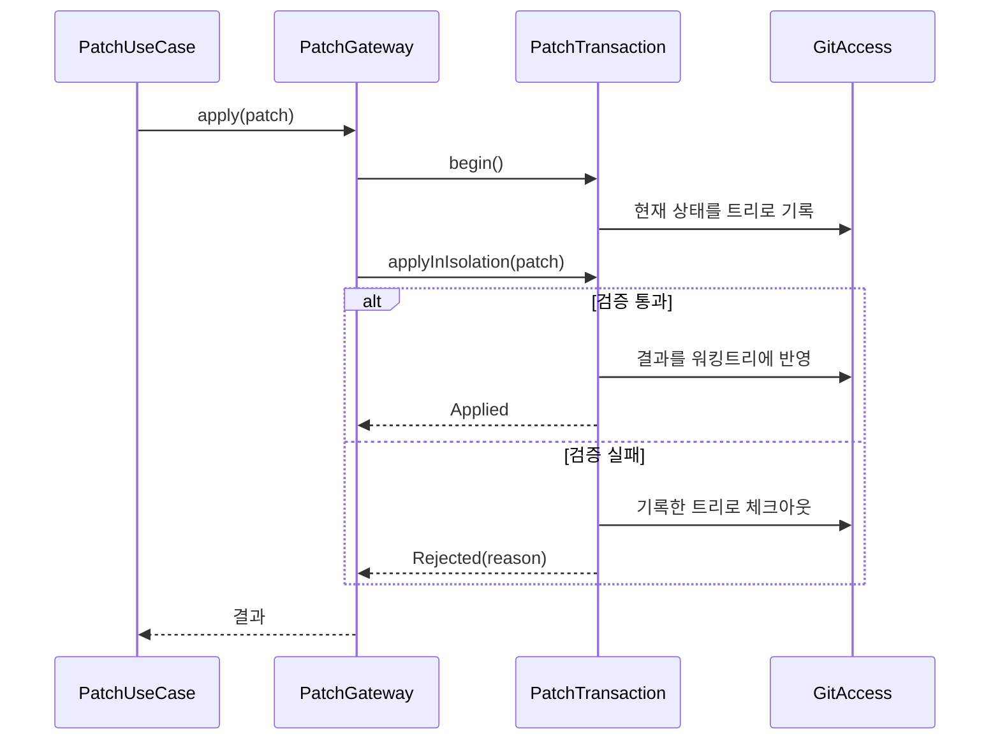
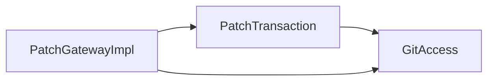

# [UND-60] 패치 적용 트랜잭션 — 실패 복원을 설계부터 다시 잡는다

> wave 8 · 사이즈 M · 의존 UND-31 · 소유 `infrastructure/git/patch/` 의 스냅샷·복원 경로

## 작업 내용 (설계 의도)

### 왜 이 티켓이 있는가

UND-31 이 패치 적용 실패 시 원상 복구를 **워킹트리 스냅샷을 직접 뜨고 되돌리는 방식**으로 구현했고,
그 복원 경로에서 **6라운드 동안 p0 이 네 번** 나왔다. 라운드마다 지적된 결함을 고쳤고, 고칠 때마다
같은 파일에서 인접한 데이터 유실 경로가 새로 드러났다:

| 라운드 | 드러난 유실 경로 |
|---|---|
| 3 | mode 변경 패치 적용 후 검증 실패 시 실행 권한이 적용 후 상태로 남음 |
| 4 | copy 가 다른 변경과 섞이면 역연산이 source 를 덮어씀 |
| 5 | `a` 삭제 + `a/b` 추가 패치 실패 시 비어 있지 않은 `a` 를 못 지워 원본 `a` 미복구 |
| 6 | 조상 토폴로지 미보존 — `a` 가 symlink 로 바뀐 상태에서 `a/b` 삭제가 **바깥 대상**을 지움 |

**방어적 패치를 쌓아 만들 물건이 아니다.** 원인은 개별 버그가 아니라 접근이다 —
파일 경로 목록을 손으로 스냅샷·복원하면 심볼릭 링크·디렉터리/파일 전환·조상 생성 같은
파일시스템 토폴로지 변화를 전부 사람이 열거해야 하고, 열거는 끝나지 않는다.

### 변경 사항

**복원을 파일시스템 조작이 아니라 Git 자료구조 위의 트랜잭션으로 바꾼다.**

- 적용 전 상태를 **트리 객체**로 기록한다. 파일 경로 목록이 아니다 — 트리는 심볼릭 링크·mode·
  디렉터리 구조를 그 자체로 담으므로 열거할 항목이 없다.
- 실패 시 복원은 기록해 둔 트리로의 **체크아웃 한 번**이다. 삭제 순서·조상 정리 같은 개념이
  사라진다.
- 적용은 격리 영역에서 먼저 검증하고, 검증을 통과한 결과만 실제 워킹트리에 반영한다.
- 되돌릴 수 없는 상태(추적되지 않은 파일 등)는 트리에 담기지 않으므로, 적용 전에 그 존재를
  확인해 **거부**한다 — 담을 수 없는 것을 담은 척하지 않는다.

### 이 티켓이 하지 않는 것

- 역방향 적용의 범위 확대 — UND-31 의 결정 I1(순수 hunk 패치만)은 그대로 둔다.
  copy·rename·mode·binary 역적용은 별도 티켓이다.
- 새 빌드 의존성 추가.

### 롤백

이 티켓 자체는 기존 복원 경로를 대체한다. 문제가 생기면 UND-31 의 스냅샷 경로로 되돌릴 수 있으나,
그 경로에 알려진 p0 이 남아 있으므로 **되돌리는 것은 데이터 유실 위험을 되살리는 선택**이다.
되돌리는 대신 적용 기능 자체를 비활성화하는 편이 안전하다.

## 의존

- UND-31

## 다이어그램

### 처리 흐름

### 클래스 의존

## 테스트 케이스

- 순수 hunk 패치를 적용하면 워킹트리에 반영되고 트랜잭션이 커밋된다
- 적용 도중 검증이 실패하면 기록한 트리로 복원되어 적용 전과 바이트 단위로 같다
- 파일 `a` 를 삭제하고 `a/b` 를 추가하는 패치가 실패해도 원본 파일 `a` 가 복구된다
- 디렉터리가 바깥을 가리키는 symlink 로 바뀐 상태에서 실패해도 링크 대상의 파일을 지우지 않는다
- 실행 권한(mode) 변경 패치가 실패하면 권한이 적용 전 값으로 되돌아온다
- 추적되지 않은 파일이 패치 대상 경로에 있으면 적용을 시작하지 않고 거부한다
- 복원 자체가 실패하면 성공으로 보고하지 않고 실패로 전파한다
