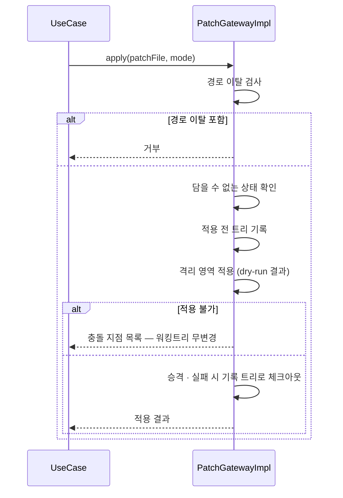
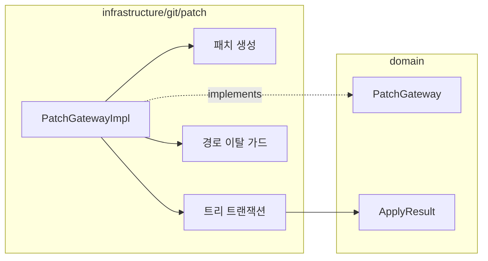

# [UND-60] Patch 생성 · 적용 — 실패 복원을 트리 트랜잭션으로

> wave 7 · 사이즈 M · 의존 UND-05 · 소유 `domain/patch/` · `infrastructure/git/patch/`

## 작업 내용 (설계 의도)

### 왜 이 티켓이 있는가

**UND-31 을 대체한다.** UND-31 은 같은 기능을 구현했으나 패치 적용 실패 시 원상 복구를
**워킹트리 스냅샷을 직접 뜨고 되돌리는 방식**으로 만들었고, 그 복원 경로에서 **6라운드 동안
p0 이 네 번** 나왔다. 라운드마다 지적된 결함을 고쳤고, 고칠 때마다 같은 파일에서 인접한
데이터 유실 경로가 새로 드러났다:

| 라운드 | 드러난 유실 경로 |
|---|---|
| 3 | mode 변경 패치 적용 후 검증 실패 시 실행 권한이 적용 후 상태로 남음 |
| 4 | copy 가 다른 변경과 섞이면 역연산이 source 를 덮어씀 |
| 5 | `a` 삭제 + `a/b` 추가 패치 실패 시 비어 있지 않은 `a` 를 못 지워 원본 `a` 미복구 |
| 6 | 조상 토폴로지 미보존 — `a` 가 symlink 로 바뀐 상태에서 `a/b` 삭제가 **바깥 대상**을 지움 |

**방어적 패치를 쌓아 만들 물건이 아니다.** 원인은 개별 버그가 아니라 접근이다 —
파일 경로 목록을 손으로 스냅샷·복원하면 심볼릭 링크·디렉터리/파일 전환·조상 생성 같은
파일시스템 토폴로지 변화를 전부 사람이 열거해야 하고, 열거는 끝나지 않는다.

UND-31 의 구현은 **머지되지 않았다.** `domain/patch/`·`infrastructure/git/patch/` 는
main 에 존재하지 않으므로, 이 티켓이 패치 기능 **전체를 처음부터** 세운다.
UND-31 의 미머지 작업물은 참고 자료일 뿐 기반이 아니다 — 위 유실 경로가 그 안에 남아 있다.

### 기능 범위 (UND-31 에서 그대로 가져온다)

`PatchGateway` 를 신설한다. 커밋·변경 범위를 patch 파일로 내보내고, 받은 패치를 적용한다.
원격 접근 없이 변경을 주고받는 경로이자, 실험적 변경을 보관하는 수단이다.

**생성**: 커밋 범위 또는 워킹트리/인덱스 변경을 내보낸다. 여러 커밋이면 커밋당 파일 하나와
단일 통합 패치 둘 다 지원한다 — 용도가 다르다.

**적용**: 반드시 **dry-run 을 먼저** 돌린다. 적용 가능 여부와 충돌 지점을 알려준 뒤 실제 적용한다.
절반만 적용된 상태로 실패하면 사용자가 수습할 방법이 없다.

적용 모드를 구분한다:

| 모드 | 동작 |
|---|---|
| 워킹트리에만 | 검토 후 직접 스테이징 |
| 인덱스까지 | 바로 커밋 가능 |
| 커밋까지 생성 | 작성자·메시지를 패치에서 가져옴 |

`3-way` 적용을 기본으로 켠다 — 단순 라인 매칭보다 잘 붙고, 실패해도 충돌 표식으로 남아
UND-23 충돌 에디터가 이어받을 수 있다.

패치는 **신뢰할 수 없는 입력**이다. 경로 이탈(`../`)이 포함된 패치는 거부한다.

### 원자성 — 이 티켓의 핵심 설계

**복원을 파일시스템 조작이 아니라 Git 자료구조 위의 트랜잭션으로 한다.**

- 적용 전 상태를 **트리 객체**로 기록한다. 파일 경로 목록이 아니다 — 트리는 심볼릭 링크·mode·
  디렉터리 구조를 그 자체로 담으므로 열거할 항목이 없다.
- 실패 시 복원은 기록해 둔 트리로의 **체크아웃 한 번**이다. 삭제 순서·조상 정리 같은 개념이
  사라진다.
- 적용은 격리 영역에서 먼저 검증하고, 검증을 통과한 결과만 실제 워킹트리에 반영한다.
  dry-run 은 이 격리 적용의 결과를 보고하는 것이지 별도 API 호출이 아니다.
- 되돌릴 수 없는 상태(추적되지 않은 파일 등)는 트리에 담기지 않으므로, 적용 전에 그 존재를
  확인해 **거부**한다 — 담을 수 없는 것을 담은 척하지 않는다.

> 표준 라이브러리 경로만으로 이 보장이 되는지, 아니면 외부 `git apply --check/--3way` 를 써야 하는지는
> 스펙 단계에서 확인해 고정한다. **외부 프로세스를 쓰기로 하면 미설치 시 동작·정리 정책을 함께 정한다.**

### 계약 축소 — 역방향 적용은 hunk 패치만

역방향 적용(`applyReversed`)은 **순수 hunk 패치만** 지원한다. copy·rename·mode 변경·binary 가
하나라도 섞이면 거부한다. UND-31 의 결정 I1 을 그대로 잇는다 — 그 확장은 별도 티켓이다.

### 이 티켓이 하지 않는 것

- 역방향 적용의 범위 확대 (위 계약 축소 참조).
- 새 빌드 의존성 추가.
- 화면 — Patch 화면은 UND-47 이다.

### 롤백

적용 실패는 기록해 둔 트리로 체크아웃해 되돌린다. 기능 자체에 문제가 생기면
**적용 기능을 비활성화**한다 — UND-31 의 스냅샷 경로로 되돌리는 선택지는 없다
(그 경로에 위 표의 p0 이 그대로 남아 있다).

## 의존

- UND-05

## 다이어그램

### 처리 흐름

### 클래스 의존

## 테스트 케이스

- 커밋 하나를 patch 로 내보내고 다시 적용하면 동일한 변경이 재현된다
- 여러 커밋을 커밋당 파일로 내보낼 수 있다
- 워킹트리 변경을 patch 로 내보낼 수 있다
- 적용 전 dry-run 이 먼저 수행되고, 불가하면 아무것도 적용되지 않는다
- 경로 이탈이 포함된 패치는 거부된다
- 3-way 적용으로 컨텍스트가 조금 다른 패치도 붙는다
- 빈 패치 파일은 변경 없음으로 처리된다
- 적용 실패 시 워킹트리가 부분 적용 상태로 남지 않는다
- **mode 변경 패치가 적용 후 검증에 실패하면 실행 권한이 적용 전 값으로 돌아온다**
- **`a` 삭제 + `a/b` 추가 패치가 실패하면 원본 파일 `a` 가 그대로 복구된다**
- **`a` 가 심볼릭 링크로 바뀐 뒤 실패해도 링크 바깥 대상이 삭제되지 않는다**
- **추적되지 않은 파일이 적용 대상 경로에 있으면 적용을 거부한다**
- 역방향 적용에 copy·rename·mode·binary 가 섞이면 거부한다
