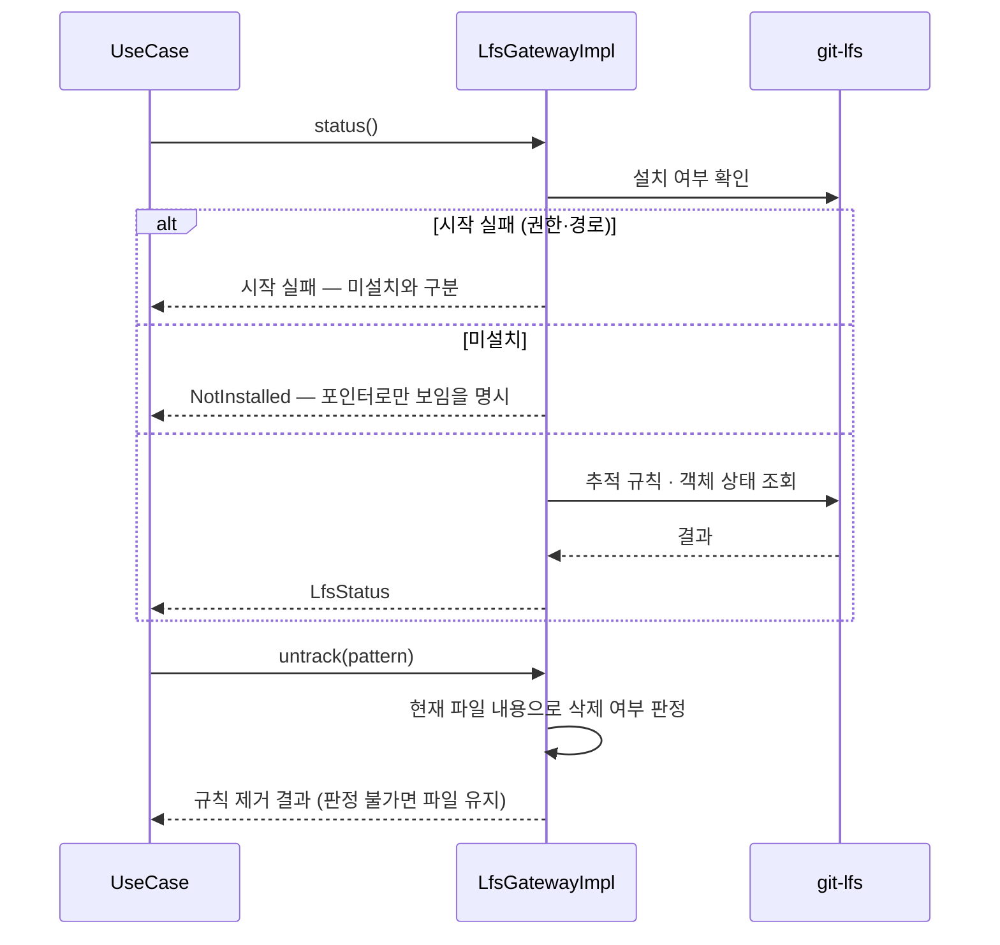
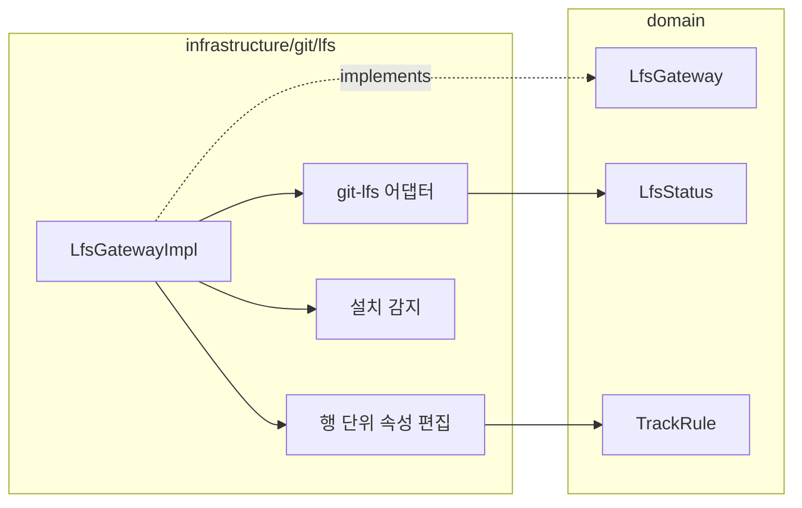

# [UND-61] Git LFS 연동 — 출처를 상태가 아니라 사실로

> wave 7 · 사이즈 M · 의존 UND-08 · 소유 `domain/lfs/` · `infrastructure/git/lfs/`

## 작업 내용 (설계 의도)

### 왜 이 티켓이 있는가

**UND-33 을 대체한다.** UND-33 은 같은 기능을 구현했으나 LFS 추적 규칙을 넣고 빼면서
`.gitattributes` 를 편집하는 경로에서 **"추가의 롤백은 해당 항목 제거" AC 가 6라운드 동안
충족되지 못했다.** 매 라운드 사용자 파일을 지우는 경로가 새로 나왔다:

| 라운드 | 드러난 유실 경로 |
|---|---|
| 3 | 원자 교체 미지원 파일시스템에서 교체 중단 시 기존 사용자 규칙 유실 |
| 4 | 파싱 후 LF 로 재조립해 CRLF·CR·혼합 줄끝이 훼손, 원래 없던 파일이 빈 파일로 잔존 |
| 5 | 빈 내용과 파일 부재를 같게 취급 — 0바이트 파일이 원래 있었으면 **그 파일을 삭제** |
| 6 | `createdAttributesFile` 단일 플래그가 저장소·세션 출처를 구분 못 함 — 저장소 A 에서 만든 뒤 B 로 전환하면 **B 의 사용자 파일을 삭제** |

라운드 6 의 원인이 핵심이다. **"이 파일을 우리가 만들었는가" 를 Gateway 인스턴스의 필드에 기억**하려
했고, 그 기억은 저장소 전환·인스턴스 재생성·사용자의 외부 편집 앞에서 전부 틀린다.
기억한 값과 실제가 어긋나면 **남의 파일을 지운다.**

UND-33 의 구현은 **머지되지 않았다.** `domain/lfs/`·`infrastructure/git/lfs/` 는 main 에
존재하지 않으므로, 이 티켓이 LFS 기능 **전체를 처음부터** 세운다. UND-33 의 미머지 작업물은
참고 자료일 뿐 기반이 아니다.

### 기능 범위 (UND-33 에서 그대로 가져온다)

`LfsGateway` 를 신설한다. 대용량 파일을 포인터로 대체하는 Git LFS 를 다룬다.

**LFS 를 자체 구현하지 않는다.** 프로토콜을 직접 구현하면 서버 구현체마다 어긋난다.
설치된 `git-lfs` 를 호출하는 어댑터로 두고, **미설치 시 그 사실을 명확히 알린다** —
LFS 저장소를 LFS 없이 열면 포인터 텍스트만 보여 사용자가 "파일이 깨졌다" 고 오해한다.

다루는 것:

1. **추적 규칙 조회·추가·제거** (`.gitattributes` 기반)
2. **객체 상태** — 포인터만 있는지, 실제 파일이 받아졌는지
3. **fetch/pull 시 객체 동반 다운로드** — UND-08 원격 작업과 연동
4. **잠금(lock)** — 병합 불가능한 이진 파일의 동시 편집 방지. 서버가 지원할 때만

diff 화면에서 LFS 포인터는 **포인터 내용이 아니라 "LFS 객체" 로 표시**한다.

LFS 대역폭은 유료 한도가 있는 서비스가 많다. 큰 객체를 받기 전에 총 크기를 알리고 확인받는다.

### `.gitattributes` 편집 — 이 티켓의 핵심 설계

**1. 출처를 기억하지 않고, 편집 시점에 사실로 판정한다**

- Gateway 가 `createdAttributesFile` 같은 **가변 필드를 갖지 않는다.** 인스턴스 수명 동안
  유지되는 상태는 저장소 전환·재생성에서 반드시 틀린다.
- 규칙을 제거해 0건이 됐을 때 파일을 지울지는 **그 시점의 파일 내용**으로 정한다 —
  우리가 넣은 규칙 외에 아무 내용(다른 규칙·주석·빈 줄)도 없을 때만 지운다.
  판단이 서지 않으면 **남긴다.** 남는 빈 파일은 되돌릴 수 있고, 지운 사용자 파일은 못 되돌린다.
- **"파일 없음" 과 "파일 있음(내용은 빌 수 있음)" 은 끝까지 별개 값**으로 다룬다.
  `content.isEmpty()` 로 부재를 추론하지 않는다.

**2. 원문 보존 편집**

- 대상 행만 제거하고 나머지 행의 원래 구분자·마지막 개행 유무를 그대로 둔다. 전체 파싱 후
  재조립하지 않는다.
- 추가할 때는 그 파일이 이미 쓰던 구분자를 따른다.

**3. LFS CLI 실행 경계**

- stdout/stderr drain 을 JVM 공용 executor 가 아니라 선언한 `Dispatchers.IO` 경계 안에서 수행하고,
  **기다리기 전에** 비운다 (파이프가 차면 자식이 멈춘다).
- 모든 `IOException` 을 "미설치" 로 뭉개지 않는다 — 실행 권한 거부·잘못된 작업 디렉터리 같은
  시작 실패를 미설치와 구분해 보고한다.
- 취소는 핸들 획득부터 자손 완전 종료까지 덮고, stdin 을 포함한 세 스트림을 모든 종료 경로에서 닫는다.

### 이 티켓이 하지 않는 것

- 이미 변환된 LFS 객체의 마이그레이션 (UND-33 범위 밖 그대로).
- LFS 프로토콜 자체 구현.
- 새 빌드 의존성 추가.

### 롤백

추적 규칙 추가는 `.gitattributes` 항목 제거로 되돌린다 — 이미 변환된 객체는 별도 마이그레이션이 필요하다.
판정이 서지 않으면 파일을 남기는 쪽이 기본값이다.

## 의존

- UND-08

## 다이어그램

### 처리 흐름

### 클래스 의존

## 테스트 케이스

- `git-lfs` 미설치 시 그 사실이 명시적으로 반환된다
- 추적 규칙을 추가하면 `.gitattributes` 에 반영된다
- 포인터만 있고 실제 객체가 없는 파일이 구분되어 보고된다
- 객체 다운로드 전에 총 크기가 보고된다
- 다운로드 진행률이 콜백으로 보고되고 취소할 수 있다
- LFS 추적 파일의 diff 가 포인터 텍스트가 아니라 LFS 객체로 표시된다
- 서버가 잠금을 지원하지 않으면 잠금 기능이 비활성으로 보고된다
- LFS 를 쓰지 않는 저장소는 빈 상태를 반환한다
- **추적 추가 뒤 제거하면 `.gitattributes` 가 추가 전 바이트와 동일하다**
- **CRLF·혼합 줄끝 파일을 편집해도 대상 행 외의 줄끝이 보존된다**
- **원래 존재하던 0바이트 `.gitattributes` 는 규칙 제거 후에도 삭제되지 않는다**
- **저장소 A 에서 파일을 만든 뒤 B 로 전환해 규칙을 제거해도 B 의 사용자 파일이 삭제되지 않는다**
- **우리 규칙 외에 주석·다른 규칙이 남아 있으면 파일을 지우지 않는다**
- **실행 권한 거부로 CLI 시작이 실패하면 미설치와 구분해 보고된다**
