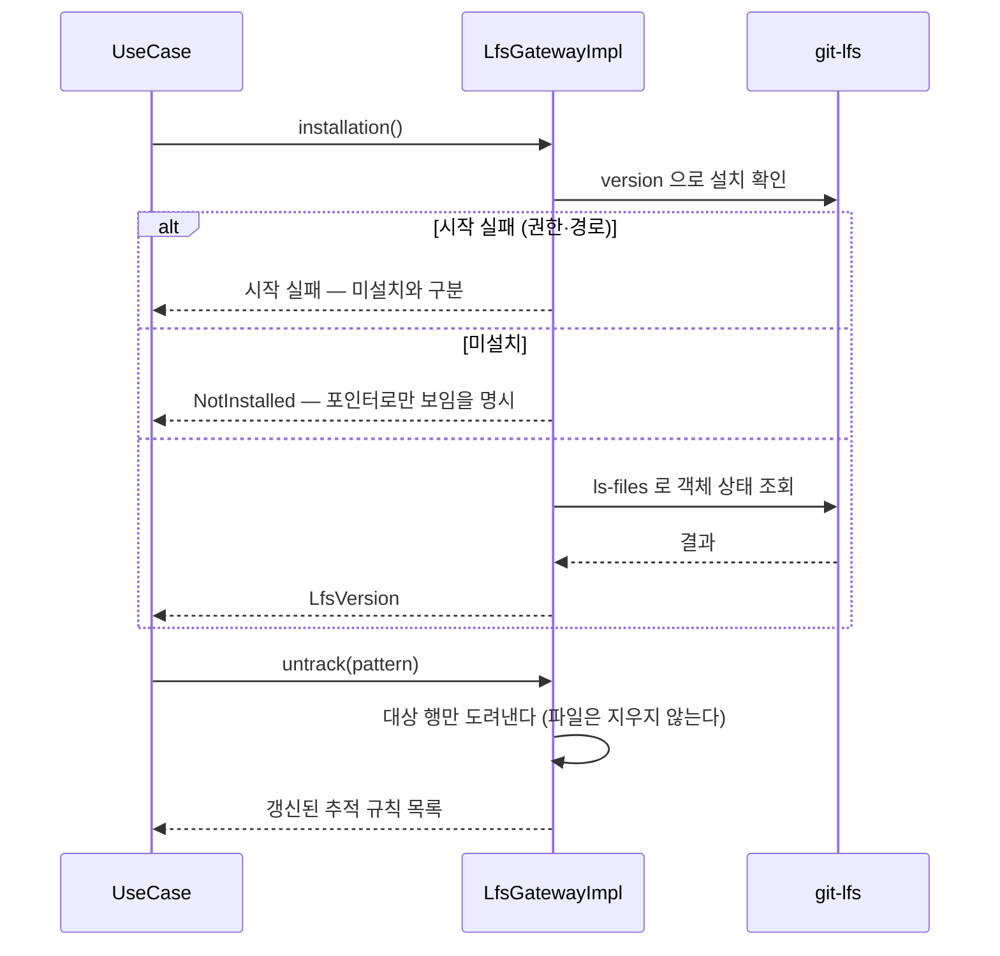
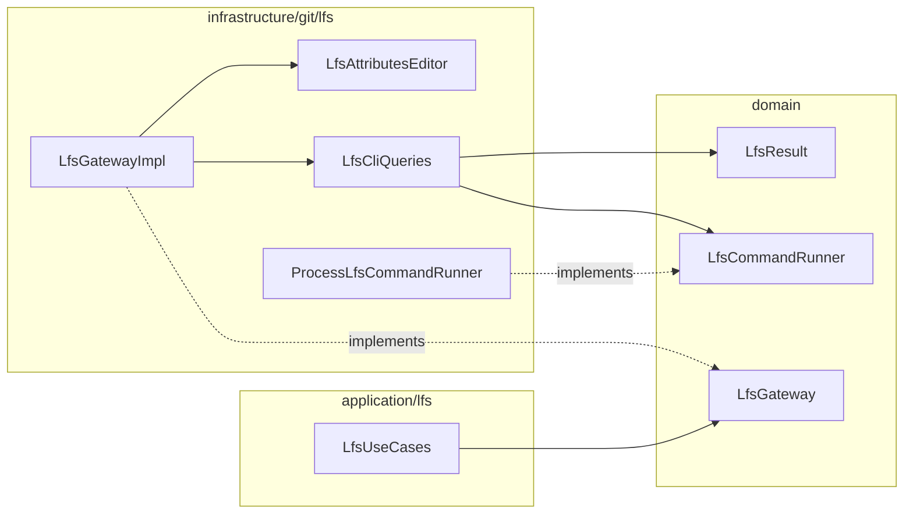

# [UND-61] Git LFS 연동 — 출처를 상태가 아니라 사실로

> wave 7 · 사이즈 M · 의존 UND-08 · 소유 `domain/lfs/` · `application/lfs/` · `infrastructure/git/lfs/` ·
> `di/AppComponent.kt` · `domain/DiffResult.kt` · `infrastructure/git/diff/DiffContent.kt` ·
> `presentation/diff/DiffViewer.kt` · `presentation/i18n/DiffStrings.kt`

## 작업 내용 (설계 의도)

### 왜 이 티켓이 있는가

**UND-33 을 대체한다.** UND-33 은 같은 기능을 구현했으나 LFS 추적 규칙을 넣고 빼면서
`.gitattributes` 를 편집하는 경로에서 **"추가의 롤백은 해당 항목 제거" AC 가 6라운드 동안
충족되지 못했다.** 매 라운드 사용자 파일을 지우는 경로가 새로 나왔다:

| 라운드 | 드러난 유실 경로 |
|---|---|
| 3 | 원자 교체 미지원 파일시스템에서 교체 중단 시 기존 사용자 규칙 유실 |
| 4 | 파싱 후 LF 로 재조립해 CRLF·CR·혼합 줄끝이 훼손, 원래 없던 파일이 빈 파일로 잔존 |
| 5 | 빈 내용과 파일 부재를 같게 취급 — 0바이트 파일이 원래 있었으면 **그 파일을 삭제** |
| 6 | `createdAttributesFile` 단일 플래그가 저장소·세션 출처를 구분 못 함 — 저장소 A 에서 만든 뒤 B 로 전환하면 **B 의 사용자 파일을 삭제** |

라운드 6 의 원인이 핵심이다. **"이 파일을 우리가 만들었는가" 를 Gateway 인스턴스의 필드에 기억**하려
했고, 그 기억은 저장소 전환·인스턴스 재생성·사용자의 외부 편집 앞에서 전부 틀린다.
기억한 값과 실제가 어긋나면 **남의 파일을 지운다.**

UND-33 의 구현은 **머지되지 않았다.** `domain/lfs/`·`infrastructure/git/lfs/` 는 main 에
존재하지 않으므로, 이 티켓이 LFS 기능 **전체를 처음부터** 세운다. UND-33 의 미머지 작업물은
참고 자료일 뿐 기반이 아니다.

### 기능 범위 (UND-33 에서 그대로 가져온다)

`LfsGateway` 를 신설한다. 대용량 파일을 포인터로 대체하는 Git LFS 를 다룬다.

**LFS 를 자체 구현하지 않는다.** 프로토콜을 직접 구현하면 서버 구현체마다 어긋난다.
설치된 `git-lfs` 를 호출하는 어댑터로 두고, **미설치 시 그 사실을 명확히 알린다** —
LFS 저장소를 LFS 없이 열면 포인터 텍스트만 보여 사용자가 "파일이 깨졌다" 고 오해한다.

다루는 것:

1. **추적 규칙 조회·추가·제거** (`.gitattributes` 기반)
2. **객체 상태** — 포인터만 있는지, 실제 파일이 받아졌는지
3. **객체 다운로드** — 총 크기 사전 보고 · 진행 상황 콜백 · 취소를 갖는 **독립 계약**.
   fetch/pull 동반 다운로드는 이 티켓에서 연결하지 않는다 — 원격 경로에 끼우면 실패의 의미가
   원격 실패와 LFS 실패로 갈리는데 그 조합이 설계돼 있지 않다. 후속 통합 티켓이 필요하다.
4. **잠금(lock) 조회** — 서버 지원 여부와 현재 잠금 목록(경로·소유자)만. 서버 상태를 바꾸는
   잠금 생성·해제는 실패 경로가 설계돼 있지 않아 만들지 않는다.

diff 화면에서 LFS 포인터는 **포인터 내용이 아니라 "LFS 객체" 로 표시**한다.

LFS 대역폭은 유료 한도가 있는 서비스가 많다. 큰 객체를 받기 전에 총 크기를 알리고 확인받는다.

### `.gitattributes` 편집 — 이 티켓의 핵심 설계

**1. 출처를 기억하지 않고, 편집 시점에 사실로 판정한다**

- Gateway 가 `createdAttributesFile` 같은 **가변 필드를 갖지 않는다.** 인스턴스 수명 동안
  유지되는 상태는 저장소 전환·재생성에서 반드시 틀린다.
- **`.gitattributes` 를 삭제하지 않는다. 조건은 0개다.** 규칙을 전부 빼 내용이 비어도 0바이트로
  남긴다. 지울지 말지를 가르려면 "이 파일을 우리가 만들었는가" 를 기억해야 하는데 그 기억이
  틀린 것이 라운드 6 이다. 조건을 하나라도 두면 그 조건이 틀리는 경로가 다시 생긴다 —
  **지우지 않으면 유실 경로가 증명적으로 없다.**
- **"파일 없음" 과 "파일 있음(내용은 빌 수 있음)" 은 끝까지 별개 값**으로 다룬다.
  `content.isEmpty()` 로 부재를 추론하지 않는다.

**2. 원문 보존 편집**

- 대상 행만 제거하고 나머지 행의 원래 구분자·마지막 개행 유무를 그대로 둔다. 전체 파싱 후
  재조립하지 않는다.
- 추가할 때는 그 파일이 이미 쓰던 구분자를 따른다.

**3. 쓰기 안전성 — 지키지 못하면 원본을 건드리지 않고 실패한다**

삭제뿐 아니라 **쓰기**에도 유실 경로가 있다. 넷 다 "반쯤 고친 파일" 보다 "아무것도 안 한 파일" 을 택한다.

- **원자 교체.** 같은 디렉터리의 임시 파일에 기록·동기화한 뒤 한 번의 이동으로 교체한다. 원자
  이동이 불가능한 파일시스템이면 덮어쓰기로 물러서지 않고 실패한다 — 그 물러섬이 정확히 사용자
  규칙을 반쯤 날리는 경로다. 실패해도 임시 파일을 남기지 않고, 기존 파일의 권한을 그대로 옮긴다.
- **심볼릭 링크 거부.** 따라가면 저장소 밖 사용자 파일을 고치고, 교체하면 사용자가 만든 링크를
  없앤다. 둘 다 되돌릴 수 없으므로 어느 쪽도 하지 않는다.
- **읽은 뒤 바뀐 파일을 옛 스냅샷으로 덮지 않는다.** 쓰기 직전 내용이 읽은 내용과 다르면 실패한다.
- **저장소 경로 단위로 직렬화한다.** 겹치는 read-modify-write 는 나중 쓰기가 먼저 넣은 규칙을
  삼킨다. 락은 전역 하나가 아니라 **경로마다** 잡고, **경로는 기다리기 전에 확정한다** — 대기를
  사이에 두고 "지금 어느 저장소인가" 를 다시 물으면 깨어났을 때 답이 바뀌어 남의 파일을 고친다.

닫지 못한 창 하나를 남긴다: 내용 비교와 원자 교체 사이에 **비협조적 외부 writer** 가 끼어드는
구간은 JDK 파일 API 로 닫을 수 없다. 닫을 수 없는 것을 닫은 척하지 않고 PR 본문에 명시한다.

**4. 추적 패턴은 정규화하지 않고 거부한다**

공백·탭·CR/LF 가 섞인 입력은 행 구조를 바꿔, 같은 문자열로 제거해도 원상 복구되지 않는다.
조용히 다듬지 말고 거부한다 — 거부는 사용자가 바로 알지만 조용한 변형은 나중에 "왜 안 지워지지"
로 돌아온다. 거부된 입력은 파일을 건드리지 않는다.

**5. LFS 포인터 판정은 선언 한 줄로 하지 않는다**

`version`·`oid sha256:<64자리>`·`size <숫자>` 세 행이 형식에 맞게 모두 있을 때만 포인터다. 선언
한 줄로 판정하면 그 문구를 본문에 담은 평범한 텍스트 파일의 **진짜 diff 가 숨고**, 사용자는 변경을
못 보고 왜 안 보이는지도 모른다. 애매하면 숨기는 쪽이 아니라 보여 주는 쪽으로 틀린다.

**6. LFS CLI 실행 경계**

- stdout/stderr drain 을 JVM 공용 executor 가 아니라 선언한 `Dispatchers.IO` 경계 안에서 수행하고,
  **기다리기 전에** 비운다 (파이프가 차면 자식이 멈춘다).
- 모든 `IOException` 을 "미설치" 로 뭉개지 않는다 — 실행 권한 거부·잘못된 작업 디렉터리 같은
  시작 실패를 미설치와 구분해 보고한다.
- 취소는 핸들 획득부터 자손 완전 종료까지 덮고, stdin 을 포함한 세 스트림을 모든 종료 경로에서 닫는다.

### 이 티켓이 하지 않는 것

- 이미 변환된 LFS 객체의 마이그레이션 (UND-33 범위 밖 그대로).
- LFS 프로토콜 자체 구현.
- 새 빌드 의존성 추가.

### 검증되지 않은 것

이 환경에는 `git-lfs` 가 **설치돼 있지 않다.** 하위 명령 인자(`version`·`ls-files`·`ls-files --size`·
`locks --json`·`fetch`)와 그 출력 형식은 **실제 CLI 로 검증되지 않았다.** 파서는 기대 형식을
정규식·주석으로 명시하고, 어긋나면 관대하게 넘기지 않고 파싱 실패로 보고한다.

## 롤백

추적 규칙 추가는 `.gitattributes` 항목 제거로 되돌린다 — 이미 변환된 객체는 별도 마이그레이션이 필요하다.
파일은 어떤 경우에도 지우지 않는다.

## 의존

- UND-08

## 다이어그램

### 처리 흐름

### 클래스 의존

## 테스트 케이스

- `git-lfs` 미설치 시 그 사실이 명시적으로 반환된다
- 추적 규칙을 추가하면 `.gitattributes` 에 반영된다
- 포인터만 있고 실제 객체가 없는 파일이 구분되어 보고된다
- 객체 다운로드 전에 총 크기가 보고된다
- 다운로드 진행률이 콜백으로 보고되고 취소할 수 있다
- LFS 추적 파일의 diff 가 포인터 텍스트가 아니라 LFS 객체로 표시된다
- 서버가 잠금을 지원하지 않으면 잠금 기능이 비활성으로 보고된다
- LFS 를 쓰지 않는 저장소는 빈 상태를 반환한다
- **원래 있던 `.gitattributes` 는 추적 추가 뒤 제거하면 추가 전 바이트와 동일하고, 원래 없던
  경우에는 0바이트 파일이 남는다** — 제거 시점의 두 파일은 바이트가 같아 출처를 기억하지 않고는
  가를 수 없다. 그래서 지우지 않는 쪽으로 통일한다.
- **CRLF·혼합 줄끝 파일을 편집해도 대상 행 외의 줄끝이 보존된다**
- **원래 존재하던 0바이트 `.gitattributes` 는 규칙 제거 후에도 삭제되지 않는다**
- **저장소 A 에서 파일을 만든 뒤 B 로 전환해 규칙을 제거해도 B 의 사용자 파일이 삭제되지 않는다**
- **우리 규칙 외에 주석·다른 규칙이 남아 있으면 파일을 지우지 않는다**
- **실행 권한 거부·잘못된 작업 디렉터리로 CLI 시작이 실패하면 미설치와 구분해 보고된다**
- **알 수 없는 CLI 출력은 빈 결과가 아니라 파싱 실패로 보고된다**
- **다운로드 크기 조회만으로는 수신이 시작되지 않는다**
- **`.gitattributes` 가 심볼릭 링크면 링크도 그 대상도 건드리지 않고 실패한다**
- **읽은 뒤 파일이 외부에서 바뀌면 덮어쓰지 않고 실패하며, 임시 파일을 남기지 않는다**
- **원자 교체가 지원되지 않으면 원본 바이트가 그대로 남는다**
- **기존 파일의 권한이 교체 뒤에도 유지된다**
- **동시에 track 과 untrack 이 돌아도 두 결과와 사용자의 다른 규칙이 모두 남는다**
- **편집을 기다리는 동안 저장소가 바뀌어도 각 요청은 자기 저장소의 파일만 고친다** — 대기 뒤에
  저장소를 다시 묻는 것이 라운드 6 과 같은 모양이다
- **공백·탭·줄바꿈이 섞인 패턴은 다듬지 않고 거부하며 원본 바이트를 남긴다**
- **`oid`·`size` 형식이 어긋난 포인터 유사 텍스트는 포인터로 판정되지 않고 diff 가 그대로 계산된다**
- **실행 파일 이름 해소와 PATH 탐색이 호출자 스레드가 아니라 IO 경계 안에서 실행된다**
- **크기 조회·다운로드·잠금 조회의 미설치·시작 실패·명령 실패·파싱 실패가 UseCase 를 그대로 통과한다**
