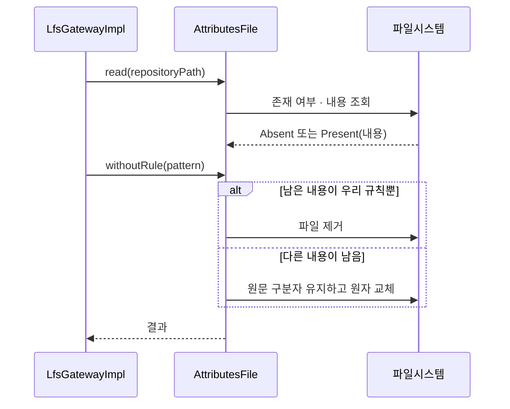
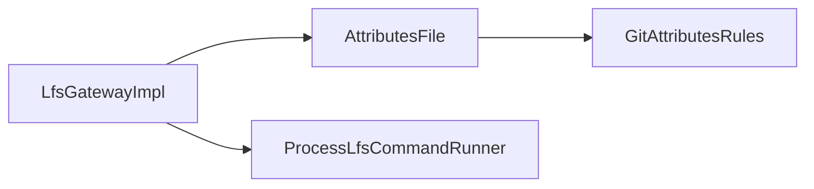

# [UND-61] `.gitattributes` 왕복 편집 — 출처 추적을 상태가 아니라 사실로

> wave 8 · 사이즈 S · 의존 UND-33 · 소유 `infrastructure/git/lfs/AttributesFile.kt` · `GitAttributesRules.kt`

## 작업 내용 (설계 의도)

### 왜 이 티켓이 있는가

UND-33 이 LFS 추적 규칙을 넣고 빼면서 `.gitattributes` 를 편집하는데, **"추가의 롤백은 해당
항목 제거" AC 가 6라운드 동안 충족되지 못했다.** 매 라운드 사용자 파일을 지우는 경로가 새로 나왔다:

| 라운드 | 드러난 유실 경로 |
|---|---|
| 3 | 원자 교체 미지원 파일시스템에서 교체 중단 시 기존 사용자 규칙 유실 |
| 4 | 파싱 후 LF 로 재조립해 CRLF·CR·혼합 줄끝이 훼손, 원래 없던 파일이 빈 파일로 잔존 |
| 5 | 빈 내용과 파일 부재를 같게 취급 — 0바이트 파일이 원래 있었으면 **그 파일을 삭제** |
| 6 | `createdAttributesFile` 단일 플래그가 저장소·세션 출처를 구분 못 함 — 저장소 A 에서 만든 뒤 B 로 전환하면 **B 의 사용자 파일을 삭제** |

라운드 6 의 원인이 핵심이다. **"이 파일을 우리가 만들었는가" 를 Gateway 인스턴스의 필드에 기억**하려
했고, 그 기억은 저장소 전환·인스턴스 재생성·사용자의 외부 편집 앞에서 전부 틀린다.
기억한 값과 실제가 어긋나면 **남의 파일을 지운다.**

### 변경 사항

**1. 출처를 기억하지 않고, 편집 시점에 사실로 판정한다**

- Gateway 가 `createdAttributesFile` 같은 **가변 필드를 갖지 않는다.** 인스턴스 수명 동안
  유지되는 상태는 저장소 전환·재생성에서 반드시 틀린다.
- 규칙을 제거해 0건이 됐을 때 파일을 지울지는 **그 시점의 파일 내용**으로 정한다 —
  우리가 넣은 규칙 외에 아무 내용(다른 규칙·주석·빈 줄)도 없을 때만 지운다.
  판단이 서지 않으면 **남긴다.** 남는 빈 파일은 되돌릴 수 있고, 지운 사용자 파일은 못 되돌린다.
- "파일 없음" 과 "파일 있음(내용은 빌 수 있음)" 은 끝까지 **별개 값**으로 다룬다.
  `content.isEmpty()` 로 부재를 추론하지 않는다.

**2. 원문 보존 편집**

- 대상 행만 제거하고 나머지 행의 원래 구분자·마지막 개행 유무를 그대로 둔다. 전체 파싱 후
  재조립하지 않는다.
- 추가할 때는 그 파일이 이미 쓰던 구분자를 따른다.

**3. LFS CLI 실행 경계 정리 (UND-33 잔여 p1·p2)**

- stdout/stderr drain 을 JVM 공용 executor 가 아니라 선언한 `Dispatchers.IO` 경계 안에서 수행한다.
- 모든 `IOException` 을 "미설치" 로 뭉개지 않는다 — 실행 권한 거부·잘못된 작업 디렉터리 같은
  시작 실패를 미설치와 구분해 보고한다.

### 이 티켓이 하지 않는 것

- 이미 변환된 LFS 객체의 마이그레이션 (UND-33 범위 밖 그대로).
- `.gitattributes` 의 LFS 외 속성 해석.

### 롤백

편집 로직 교체다. 되돌리면 위 표의 유실 경로가 되살아나므로, 되돌리는 대신 추적 규칙
추가·제거 기능을 비활성화하는 편이 안전하다.

## 의존

- UND-33

## 다이어그램

### 처리 흐름

### 클래스 의존

## 테스트 케이스

- 원래 없던 저장소에 규칙을 추가했다가 제거하면 `.gitattributes` 가 남지 않는다
- 원래 0바이트 `.gitattributes` 가 있던 저장소에서 규칙을 추가했다가 제거해도 그 파일이 남는다
- 사용자 규칙이 있는 파일에서 LFS 규칙만 제거하면 사용자 규칙과 그 줄끝이 그대로 보존된다
- CRLF 파일에 규칙을 추가하면 추가된 행도 CRLF 를 쓰고 기존 행은 변하지 않는다
- 저장소 A 에서 규칙을 추가한 Gateway 로 저장소 B 의 규칙을 제거해도 B 의 `.gitattributes` 를 지우지 않는다
- Gateway 를 새로 만들어 제거해도 판정이 같다 (인스턴스 상태에 의존하지 않는다)
- LFS CLI 실행 권한이 없으면 미설치가 아니라 시작 실패로 구분해 보고한다
- 취소 시 자식 프로세스 종료 요청이 선언한 IO 경계 안에서 실행된다
