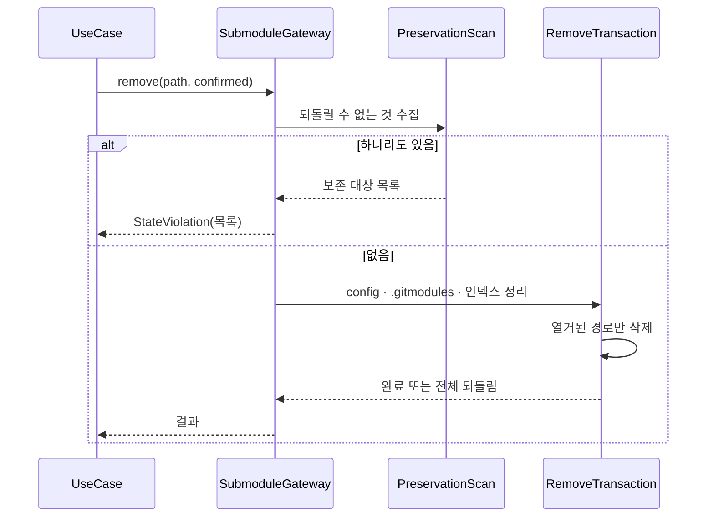
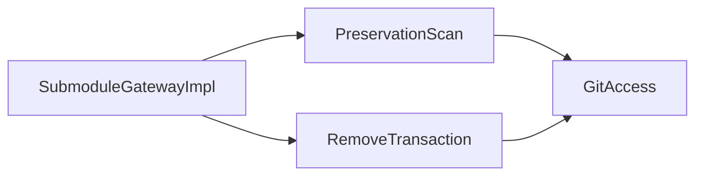

# [UND-62] 서브모듈 제거 — 파괴적 정리를 설계부터 다시 잡는다

> wave 8 · 사이즈 M · 의존 UND-32 · 소유 `domain/submodule/SubmoduleGateway.kt`(제거 계약 재도입) · `infrastructure/git/submodule/` 의 제거 경로

## 작업 내용 (설계 의도)

### 왜 이 티켓이 있는가

UND-32 의 조회·초기화·업데이트·추가는 수렴했지만 **`remove` 하나가 8라운드 동안 p0 을 계속
만들었다.** 라운드마다 지적된 결함을 고쳤고, 고칠 때마다 같은 경로에서 새 데이터 유실 경로가 드러났다:

| 라운드 | 드러난 유실 경로 |
|---|---|
| 4 | 중첩 서브모듈 변경을 `IgnoreSubmoduleMode.ALL` 로 가려 clean 판정 → 중첩 미커밋 데이터 삭제 |
| 5 | `getSubmoduleRepository()` 의 null 을 "깨끗함" 으로 읽음 → 판정 불가 상태를 삭제 |
| 6 | `.gitmodules` subsection 이름의 `..`·절대 경로 → `.git/modules` **밖** 삭제 |
| 7 | `config.save()` 실패 뒤에도 파일 정리 계속 → 설정과 파일시스템이 갈라짐 |
| 8 | `Status.isClean` 이 ignored 파일을 깨끗한 것으로 통과 → 사용자의 ignored 파일 삭제 |

**공통 원인은 하나다.** "지울 수 있는가" 를 **여러 개의 개별 검사**로 판단하고, 하나라도 빠지면
바로 재귀 삭제가 실행된다. 검사 목록은 계속 늘어나고, 빠진 하나가 곧 데이터 유실이다.

### 변경 사항

**판단을 "검사 목록" 이 아니라 "보존해야 할 것의 목록" 으로 뒤집는다.**

- 제거 전에 대상 경로 아래에서 **저장소가 되돌려줄 수 없는 것**을 전부 수집한다 —
  미커밋 수정 · 추적되지 않은 파일 · **ignored 파일** · 중첩 서브모듈의 같은 것들 ·
  판정 불가 경로. 하나라도 있으면 목록과 함께 거부한다.
- 검사를 통과한 뒤에만 삭제하며, 삭제 대상은 **수집 단계가 열거한 경로**로 한정한다.
  "그 아래 전부" 라는 재귀 삭제를 쓰지 않는다.
- 경로는 정규화해 기준 디렉터리 안인지 확인한다 — `.gitmodules` 는 clone 해 온 신뢰할 수 없는
  입력이다.
- 전체를 **보상 트랜잭션**으로 감싸고, 되돌릴 수 없는 단계(삭제)는 되돌릴 수 있는 단계
  (config·`.gitmodules`·인덱스) 뒤에 둔다.

### 계약 재도입

UND-32 가 `SubmoduleGateway` 에서 `remove` 를 **뺀 상태**로 끝났다. 이 티켓이 그 메서드를
`domain/submodule/SubmoduleGateway.kt` 에 다시 넣는다 — 계약과 구현이 같은 티켓 소유다.
UND-32 는 닫혀 있으므로 동시 작성자가 없다.

### 이 티켓이 하지 않는 것

- 조회·초기화·업데이트·추가 — UND-32 가 이미 한다.
- 검사와 실행 사이 **외부 프로세스**의 동시 변경 방어 (UND-34 와 같은 명시적 비목표).

### 롤백

`remove` 를 노출하지 않는 상태(UND-32 종료 시점)로 되돌릴 수 있다. 기능이 없어질 뿐 데이터는 안전하다.

## 의존

- UND-32

## 다이어그램

### 처리 흐름

### 클래스 의존

## 테스트 케이스

- 깨끗한 서브모듈은 `confirmed` 뒤 제거되고 `.gitmodules`·`.git/config`·워킹트리에 잔재가 없다
- 미커밋 수정이 있으면 `confirmed` 와 무관하게 거부하고 무엇 때문인지 알린다
- **ignored 파일만 있어도 거부한다** — `Status.isClean` 이 참이어도 사용자 데이터다
- 추적되지 않은 파일이 있으면 거부한다
- 중첩 서브모듈에 미커밋 수정이 있으면 최상위 제거를 거부한다
- 대상 경로에 있는 것이 유효한 저장소로 열리지 않으면 판정 불가로 거부한다
- `.gitmodules` 의 subsection 이름이 `..`·절대 경로·심볼릭 링크로 기준 디렉터리를 벗어나면 거부하고, 밖의 sentinel 파일이 살아남는다
- 삭제 단계 앞의 어느 단계에서 실패하든 config·`.gitmodules`·인덱스가 호출 전 상태로 돌아온다
- 열거되지 않은 경로는 삭제되지 않는다
