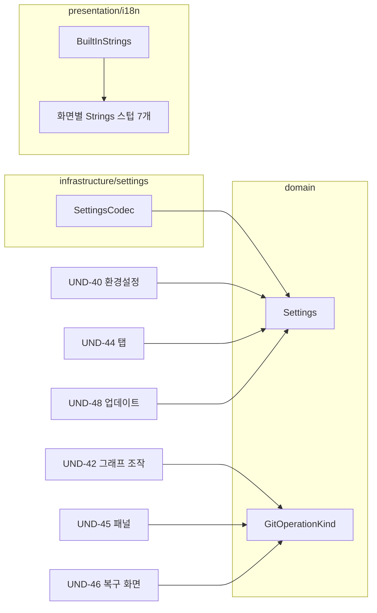

# [UND-63] wave 8 공통 계약 확장

> wave 8 · 사이즈 M · 의존 UND-38 · UND-49 · UND-59 · 소유 `domain/Settings.kt` · `infrastructure/settings/SettingsCodec.kt` · `domain/undo/GitOperationKind.kt` · `presentation/i18n/`

## 작업 내용 (설계 의도)

### 왜 이 티켓이 있는가

wave 8 화면 티켓 7건의 스펙을 돌렸더니 **6건이 같은 질문을 올렸다** — "이 화면을 만들려면
다른 티켓 소유 파일을 고쳐야 한다". 조사해 보니 요구가 겹치는 파일이 정확히 셋이다:

| 공통 파일 | 필요한 티켓 | 무엇이 필요한가 |
|---|---|---|
| `presentation/i18n/BuiltInStrings.kt` | UND-40·41·42·43·44·45·46 (7건) | `builtInTranslations` 목록에 자기 네임스페이스 한 줄 |
| `domain/Settings.kt` · `infrastructure/settings/SettingsCodec.kt` | UND-40·44·48 (3건) | 환경설정 · 탭 세션 · 업데이트 확인 주기 필드 |
| `domain/undo/GitOperationKind.kt` | UND-42·45·46 (3건) | 그래프 조작 · 서브모듈/worktree · 복구 연산 종류 |

같은 wave 의 세 티켓이 `Settings.kt` 를 각자 확장하면 머지 충돌이 난다 (Rule 3 파일 소유).
**연관된 병목은 하나의 선행 티켓으로 묶는다** — wave 7 에서 UND-59 가 한 역할을 wave 8 에서 이 티켓이 한다.

### 변경 사항

**1. 설정 스키마 확장**

`Settings` 에 wave 8 소비자 세 곳이 쓸 필드를 한 번에 추가하고 `SettingsCodec` 의 스키마 버전을 올린다.

- **환경설정**(UND-40) — 언어 선택, 시작 시 마지막 저장소 열기 여부, 확인 대화상자 표시 여부.
- **탭 세션**(UND-44) — 열린 저장소 탭 목록과 활성 탭. 경로가 사라진 탭도 항목으로 남는다
  (조용히 버리지 않는다는 UND-44 요구).
- **자동 업데이트**(UND-48) — 확인 주기와 자동 확인 on/off.

각 필드는 **기본값이 있는 선택 필드**로 넣는다 — 기존 설정 파일을 그대로 읽을 수 있어야 한다.
상위 스키마 파일을 만났을 때의 처리는 이미 있는 `NewerSchemaBackup` 경로를 따른다.

**정확한 필드 모양은 스펙 단계가 각 소비자 티켓의 요구에서 확정한다.** 여기서는 세 소비자의
요구를 한 파일 안에서 동시에 만족시키는 것이 책임이다 — 필드를 발명하는 것이 아니다.

**2. Undo 연산 종류 확장**

`GitOperationKind` 는 현재 커밋·체크아웃·병합 등 **커밋 그래프 연산만** 표현한다.
wave 8 이 기록할 연산이 빠져 있다 — 그래프 드래그 조작(브랜치 ref 이동·태그 이동),
서브모듈 초기화·업데이트, worktree 추가·제거, reflog 복구, bisect 세션.

- 되돌릴 수 있는지 여부는 이 enum 이 판단하지 않는다 — 기존 주석대로 판단 근거는 `UndoStrategy` 다.
  **여기에는 사용자에게 보여줄 이름만 둔다.**
- 되돌릴 수 없는 연산(worktree 제거 등)도 종류로는 기록한다 — 되돌릴 수 없다는 사실을
  사용자에게 말하려면 이름이 있어야 한다.

**3. i18n 네임스페이스 자리 확보**

`BuiltInStrings.kt` 의 `builtInTranslations` 목록은 화면 티켓마다 **한 줄씩 추가**하는 구조라
7건이 같은 wave 에서 이 파일을 동시에 고치게 된다.

- 이 티켓이 wave 8 화면 7건의 `XxxStrings.kt` 를 **빈 네임스페이스로 미리 만들고**
  `builtInTranslations` 에 한 번에 등록한다.
- 각 화면 티켓은 그 뒤 **자기 파일 안에만** 키와 번역을 채운다 — 공통 파일을 건드리지 않는다.
- 스텁은 기존 파일들과 같은 모양을 따른다 (네임스페이스 object + 로케일별 맵 + `Strings.xxx` 접근자).
  빈 맵이어도 카탈로그 병합과 폴백이 깨지지 않아야 한다.

### 이 티켓이 하지 않는 것

- **화면·UseCase 를 만들지 않는다.** 각 화면과 그 `application/<도메인>/` UseCase 는
  해당 화면 티켓이 소유한다 — 새 패키지라 서로 충돌하지 않는다.
- 문자열 **내용**을 채우지 않는다 (자리만 만든다).
- DI 배선 — UND-51 소관이다.

### 롤백

설정 스키마는 선택 필드 추가라 구 버전 앱이 새 파일을 읽어도 필드를 무시한다.
문제가 생기면 스키마 버전을 되돌리고 추가 필드를 제거한다 — 사용자 데이터 유실은 없다.

## 의존

- UND-38 (`GitOperationKind` 원본)
- UND-49 (i18n 문자열 리소스 기반)
- UND-59 (`Settings`·`SettingsGateway` 원본)

## 다이어그램

### 클래스 의존

## 테스트 케이스

- 새 필드가 없는 기존 설정 파일을 읽으면 기본값으로 채워진다
- 새 필드를 쓴 뒤 다시 읽으면 같은 값이 복원된다
- 상위 스키마 버전 파일을 만나면 기존 `NewerSchemaBackup` 경로로 처리된다
- 경로가 사라진 탭 항목도 설정에서 사라지지 않고 그대로 복원된다
- 새로 추가한 연산 종류가 사용자에게 보여줄 이름을 갖는다
- 되돌릴 수 없는 연산도 종류로 기록된다
- 빈 네임스페이스 스텁 7개를 등록해도 카탈로그 병합이 성공하고 기존 키 조회가 그대로 동작한다
- 등록된 스텁 네임스페이스의 키를 조회하면 기본 로케일 폴백 규칙을 따른다
