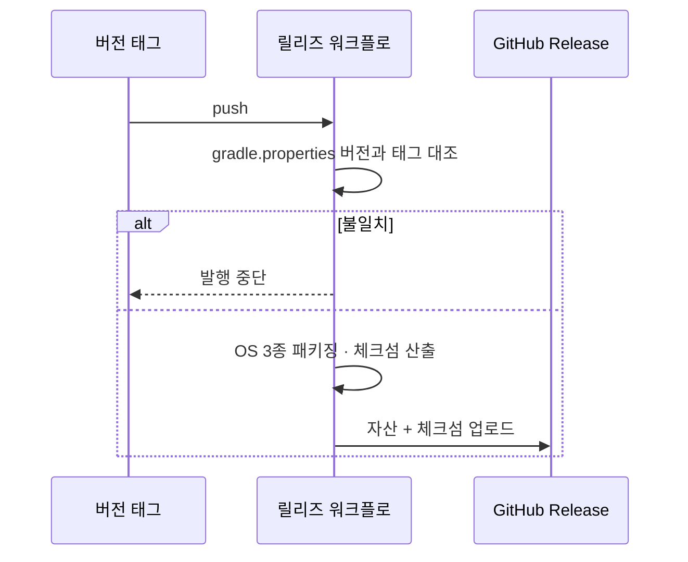

# [UND-64] 릴리즈 발행 파이프라인 — 자동 업데이트가 조회할 대상을 만든다

> wave 8 · 사이즈 S · 의존 UND-25 · 소유 `.github/workflows/` (릴리즈 워크플로) · `packaging/`(체크섬 산출)

## 작업 내용 (설계 의도)

### 왜 이 티켓이 있는가

UND-48(자동 업데이트) 스펙이 "무엇을 조회하는가" 를 답할 수 없다고 올렸고, 확인 결과 사실이다:

- `.github/workflows/` 에 `ci.yml` 하나뿐이고 **릴리즈 자산 업로드·체크섬 발행이 레포 어디에도 없다**.
- UND-25 는 로컬 `dmg`·`msi`·`deb` 산출물만 만든다.
- `/custom-release-tagger` 는 **태그**를 만들 뿐, 자산이 붙은 GitHub Release 를 만들지 않는다.

UND-48 본문의 "GitHub Releases 를 조회한다 — UND-25 가 만든 산출물이 태그에 붙어 있다" 는
**전제가 틀렸다.** 조회할 대상이 없는 채로 업데이트 확인·무결성 검증·설치를 구현하면
UND-31·33 과 같아진다 — 없는 기반 위에 짓는 것이다.

이 티켓이 **UND-48 이 소비할 계약**을 만든다.

### 변경 사항

**1. 태그 push 시 릴리즈를 발행한다**

- 버전 태그가 올라오면 OS 3종 산출물을 빌드하고 GitHub Release 에 자산으로 올린다.
- 버전은 `gradle.properties` 한 곳에서 읽는다 — UND-25 가 세운 규칙 그대로다.
  태그와 어긋나면 **발행을 중단**한다. 어긋난 채 올리면 업데이트가 잘못된 버전을 설치한다.

**2. 무결성 메타데이터를 함께 발행한다**

- 자산마다 체크섬을 산출해 릴리즈에 올린다. 검증 없는 자동 업데이트는 공급망 공격 표면이다.
- **자산 이름 규칙을 고정한다** — 클라이언트가 자기 OS 의 자산을 고를 수 있어야 한다.
  규칙이 흔들리면 업데이트가 조용히 아무것도 못 찾는다.

**3. 발행 계약을 문서로 남긴다**

UND-48 이 코드로 읽을 대상이므로 **자산 이름 규칙·체크섬 형식·릴리즈 조회 좌표**를
문서에 고정한다. 구현자가 릴리즈 페이지를 눈으로 보고 추측하지 않게 한다.

### 이 티켓이 하지 않는다

- **앱 쪽 업데이트 확인·다운로드·설치** — UND-48 이다.
- 코드 서명·공증 — UND-25 가 이미 범위 밖으로 선언했다. 이 티켓이 되살리지 않는다.
- 실행 중인 설치본 교체 방식 — UND-48 이 이 티켓의 발행 형식을 보고 정한다.

### 롤백

릴리즈 워크플로는 태그 push 에만 걸린다. 문제가 생기면 워크플로를 비활성화하고
잘못 발행된 릴리즈를 내린다 — 사용자 데이터에 영향이 없다.

## 의존

- UND-25

## 다이어그램

### 처리 흐름

## 테스트 케이스

- 태그와 `gradle.properties` 버전이 다르면 발행이 중단된다
- 발행된 릴리즈에 OS 3종 자산이 모두 붙는다
- 자산마다 체크섬이 함께 발행되고 실제 파일과 일치한다
- 자산 이름이 고정 규칙을 따라 OS 별로 구분된다
- 같은 태그로 다시 실행해도 릴리즈가 중복 생성되지 않는다
- 패키징이 실패하면 릴리즈가 만들어지지 않는다 (부분 발행 없음)
