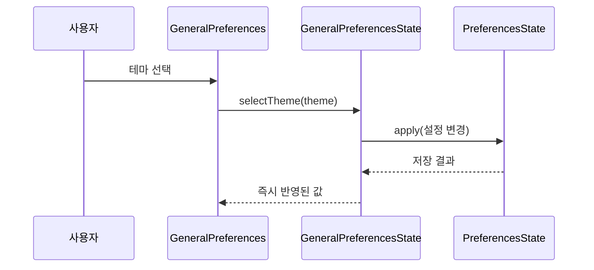
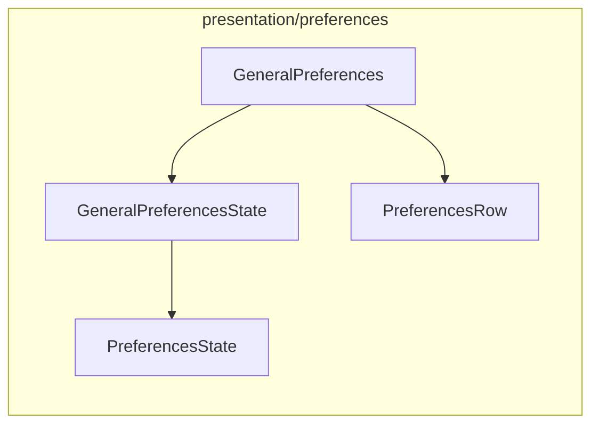

# [UND-65] 설정 — 일반 탭

> wave 8 · 사이즈 S · 의존 UND-40 · UND-74 · UND-11 · 소유 `presentation/preferences/GeneralPreferences.kt` · `presentation/preferences/GeneralPreferencesState.kt`

## 작업 내용 (설계 의도)

일반 탭의 항목을 UND-40 의 공통 설정 행 계약으로 조립한다.

| 항목 | 값 |
|---|---|
| 테마 | 라이트 · 다크 · 시스템 |
| 언어 | BCP 47 태그. `null` 은 시스템 로케일 |
| 시작 시 마지막 저장소 열기 | 켬 · 끔 |

**테마는 바꾸는 즉시 앱 전체가 전환된다** — 재시작을 요구하지 않는다. 언어도 같다.
언어 목록은 UND-49 가 가진 카탈로그에서 얻고, 목록에 없는 태그가 저장돼 있으면 시스템 로케일로
표시하되 저장값은 지우지 않는다 (사용자가 나중에 그 로케일을 추가할 수 있다).

**범위 밖**: 탭 셸 · 공통 행 · 문자열 키 (UND-40).

## 다이어그램

### 처리 흐름

### 클래스 의존

## 테스트 케이스

- 테마를 다크로 바꾸면 즉시 저장되고 앱 테마가 전환된다
- 언어를 바꾸면 표시 문자열이 그 로케일로 즉시 바뀐다
- 카탈로그에 없는 언어 태그가 저장돼 있으면 시스템 로케일로 표시하되 저장값은 유지된다
- 마지막 저장소 열기를 끄면 다음 시작에서 저장소를 열지 않는다
- 항목별 기본값 복원이 그 항목만 기본값으로 되돌린다
