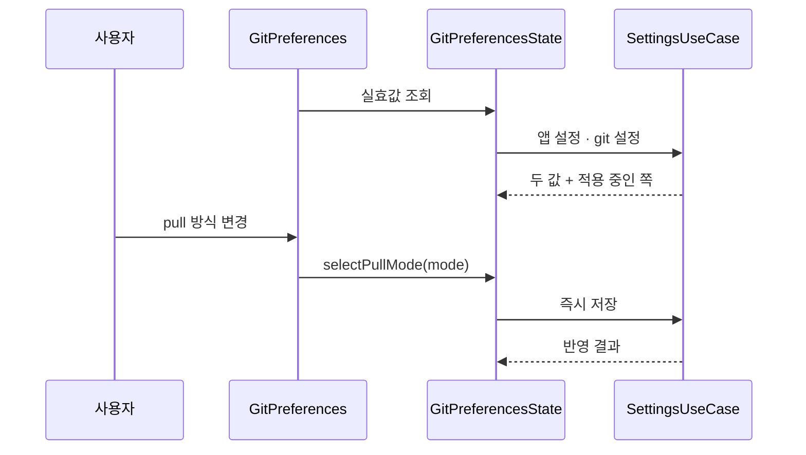
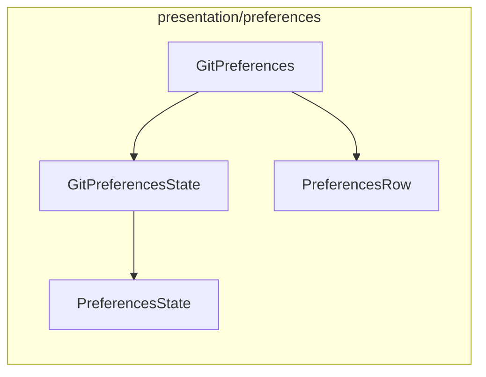

# [UND-66] 설정 — Git 탭

> wave 8 · 사이즈 S · 의존 UND-40 · UND-74 · UND-11 · UND-36 · 소유 `presentation/preferences/GitPreferences.kt` · `presentation/preferences/GitPreferencesState.kt`

## 작업 내용 (설계 의도)

Git 동작 기본값을 다루는 탭이다.

| 항목 | 값 |
|---|---|
| 기본 브랜치명 | 새 저장소·클론 시 쓸 이름 |
| pull 방식 | merge · rebase |
| fetch 주기 | 끔 · N 분 |
| 커밋 서명 활성화 | 켬 · 끔 (UND-36) |

**실효값 출처 표시는 후속 티켓이다 (UND-75).** 저장소의 git 설정(`init.defaultBranch`·`pull.rebase`)을
읽는 계약이 아직 없다. 이 탭은 **앱 설정값의 편집·표시까지만** 하고, git 설정이 이기는 항목의 실효값·
출처는 그 계약이 선 뒤에 붙인다.
> **이 wave 에서는 범위 밖이다.** 해당 계약이 아직 없어 탭 티켓이 만들면 소유 밖으로 나간다 — 후속 티켓이 계약을 세운 뒤 이 화면에 붙인다.

커밋 서명은 켜기만 하고 서명 키가 없으면 **켜지지 않는다** — 키가 없다는 사실과 어디서 설정하는지를
같이 알린다.

**범위 밖**: 탭 셸 · 공통 행 · 문자열 키 (UND-40). 서명 키 관리 자체 (UND-36).

## 다이어그램

### 처리 흐름

### 클래스 의존

## 테스트 케이스

- pull 방식을 rebase 로 바꾸면 즉시 저장된다
- 서명 키가 없는 상태에서 커밋 서명을 켜면 켜지지 않고 사유가 표시된다
- fetch 주기를 끔으로 두면 주기 값 입력이 비활성화된다
- 기본 브랜치명을 빈 문자열로 두면 저장하지 않고 입력 오류를 표시한다
