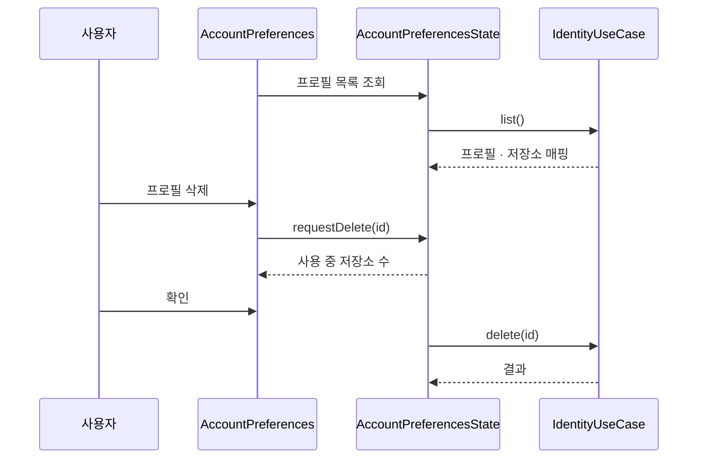
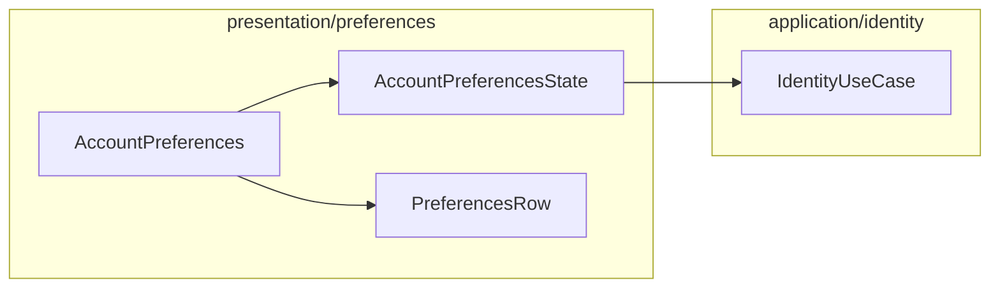

# [UND-67] 설정 — 계정 탭 (identity 프로필)

> wave 8 · 사이즈 M · 의존 UND-40 · UND-37 · 소유 `presentation/preferences/AccountPreferences.kt` · `presentation/preferences/AccountPreferencesState.kt`

## 작업 내용 (설계 의도)

UND-37 이 만든 identity 프로필을 사용자가 관리하는 탭이다.

- 프로필 목록 — 이름 · 이메일 · 서명 키
- 추가 · 수정 · 삭제
- **저장소별 매핑** — 현재 저장소에 어느 프로필을 쓸지 지정하거나 해제한다

**삭제는 매핑을 먼저 보여준다.** 그 프로필을 쓰는 저장소가 있으면 몇 개인지 알리고, 삭제하면 그
저장소들이 어떤 identity 를 쓰게 되는지(전역 git 설정) 함께 알린 뒤 확인받는다 — 조용히 지우면
사용자가 다음 커밋에서 엉뚱한 이름으로 커밋한다.

이 탭은 UseCase 만 호출한다. identity 검증·저장 규칙은 UND-37 의 계약을 그대로 쓰고 새로 만들지 않는다.

**범위 밖**: 탭 셸 · 공통 행 · 문자열 키 (UND-40). identity 계약·저장 (UND-37).

**롤백**: 프로필 삭제는 되돌릴 수 없다 — 확인 게이트가 롤백을 대신한다.

## 다이어그램

### 처리 흐름

### 클래스 의존

## 테스트 케이스

- 프로필을 추가하면 목록에 즉시 나타나고 저장된다
- 현재 저장소에 프로필을 매핑하면 다음 커밋의 author 가 그 프로필이 된다
- 사용 중인 프로필을 삭제하려 하면 사용 저장소 수와 삭제 후 적용될 identity 가 표시된다
- 확인 전에는 삭제되지 않는다
- 매핑을 해제하면 전역 git 설정으로 돌아간다
- 이메일 형식이 잘못되면 저장하지 않고 입력 오류를 표시한다
