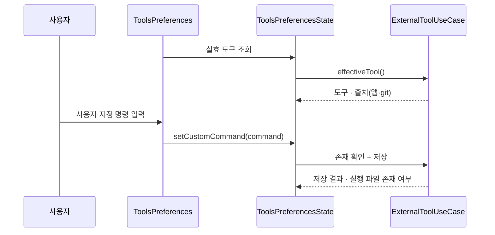
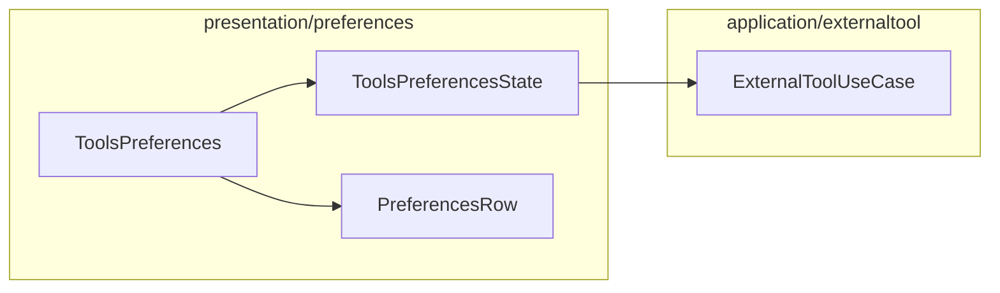

# [UND-68] 설정 — 도구 탭 (외부 diff/merge · 표시)

> wave 8 · 사이즈 S · 의존 UND-40 · UND-74 · UND-39 · 소유 `presentation/preferences/ToolsPreferences.kt` · `presentation/preferences/ToolsPreferencesState.kt`

## 작업 내용 (설계 의도)

| 항목 | 값 |
|---|---|
| 외부 diff 도구 | UND-39 가 아는 도구 목록 · 사용자 지정 명령 |
| 외부 merge 도구 | 위와 같음 |
| 탭 폭 | 정수 |
| 고정폭 서체 | 서체 이름 입력. **설치된 서체 목록 제시는 후속 티켓(UND-77)** — 열거 계약이 없다 |

**실효값 출처 표시가 이 탭의 핵심이다.** 외부 도구는 저장소의 git 설정이 앱 설정을 이긴다 —
지금 실제로 무엇이 실행되는지, 그 값이 어디서 왔는지 보여준다.

**사용자 지정 명령은 검증한 뒤 저장한다** — 실행 파일이 존재하지 않으면 저장은 하되 "찾을 수 없음" 을
표시한다. 저장 자체를 막으면 아직 설치 전인 도구를 미리 설정할 수 없다.

**범위 밖**: 탭 셸 · 공통 행 · 문자열 키 (UND-40). 도구 실행·인자 조립 (UND-39).

## 다이어그램

### 처리 흐름

### 클래스 의존

## 테스트 케이스

- 외부 diff 도구를 고르면 즉시 저장되고 실효값이 갱신된다
- git 설정이 도구를 지정하고 있으면 실효값 출처가 "git 설정" 으로 표시된다
- 존재하지 않는 실행 파일을 지정하면 저장은 되지만 "찾을 수 없음" 이 표시된다
- 탭 폭에 0 이하를 넣으면 저장하지 않고 입력 오류를 표시한다
