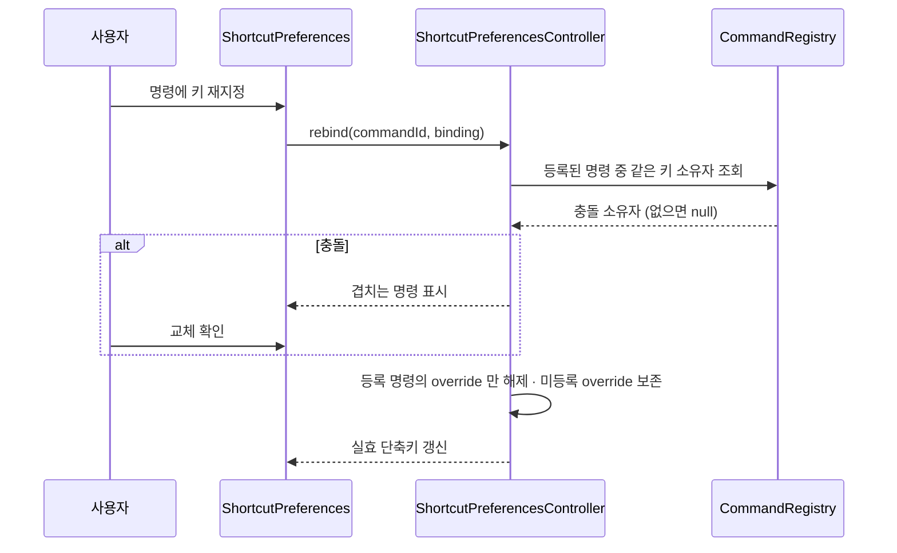
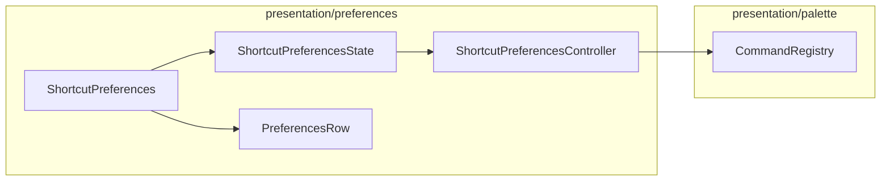

# [UND-69] 설정 — 단축키 탭 (재지정 · 충돌 해소)

> wave 8 · 사이즈 M · 의존 UND-40 · UND-22 · UND-63 · 소유 `presentation/preferences/ShortcutPreferences.kt` · `presentation/preferences/ShortcutPreferencesState.kt` · `presentation/preferences/ShortcutPreferencesController.kt`

## 작업 내용 (설계 의도)

UND-22 커맨드 레지스트리의 명령별 단축키를 사용자가 다시 지정하는 탭이다.
저장 형식은 UND-63 이 선행 제공한 설정 스키마의 단축키 오버라이드를 쓴다.

- 명령 목록과 **현재 실효 단축키**(기본값인지 오버라이드인지 함께)
- 재지정 · 해제(단축키 없음) · 항목별 기본값 복원
- 충돌하면 **어느 명령과 겹치는지 보여주고 교체할지 묻는다**

### 오버라이드 삭제 규칙 (이 티켓의 핵심)

1차 구현이 여기서 **데이터를 잃었다.** 재지정할 때 "같은 키를 쓰는 저장 오버라이드" 를 전부 지웠는데,
그중에는 **지금 레지스트리에 등록되지 않은 명령**(조건부 등록·아직 배선 전)의 오버라이드가 섞여 있었다.
그 명령이 나중에 등록되면 사용자가 지정했던 키가 사라진 뒤다.

따라서:

- 충돌 판정과 해제는 **레지스트리에 실제로 등록된 명령**만 대상으로 한다.
- 등록되지 않은 명령 id 의 저장 오버라이드는 **키가 같아도 보존한다.**
- 상대가 기본 단축키로 그 키를 쓰는 경우, 교체는 **대상이 그 키를 갖는다는 사실이 영속**돼야 한다 —
  기존 오버라이드가 먼저 적용돼 대상이 무단축키가 되거나 등록 순서로 결과가 달라지면 안 된다.
- 해제(`null`)도 같은 규칙을 따른다.

**범위 밖**: 탭 셸 · 공통 행 · 문자열 키 (UND-40). 명령 등록·팔레트 (UND-22 · UND-51).

**롤백**: 항목별 기본값 복원과 전체 초기화가 롤백 경로다.

## 다이어그램

### 처리 흐름

### 클래스 의존

## 테스트 케이스

- 충돌하지 않는 키로 재지정하면 즉시 저장되고 실효 단축키가 바뀐다
- 이미 쓰는 키를 지정하면 겹치는 명령이 표시되고 확인 전에는 바뀌지 않는다
- 교체를 확인하면 대상이 그 키를 갖고, 상대는 자기 기본값으로 돌아간다
- **미등록 명령이 같은 키의 오버라이드를 갖고 있어도 그 저장값은 삭제되지 않는다**
- 상대가 기본 단축키로 그 키를 쓰는 경우에도 재시작 후 대상이 그 키를 갖는다
- 해제하면 그 명령은 단축키 없음이 되고, 다른 명령의 오버라이드는 영향받지 않는다
- 항목별 기본값 복원이 그 명령만 기본 단축키로 되돌린다
