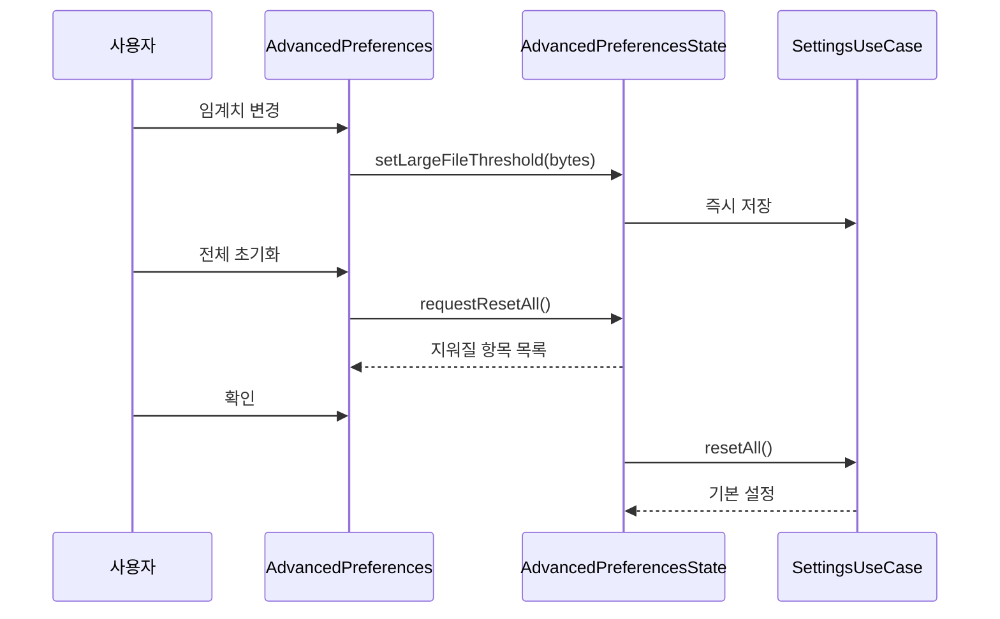
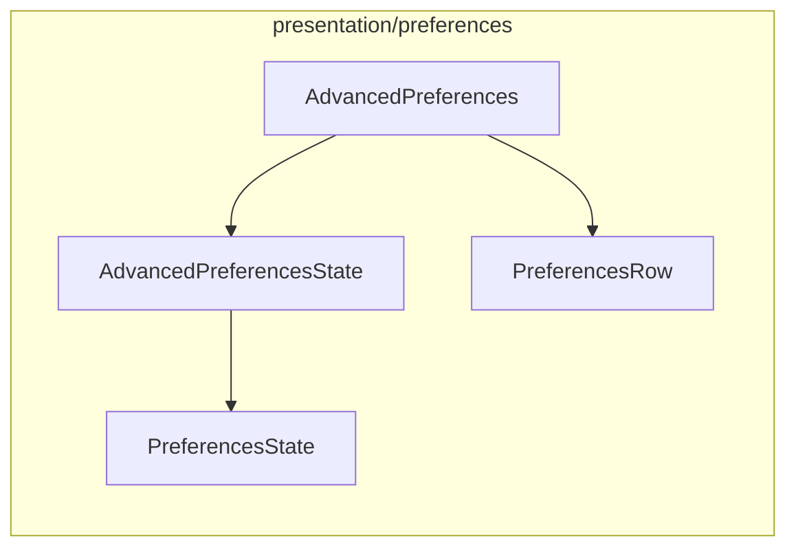

# [UND-70] 설정 — 고급 탭 · 전체 초기화

> wave 8 · 사이즈 S · 의존 UND-40 · UND-74 · UND-11 · 소유 `presentation/preferences/AdvancedPreferences.kt` · `presentation/preferences/AdvancedPreferencesState.kt`

## 작업 내용 (설계 의도)

| 항목 | 값 |
|---|---|
| 대용량 파일 임계치 | 바이트. 이 크기를 넘는 파일은 diff 를 접는다 |
| 커밋 페이지 크기 | 정수. 이력 조회 단위 |
| 로그 위치 | **후속 티켓(UND-78)** — 디렉터리 노출·열기 경로가 없다 |
| 전체 초기화 | 모든 설정을 기본값으로 |

**전체 초기화는 확인을 받는다.** 무엇이 지워지는지(단축키 오버라이드 · identity 매핑 · 도구 설정)
목록으로 알린 뒤 진행한다. 되돌릴 수 없다.

로그 위치 표시·폴더 열기는 **후속 티켓(UND-78)** 이다 — 로그 디렉터리를 노출하고 여는 경로가 없어
이 화면이 만들면 소유 밖으로 나간다. 경로 변경은 애초에 범위 밖이다 (설정 스키마에 자리가 없다).

**범위 밖**: 탭 셸 · 공통 행 · 문자열 키 (UND-40).

**롤백**: 전체 초기화는 되돌릴 수 없다 — 확인 게이트가 롤백을 대신한다.

## 다이어그램

### 처리 흐름

### 클래스 의존

## 테스트 케이스

- 대용량 파일 임계치를 바꾸면 즉시 저장된다
- 임계치에 0 이하나 숫자가 아닌 값을 넣으면 저장하지 않고 입력 오류를 표시한다
- 전체 초기화 요청 시 지워질 항목 목록이 표시되고 확인 전에는 초기화되지 않는다
- 전체 초기화 후 모든 탭이 기본값으로 표시된다
