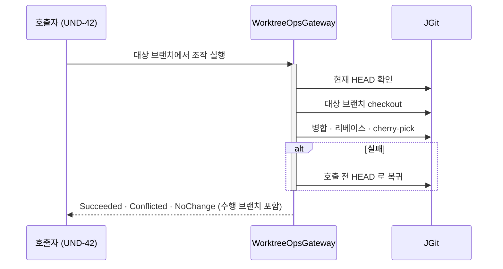
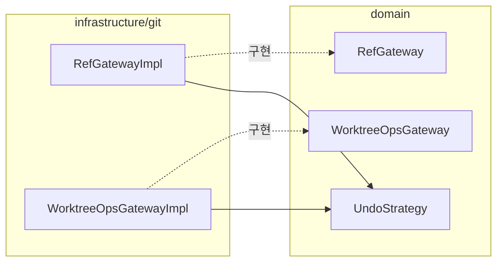

# [UND-71] 그래프 조작 계약 — 원자 실행 · 조건부 ref 갱신 · Undo 전략

> wave 8 · 사이즈 M · 의존 UND-21 · UND-28 · UND-38 · UND-63 · 소유 `application/undo/` · `domain/RefGateway.kt` · `domain/WorktreeOpsGateway.kt` · `domain/undo/UndoStrategy.kt` · `infrastructure/git/cherrypick/` · `infrastructure/git/merge/` · `infrastructure/git/ref/` · `infrastructure/git/repository/` · `infrastructure/git/worktreeops/`

## 작업 내용 (설계 의도)

그래프 드래그&드롭(UND-42)이 필요로 하는 **실행 계약**을 gateway 층에 세운다.
UND-42 는 이 계약을 호출하기만 하고, 자기가 임계 구역을 만들지 않는다.

**왜 별도 티켓인가.** UND-42 는 `presentation/graph/` 만 소유하는 UI 티켓인데, 필요한 보증
셋(원자 실행 · 조건부 ref 갱신 · Undo 전략)이 전부 gateway 소유 영역에 있다. 소유 밖에서 고치려는
시도가 4라운드 동안 같은 p0 를 다른 얼굴로 재생산했다 — 결정문 A-N1("동기화는 그 자원의 Gateway 가
소유한다. 소비자가 아니다")과 A-L3("여러 단계 전이는 한 임계 구역 안에서 끝낸다")이 이 티켓의 근거다.

### 1. 브랜치 대상 조작은 **한 임계 구역**에서 끝난다

브랜치를 대상으로 한 병합·리베이스·cherry-pick 은 "현재 HEAD 확인 → 대상 브랜치 checkout → 조작 실행"
세 단계를 거친다. 이 셋을 **호출자가 순서대로 부르는 방식으로는 안전해지지 않는다** — 앱 내부의 다른
checkout 이 그 사이에 끼어들면 의도하지 않은 브랜치에서 실행된다.

gateway 가 이 시퀀스를 **하나의 연산으로 노출**하고 자기 잠금 안에서 끝낸다. 실패하면 호출 전
HEAD 로 되돌린다. 호출자에게는 "어느 브랜치에서 무엇을 했는지" 가 결과로 돌아온다.

> 검사와 실행 사이의 **외부 프로세스** 변경은 방어 대상이 아니다 (결정문 A-M1). 앱 내부 경합만 막는다.

### 2. ref 이동은 **조건부 갱신**(CAS)이다

브랜치·태그 포인터 이동과 reset 은 "기대한 현재 위치" 를 함께 받아, ref-update 잠금 안에서
그 값과 다르면 실패한다. 화면이 본 스냅샷과 실제 ref 가 어긋난 사이 다른 경로가 ref 를 옮겼다면
덮어쓰지 않는다. Undo 의 되돌리기도 같은 계약을 쓴다 — 되돌릴 때도 남의 이동을 덮지 않는다.

**현재 체크아웃 브랜치의 reset 도 예외가 아니다.** 워킹트리 동기화가 따라붙을 뿐, ref 갱신 자체는
같은 조건부 규칙을 따른다. 대상이 현재 브랜치인지 여부는 **화면 스냅샷이 아니라 실행 시점의 실제
HEAD** 로 판정한다.

### 결과 형태와 취소 계약

`runOnBranch` 는 `Succeeded` · `Conflicted` · `NoChange` 각각에 **수행 브랜치**(`performedOn`)와
**조작 전 대상 브랜치 위치**(`previousTarget`, UND-72 가 추가)를 담아 준다. `previousTarget` 은
임계 구역 안에서 조작을 시작하기 전에 읽은 값이라, 호출자가 밖에서 따로 읽을 때 생기는 창이 없다.
충돌은 실패가 아니라 **진행 중 상태를 보존하는 결과**다 — 호출자가 해결 화면으로 이어 갈 수 있어야 한다.
호출 전 HEAD 와 대상 브랜치 위치의 복구는 **예상하지 못한 실패에만** 적용한다.

**변경과 그 결과의 소비(Undo 기록)는 호출자가 한 `NonCancellable` 구간으로 묶는다.**
임계 구역 안의 조작은 중간에 끊기지 않지만, 그 구간으로 묶지 않으면 완료 뒤 취소가 떨어졌을 때
호출자가 결과 대신 `CancellationException` 을 받아 저장소는 바뀐 채 Undo 항목만 없어진다
(결정 A-L2). 계약대로 묶은 호출자에게는 **취소가 Undo 기록을 건너뛰지 않는다** — UND-42 의
`ExecuteGraphOperationUseCase` 가 그 형태이고, reset 성공 직후 취소에도 기록이 정확히 1건임을
회귀 테스트가 고정한다.

Undo 기록 실패는 **저장소 변경 실패로 취급하지 않는다** — 호출 결과로 전달해 화면이 복구 불가
사실과 reflog 경로를 안내한다.

### 3. Undo 전략 3종을 추가한다

`MoveBranchTo` · `MoveTagTo` · `HardResetTo` 를 되돌릴 수 있는 전략으로 정의한다.
되돌리기 실행은 1·2 의 계약을 그대로 쓴다.

**범위 밖**: 드래그&드롭 UI · 드롭 판정 · 확인 다이얼로그 · 팔레트 등가 경로 (전부 UND-42).

`domain/undo/UndoStrategy.kt` 와 `application/undo/UndoService.kt` 는 이 티켓이 확장한다 —
새 이동 변이를 실행할 분기가 UndoService 에 있어야 하고, 두 파일의 앞선 소유 티켓(UND-42 · UND-43)은
재분해·머지로 닫혔다. 근거는 결정문 `G1 정정` · `G5`.

**롤백**: 계약 추가는 기존 호출부를 깨지 않는 확장이다. 되돌리기는 revert 로 끝난다.

## 다이어그램

### 처리 흐름

### 클래스 의존

## 테스트 케이스

- 브랜치 대상 병합이 대상 브랜치를 checkout 한 뒤 실행되고 결과에 수행 브랜치가 담긴다
- 조작이 실패하면 호출 전 HEAD 로 돌아오고 워킹트리에 흔적이 남지 않는다
- 실행 도중 앱 내부의 다른 checkout 이 시도되면 그 조작이 끝난 뒤에 직렬화돼 수행된다
- 기대 위치와 다른 곳을 가리키는 브랜치를 이동하려 하면 실패하고 ref 가 그대로 남는다
- 태그 이동도 같은 조건부 규칙으로 거부된다
- detached HEAD 에서 현재 브랜치 대상 연산을 요청하면 사유와 함께 거부된다
- reset 대상이 실행 시점의 실제 현재 브랜치면 워킹트리를 동기화하고, 아니면 ref 만 옮긴다
- `MoveBranchTo` · `MoveTagTo` · `HardResetTo` 되돌리기가 조건부 갱신으로 수행된다
