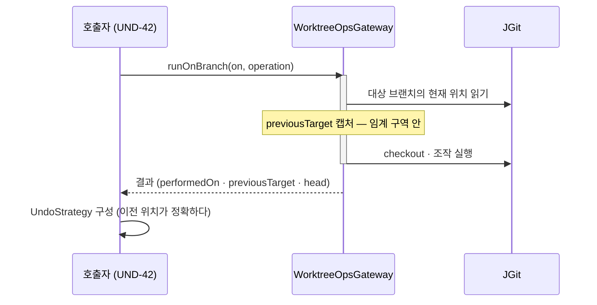
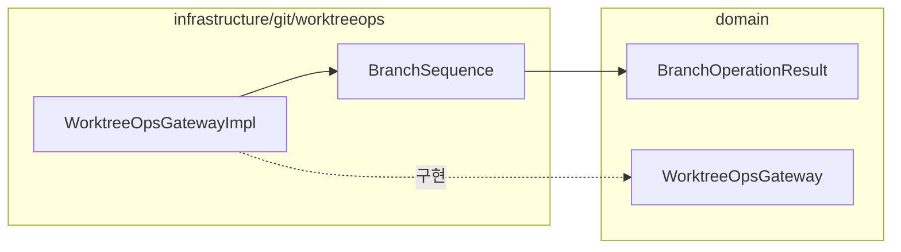

# [UND-72] 원자 조작 결과에 **이전 target** 을 담는다

> wave 8 · 사이즈 S · 의존 UND-71 · 소유 `domain/WorktreeOpsGateway.kt` · `infrastructure/git/worktreeops/`

## 작업 내용 (설계 의도)

UND-71 의 `runOnBranch` 는 조작 **후** 상태만 결과로 준다. 그래서 되돌리기 전략을 만들려는 호출자가
**조작 전 위치를 스스로 읽어야 하고, 그 읽기는 임계 구역 밖에서 일어난다.**

UND-42 검증이 이것을 p0 로 잡았다 (`GraphOperationUseCases.kt:128`) — 이전 target 을 읽은 뒤
`runOnBranch` 가 락을 잡기까지 사이에 앱 내부의 다른 조작이 끼어들면, **실제 조작 전 위치와 다른 값**
으로 `UndoStrategy.HardResetTo` 가 기록된다. 그 기록으로 되돌리기를 실행하면 엉뚱한 커밋으로 가고,
그 사이 커밋들은 ref 로 도달할 수 없게 된다.

호출자가 이 창을 스스로 닫을 방법은 없다 — **임계 구역은 gateway 가 소유**하기 때문이다 (결정 A-N1).
따라서 계약이 답해야 한다.

**`BranchOperationResult` 의 세 변이가 `previousTarget` 을 갖는다.** 값은 `runOnBranch` 가
**자기 임계 구역 안에서**, 조작을 시작하기 전에 읽는다. `NoChange` 도 포함한다 — 호출자가 결과 종류로
분기하지 않고 되돌리기 전략을 만들 수 있어야 한다.

`hardResetBranch` 는 이미 `expected` 를 받으므로 호출자가 이전 위치를 안다 — 변경 대상이 아니다.

**범위 밖**: `UndoStrategy` 변이 (UND-71 이 이미 previous+expected 를 갖게 만들었다) ·
그래프 UI 와 UseCase (UND-42). 이 티켓은 계약 한 곳만 넓힌다.

**롤백**: 필드 추가라 되돌리기는 revert 로 끝난다. 호출부는 현재 UND-42(미머지) 뿐이다.

## 다이어그램

### 처리 흐름

### 클래스 의존

## 테스트 케이스

- 병합이 성공하면 결과의 `previousTarget` 이 조작 직전 대상 브랜치 위치와 같다
- 리베이스·cherry-pick 도 같은 값을 담는다
- 적용할 변경이 없어 `NoChange` 일 때도 `previousTarget` 이 담긴다
- 충돌로 멈춘 `Conflicted` 결과에도 `previousTarget` 이 담긴다
- `previousTarget` 으로 구성한 되돌리기가 조작 전 위치를 정확히 복원한다
- 조작 실패로 복구된 경우 결과가 아니라 예외이므로 `previousTarget` 을 약속하지 않는다
