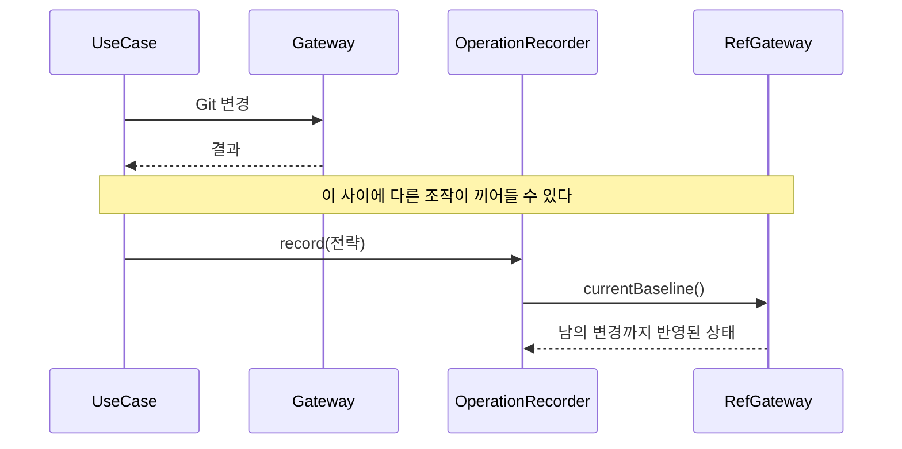
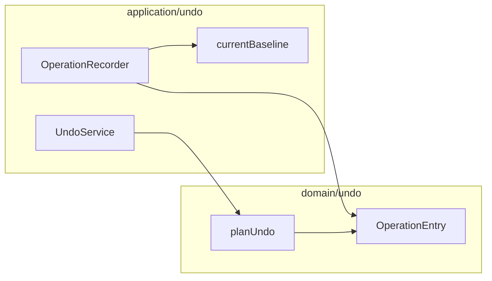

# [UND-73] Undo 기록의 기준 상태를 **변경과 같은 순간**에 확정한다

> wave 8 · 사이즈 M · 의존 UND-38 · UND-71 · UND-72 · 소유 `application/undo/` · `domain/undo/OperationEntry.kt`

## 작업 내용 (설계 의도)

`OperationRecorder` 는 기록할 때 `refGateway.currentBaseline()` 을 **자기가 다시 읽는다.**
Git 변경은 이미 끝난 뒤이고, 그 읽기는 **변경과 다른 gateway 호출**이다.

그 사이에 앱 내부의 다른 Git 조작이 끼어들면, 기록된 `baseline` 은 "내 변경 직후" 가 아니라
**남의 변경까지 반영된 상태**가 된다. `OperationEntry.planUndo` 는 `current != baseline` 일 때
`ExternalChange` 로 되돌리기를 거부하는데, 그 비교의 기준이 오염되면 **거부해야 할 때 통과**한다 —
남의 변경 위에서 내 되돌리기가 실행된다.

UND-72 가 `runOnBranch` 결과에 `previousTarget` 을 담아 같은 부류의 창을 닫았다. 이 티켓은 그
나머지 절반이다.

### 채택한 방안 — 변경 연산이 기준 상태를 결과로 준다

되돌릴 수 있는 변경(`runOnBranch` 성공 · `hardResetBranch` · `moveBranch` · `moveTag` ·
reflog 복구)이 **자기 임계 구역 안에서** 변경 직후 `RepositoryBaseline` 을 캡처해 결과로 준다.
호출자는 그 값을 `OperationRecorder.record(operation, strategy, baseline)` 에 넘기고,
recorder 는 `currentBaseline()` 을 다시 읽지 않는다. `currentBaseline()` 은 되돌리기 실행 직전
비교에만 쓴다.

**CAS 를 갖지 않는 전략**(`DeleteBranch` · `CheckoutRef` · `SoftResetTo` · `PopStash`)의
baseline/`ExternalChange` 방어는 그대로 둔다 — 이동 전략만 CAS 로 갈음하면 저 넷이 무방비가 된다.

`recordIrreversible` 은 현행대로 `currentBaseline()` 을 읽는다 (결정 G9). `planUndo` 가
`Irreversible` 을 가장 먼저 걸러 그 항목의 baseline 은 비교에 닿지 않아 **닫을 창이 없고**, 값을
요구하면 읽히지도 않는 값 때문에 여러 계약을 넓혀야 한다. 이 예외가 분기 순서에 기댄다는 사실은
`OperationRecorder` KDoc 에 남긴다.

**범위 밖**: 그래프 UI(UND-42, 머지됨) · Gateway 구현. (a) 를 고르면 계약 확장이 이 티켓에 들어온다.

**롤백**: 되돌리기 판단 규칙 변경이므로, 기존 Undo 항목의 해석이 달라지는지 확인하고 달라지면
마이그레이션이 아니라 **다음 실행부터 적용**되게 한다 (스택은 프로세스 수명이다 — 사실 확인 필요).

## 다이어그램

### 처리 흐름 (현재 — 창이 열려 있다)

### 클래스 의존

## 테스트 케이스

- 변경과 기록 사이에 다른 조작이 끼어들어도 기록된 기준 상태가 내 변경 직후를 가리킨다
- 그 상황에서 되돌리기를 요청하면 남의 변경 위에서 실행되지 않고 거부된다
- 아무도 끼어들지 않은 정상 경로의 되돌리기는 그대로 성공한다
- detached HEAD 에서 기록된 항목의 되돌리기는 사유와 함께 거부된다
- CAS 를 갖지 않는 전략(`PopStash` 등)의 되돌리기 판단이 이 변경으로 약해지지 않는다
- 기존에 기록된 항목이 있는 상태에서 규칙이 바뀌어도 되돌리기가 크래시하지 않는다
