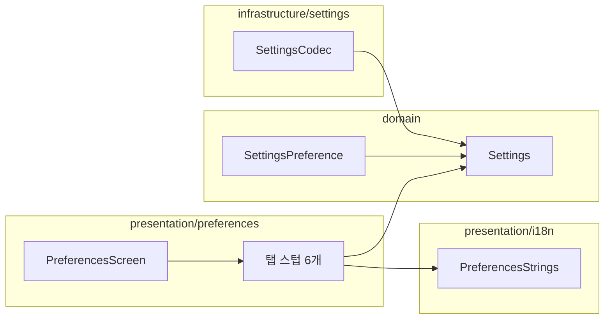

# [UND-74] 설정 골격 보강 — 탭 6건이 실제로 필요로 하는 자리를 채운다

> wave 8 · 사이즈 M · 의존 UND-40 · 소유 `presentation/i18n/PreferencesStrings.kt` · `domain/Settings.kt` · `domain/SettingsPreference.kt` · `infrastructure/settings/SettingsCodec.kt` · `presentation/preferences/PreferencesScreen.kt` · `presentation/preferences/*PreferencesContent.kt`(시그니처)

## 작업 내용 (설계 의도)

UND-40 이 골격을 세웠지만 **탭 6건이 쓸 자리 세 가지가 비어 있다.** 스펙 단계에서 6건 중 5건이
같은 질문을 냈고, 코드로 확인한 결과 사실이다. 지금 채우지 않으면 **6개 티켓이 같은 세 파일을
동시에 고쳐** 머지 충돌이 확정된다 — 골격을 따로 만든 이유가 무너진다.

### 1. 문자열 키 — 일반 탭 것만 있다

현재 `PreferencesStrings` 의 항목 키는 테마·언어·시작 동작·확인 표시(일반 탭)와 서명 표시뿐이다.
**Git · 계정 · 도구 · 단축키 · 고급 탭 항목의 키가 없다.** 각 탭 티켓의 항목 표를 읽어 채운다.

| 탭 | 필요한 키 (티켓 항목 표 기준) |
|---|---|
| Git (UND-66) | 기본 브랜치명 · pull 방식(merge/rebase) · fetch 주기(끔/N분) |
| 계정 (UND-67) | 프로필 추가·수정·삭제 · 삭제 확인 · 저장소 매핑 지정/해제 · 이메일 형식 오류 |
| 도구 (UND-68) | 외부 diff/merge 도구 · 사용자 지정 명령 · 실행 파일 찾을 수 없음 · 탭 폭 · 고정폭 서체 |
| 단축키 (UND-69) | 충돌 안내 · 교체 확인 · 해제 · 적용 실패 표시 |
| 고급 (UND-70) | 대용량 파일 임계치 · 커밋 페이지 크기 · 로그 위치 · 폴더 열기 |

### 2. `Settings` 필드 — 탭 항목이 앉을 자리가 없다

`기본 브랜치명` · `pull 방식` · `fetch 주기` · `탭 폭` · `고정폭 서체` · `대용량 파일 임계치` ·
`커밋 페이지 크기` 는 티켓 표에 적힌 항목인데 스키마에 필드가 없다. 필드 · 기본값 · 허용 범위를
정하고 `SettingsCodec` 왕복과 `SettingsPreference`(항목별 기본값 복원 대상) 등록까지 한다.

**저장 계약만 만든다.** 이 값들을 실제로 소비하는 경로(`DiffLimits` · `GraphViewState` ·
fetch 스케줄러) 연결은 **이 티켓도, 탭 티켓도 아니다** — 별도 후속 티켓이다 (아래 "범위 밖").

### 3. 탭 스텁이 상태를 받지 않는다

`GitPreferencesContent(modifier: Modifier = Modifier)` 처럼 스텁이 인자를 받지 않는다. 탭 티켓이
시그니처를 바꾸면 호출부 `PreferencesScreen.kt` 도 바뀌어야 하는데, 그 파일은 탭 티켓에 수정
금지다 — **탭 티켓이 자기 일을 할 수 없는 모순**이다.

여섯 스텁이 **지금** 상태를 받도록 시그니처를 확정하고 `PreferencesScreen` 의 호출을 맞춘다.
무엇을 넘길지는 탭이 실제로 쓰는 것(설정 값 · 저장 경로 · 문자열)으로 정한다.

**롤백**: 설정 스키마가 다시 오른다(4→5). 되돌리기 경로는 UND-40 과 같다 — 구버전 앱은
`NewerSchemaBackup` 으로 원본을 보존하고 기본값으로 시작한다.

### 확정된 계약 (구현 결과)

- `Settings` 에 탭 값 7개 — 기본 브랜치명 · `PullStrategy`(enum) · `AutomaticFetchSettings`(켬/끔과
  주기 분리) · 탭 폭 · 고정폭 서체 · 대용량 파일 임계치 · 커밋 페이지 크기. 검증은 `require` 로
  domain 에서 한다 (G15). **fetch 주기는 꺼져 있어도 양수다** (G17).
- `SettingsTabValueCodec` 이 스키마 5 왕복을 맡고, 값 보정은 **손상된 파일 방어에만** 쓴다 —
  앱이 만들 수 있는 값은 바꾸지 않는다 (G17).
- `PreferencesSaveFailure` sealed — 값 거부(Rejected)와 쓰기 실패(NotWritten)를 나눈다. 사용자가
  할 일이 다르다.
- 탭 진입점 묶음 — `IdentityUseCases`(계정) · `ExternalToolUseCases`(도구). 낱개가 아니라 묶음인
  이유는 의존이 늘어도 `PreferencesScreen` 호출부가 고정되기 때문이다 (G16).

## 범위 밖

- **소비 경로 연결** — 저장된 값이 `DiffLimits`(diff 접기) · `GraphViewState`(이력 페이지 크기) ·
  fetch 스케줄러의 동작을 실제로 바꾸는 것. 탭마다 다른 화면을 건드리게 되므로 별도 티켓으로 뺀다.

> **탭 시그니처가 요구하는 application 진입점은 범위 안이다** (결정 G16). presentation 은 Gateway 를
> 직접 쓰지 않으므로 탭이 받을 UseCase 타입이 존재해야 하고, 탭 티켓이 만들면 그 티켓이 소유 밖으로
> 나간다. "탭이 호출할 자리를 만드는 것" 과 "저장값이 다른 화면의 동작을 바꾸는 것" 은 다르다.
- 탭 내용 구현 (UND-65~70) · DI 배선 (UND-51).

## 다이어그램

### 클래스 의존

## 테스트 케이스

- 다섯 탭이 요구한 문자열 키가 두 로케일 카탈로그에 모두 존재한다
- 새 설정 필드가 저장·재로딩을 왕복해도 값이 유지된다
- 스키마 4 파일을 읽으면 새 필드가 기본값으로 채워진다
- 새 필드가 항목별 기본값 복원 대상으로 등록되어 그 항목만 되돌아간다
- 허용 범위를 벗어난 값(0 이하 임계치·페이지 크기)은 저장되지 않고 입력 오류로 처리된다
- 여섯 탭 스텁이 상태를 받는 시그니처로 호출되며 화면 디스패치가 그대로 동작한다
