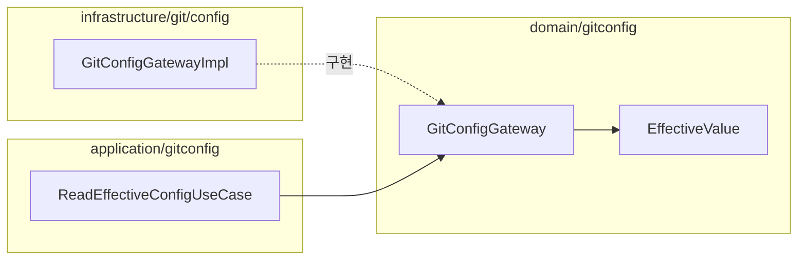

# [UND-75] 저장소 git 설정의 실효값 조회

> wave 9 · 사이즈 M · 의존 UND-66 · 소유 `domain/gitconfig/` · `application/gitconfig/` · `infrastructure/git/config/`

## 작업 내용 (설계 의도)

앱 설정과 저장소 git 설정이 **같은 것을 다르게 정할 때**, 실제로 무엇이 적용되는지 화면이 말할 수
있어야 한다. 앱에서 바꿨는데 안 먹는 이유를 사용자가 알 방법이 지금은 없다.

읽어야 하는 키는 설정 화면이 다루는 항목에서 나온다 — `init.defaultBranch` · `pull.rebase` ·
`diff.tool` · `merge.tool` · `user.name` · `user.email` · 서명 관련 키.

**읽기 전용이다.** git 설정을 앱이 쓰지 않는다 — 사용자가 명령행에서 정한 것을 앱이 덮으면
"내가 설정한 대로 안 된다" 가 반대 방향으로 생긴다.

계약은 **"값과 출처"** 를 함께 돌려준다. 값만 주면 호출부가 출처를 알 수 없어 결국 다시 묻는다.
출처는 최소한 **앱 설정 / 저장소 git 설정 / 전역 git 설정**을 구분한다.

**롤백**: 읽기 전용 계약 추가라 revert 로 끝난다.

## 다이어그램

### 클래스 의존

## 테스트 케이스

- 저장소 설정에만 값이 있으면 출처가 저장소 git 설정으로 온다
- 전역에만 있으면 출처가 전역으로 온다
- 저장소와 전역 둘 다 있으면 저장소 값이 이긴다
- 어느 쪽에도 없으면 값 없음으로 오고 호출부가 앱 설정을 쓴다
- 저장소가 열려 있지 않으면 전역만 조회한다
- 설정 파일이 손상돼 읽히지 않으면 값 없음이 아니라 실패로 보고한다
