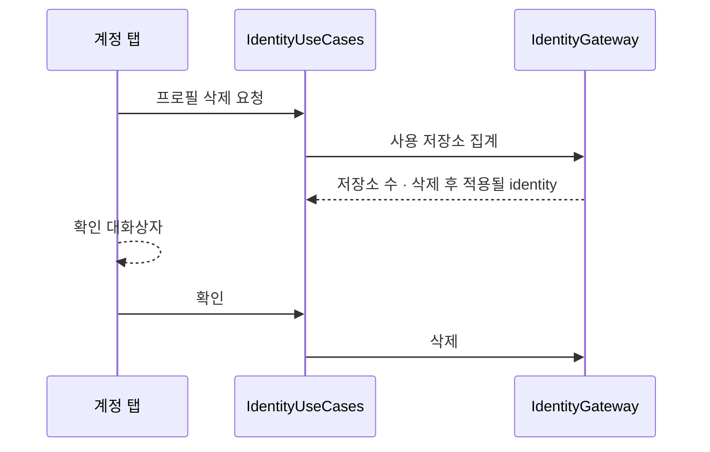

# [UND-76] Identity 프로필 — 사용 저장소 집계 · 이메일 검증

> wave 9 · 사이즈 M · 의존 UND-37 · UND-67 · 소유 `domain/identity/` · `application/identity/` · `infrastructure/identity/`

## 작업 내용 (설계 의도)

두 가지를 identity 계약에 더한다. 둘 다 **설정 화면이 요구했지만 계약이 없어** 화면에서 만들 수
없었던 것이다.

### 사용 저장소 집계

프로필을 지우기 전에 **그 프로필을 쓰는 저장소가 몇 개인지** 알려야 한다. 조용히 지우면 사용자가
다음 커밋에서 엉뚱한 이름으로 커밋한다. 삭제 후 그 저장소들이 무엇을 쓰게 되는지(전역 identity)도
함께 답한다.

현재 `IdentityGateway` 는 **열린 저장소 하나만** 본다. 후보 저장소 집합을 무엇으로 볼지(최근 저장소
목록 · 탭 세션 · 매핑 기록)를 정하는 것이 이 티켓의 설계 지점이다 — **모든 디스크를 훑지 않는다.**

### 이메일 형식 검증

`IdentityProfile` 생성 시점에 domain 이 거부한다. presentation 에 검증을 두면 진입점이 늘 때마다
같은 규칙을 다시 쓰게 되고 한 곳만 틀려도 조용히 통과한다 (결정 G15 와 같은 이유).

**형식 검증까지만** 한다 — 실재 여부·도달 가능성은 확인하지 않는다.

**롤백**: 검증 추가는 기존 저장값에 소급되지 않게 한다 — 이미 저장된 잘못된 이메일이 앱을 못 열게
만들면 안 된다. 읽기는 통과시키고 **쓰기에서만** 거부한다.

## 다이어그램

### 처리 흐름

## 테스트 케이스

- 프로필을 쓰는 저장소가 둘이면 집계가 2 로 온다
- 아무도 쓰지 않는 프로필의 집계는 0 이다
- 삭제 후 적용될 identity 가 전역 설정 값으로 온다
- 후보 저장소 목록이 비어 있어도 집계가 실패하지 않는다
- 형식이 잘못된 이메일로 프로필을 만들면 거부된다
- 이미 저장된 잘못된 이메일은 읽기에서 거부되지 않는다
