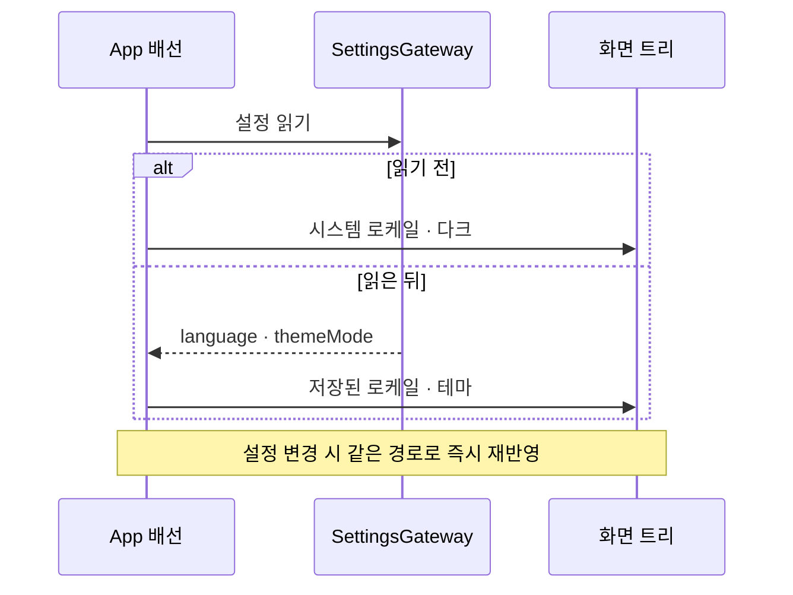
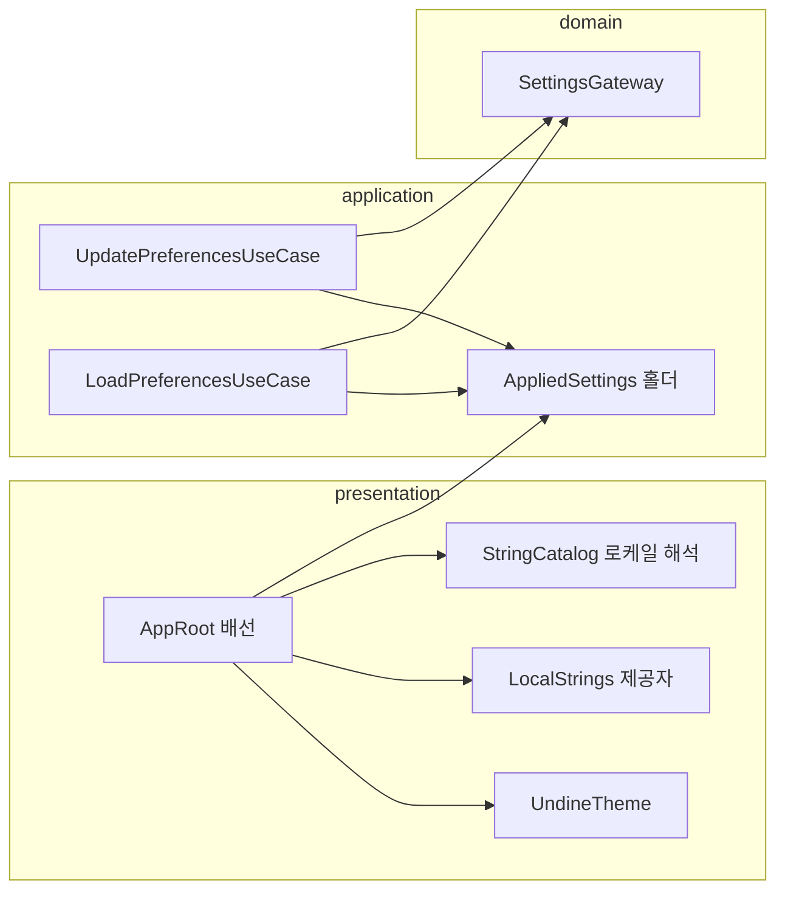

# [UND-91] 저장한 언어·테마를 화면에 적용한다

> wave 14 · 사이즈 M · 의존 UND-40 · UND-63
> 소유 `presentation/App.kt` · `application/preferences/` · `presentation/i18n/` ·
> `presentation/preferences/GeneralPreferencesState.kt` · `di/AppComponent.kt`
> 배선 주인이던 UND-51 이 이미 머지돼 홀더 조립을 이 티켓이 한다.

## 작업 내용 (설계 의도)

### 왜 이 티켓이 있는가

**설정 화면이 저장하는 언어와 테마가 화면에 전혀 닿지 않는다.**

`Settings.language` 는 저장되고(`SettingsCodec`), 설정 화면이 목록을 보여주며
(`GeneralPreferencesState#displayedLocale`), 백업에도 실린다. 그런데 배선이 그 값을 읽지 않는다:

```kotlin
// App.kt
UndineTheme(themeMode = ThemeMode.DARK) {                        // 하드코딩
    CompositionLocalProvider(LocalStrings provides systemStrings()) {   // OS 로케일 고정
```

사용자가 언어를 고르면 저장은 되지만 화면은 그대로다. 테마도 같다 — `App.kt` 주석이
"설정 화면이 저장한 테마를 읽어 오기 전까지 기본값이 곧 유일한 선택이다" 라고 이미 적어 두었다.

UND-47 에서 **화면이 제공자를 무시하던 결함**을 고쳤고, 그 나머지 두 곳도 정리했다
(`RecoveryScreen`·`availabilityOf`). 이제 화면들은 제공자를 따르므로, **제공자에 저장된 값을
넣는 일만 남았다.**

### 무엇을 하는가

- **적용된 설정을 한 곳에서만 낸다.** `application/preferences/AppliedSettings` 홀더가 유일한
  출처이고, 시작 읽기와 저장 성공이 **같은 순서로** 거기에 발행한다. 두 경로가 따로 놀면
  어느 쪽이 진짜인지 갈린다.
- **발행 순서를 구조로 보장한다.** `SettingsGateway.update` 는 읽기–수정–쓰기를 자기 임계구역에서
  끝내지만 발행은 그 밖이다. 갱신과 발행을 하나의 뮤텍스로 묶어 커밋 순서 = 발행 순서로 만든다.
  **쓰기가 실패하면 발행하지 않는다** — 저장되지 않은 값을 화면에 적용하면 재기동 후 되돌아가
  사용자가 이유를 알 수 없다.

- 배선이 설정을 읽어 `LocalStrings` 와 `UndineTheme` 에 **저장된 값**을 넣는다.
- `language` 가 `null` 이면 시스템 로케일을 따른다. 카탈로그가 모르는 태그는 기존 폴백 규칙을 따른다.
  해석은 `StringCatalog.localeForLanguageTag` · `stringsForLanguageTag` 하나로 모으고,
  설정 화면도 그것을 쓴다 — 규칙이 두 곳에 있으면 보여주는 언어와 그려지는 언어가 갈린다.
- 설정이 **바뀌면 즉시 반영**된다. 재기동을 요구하지 않는다 — 설정 화면에서 언어를 고른 사람이
  그 화면의 문구가 바뀌는 것을 봐야 값이 먹었는지 안다.
- 설정을 아직 읽지 못한 **첫 프레임**의 값을 정한다. 깜빡임을 줄이려면 읽기 전에는 시스템
  로케일·다크를 쓰고, 읽은 뒤 한 번만 바꾼다.

### 이 티켓이 하지 않는 것

- 새 설정 항목 추가. `language`·`themeMode` 는 이미 있다.
- 화면별 문구 추가·번역 보강.
- `systemStrings()` 기본값 정리 — 이미 끝났다(#125).

### 롤백

설정 읽기가 실패하면 지금 동작(시스템 로케일·다크)으로 떨어진다. 기능 자체에 문제가 생기면
배선을 되돌려 고정값으로 되돌린다 — 저장된 값은 그대로 남는다.

## 의존

- UND-40 (설정 화면 · `Settings.language`·`themeMode`)
- UND-63 (i18n 공통 계약)

## 다이어그램

### 처리 흐름



### 클래스 의존



## 테스트 케이스

- 저장된 언어가 한국어면 화면 문구가 한국어로 그려진다
- 저장된 언어가 영어면 같은 화면이 영어로 그려진다
- 언어가 `null` 이면 시스템 로케일을 따른다
- 카탈로그가 모르는 언어 태그는 폴백 로케일로 그려지고 문구가 비지 않는다
- 설정에서 언어를 바꾸면 **재기동 없이** 그 화면의 문구가 바뀐다
- 저장된 테마가 라이트면 라이트로 그려진다
- 설정을 읽기 전 첫 프레임은 시스템 로케일·다크이고, 읽은 뒤 한 번만 바뀐다
- 설정 읽기가 실패해도 화면이 뜨고 시스템 로케일·다크로 떨어진다
