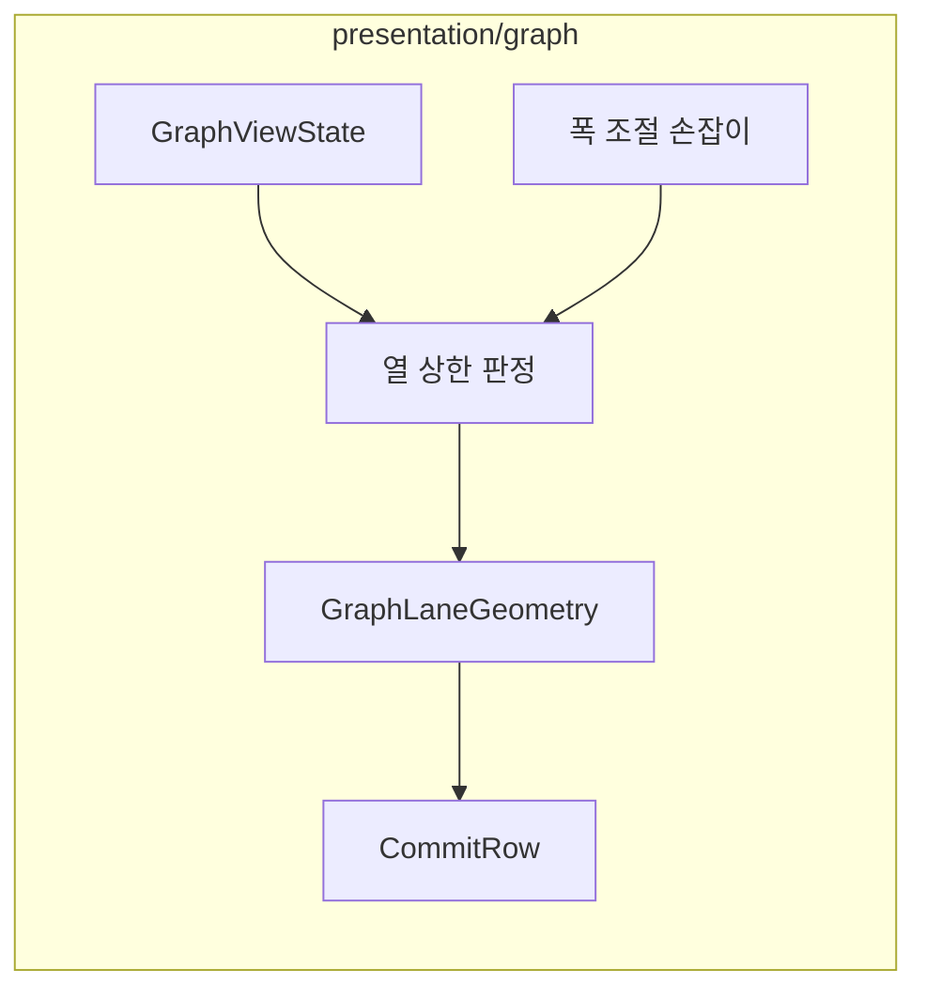

# [UND-92] 그래프 열이 커밋 메시지를 밀어내지 않게 한다

> wave 14 · 사이즈 M · 의존 UND-14 · 소유 `presentation/graph/` · `presentation/i18n/GraphStrings.kt`

## 작업 내용 (설계 의도)

### 왜 이 티켓이 있는가

**브랜치가 많은 저장소에서 그래프 열이 화면을 삼킨다.**

UND-89 가 벤치 저장소(커밋 3,338 · 병합 514 · 브랜치 60)의 실제 이력을 렌더해 확인했다:

| 측정 | 값 |
|---|---|
| 그래프 열 폭 | 406dp = 레인 29개분 |
| 화면 폭 600dp 중 비율 | **68%** |
| 화면에 실제로 보이는 레인 | **13개** |
| 커밋 메시지 | `Undine Be…` 로 잘림 |

원인은 `GraphViewState.laneCount` 다 — **적재된 페이지 전체**의 `maxOf { laneSpan }` 이고,
그 값이 모든 행의 열 폭을 정한다. 40커밋 페이지의 29레인이 열을 잡는데 화면에는 13개만 보인다.

### 무엇이 문제가 아닌가 (먼저 못박는다)

**`columnWidth = LANE_WIDTH × laneCount` 의 비례 계산은 정상이다.** 페이지 최대치로 잡아야
스크롤 중 열 폭이 흔들리지 않는다. 그 비례를 고치려 들면 안 된다.

**빠진 것은 그래프 열의 상한이다.** 지금은 레인이 늘면 열이 끝없이 넓어지고, 넓어진 만큼
커밋 메시지 열이 밀려난다. 브랜치가 수백 개인 저장소면 메시지가 아예 사라진다.

### 무엇을 하는가

- 그래프 열에 **상한**을 둔다. 상한을 넘는 레인은 잘라서 그리되, **잘렸다는 사실이 보여야 한다** —
  조용히 잘라내면 사용자는 자기가 보는 그래프가 전부라고 믿는다.
- 상한은 고정 dp 가 아니라 **화면 폭에 대한 비율**로 정한다. 창을 넓히면 그래프도 넓어져야 한다.
- 사용자가 **폭을 조절**할 수 있게 한다 — 그래프를 크게 보고 싶은 때와 메시지를 읽고 싶은 때가
  다르다. GitKraken 도 그렇게 한다. 조절값은 이 티켓에서 저장하지 않는다 (아래 참조).

### 이 티켓이 하지 않는다

- 레인 배치 알고리즘 변경 — 무엇을 몇 번 레인에 두는가는 이 티켓 밖이다.
- 조절한 폭의 **영속화** — 설정 스키마를 건드린다. 필요하면 별도 티켓이다.
- 가로 스크롤 도입.

### 롤백

상한을 화면 폭의 100%로 두면 지금 동작으로 돌아간다.

## 의존

- UND-14 (그래프 뷰)

## 다이어그램

### 클래스 의존

## 테스트 케이스

- 레인이 적으면 그래프 열이 상한보다 좁게, 레인 수에 비례해 그려진다
- 레인이 많아 상한을 넘으면 그래프 열이 상한에서 멈추고 커밋 메시지 열이 남는다
- 상한에서 잘린 경우 잘렸다는 표시가 보인다
- 창을 넓히면 상한도 함께 넓어진다
- 폭을 조절하면 그 값이 즉시 반영되고 상한 안에서 유지된다
- 스크롤로 페이지가 늘어 최대 레인이 커져도 열 폭이 조절값을 넘지 않는다
