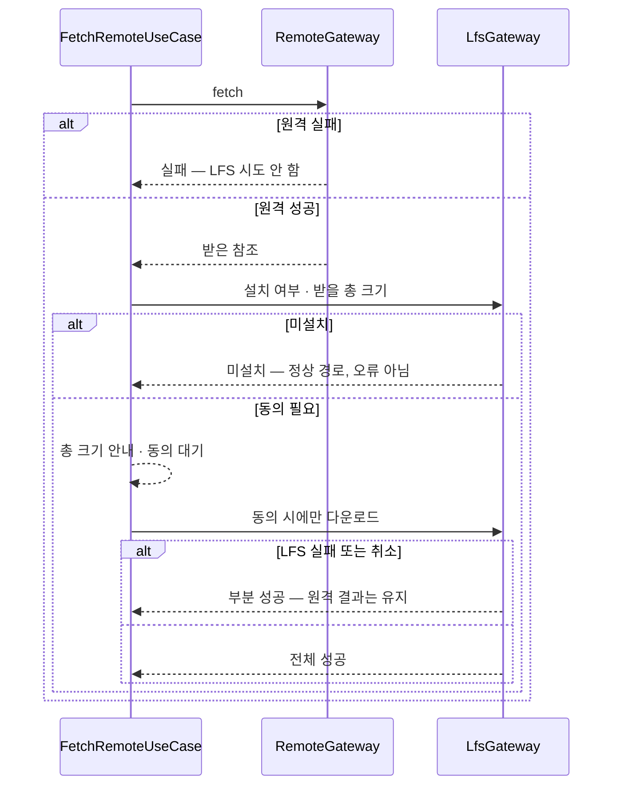
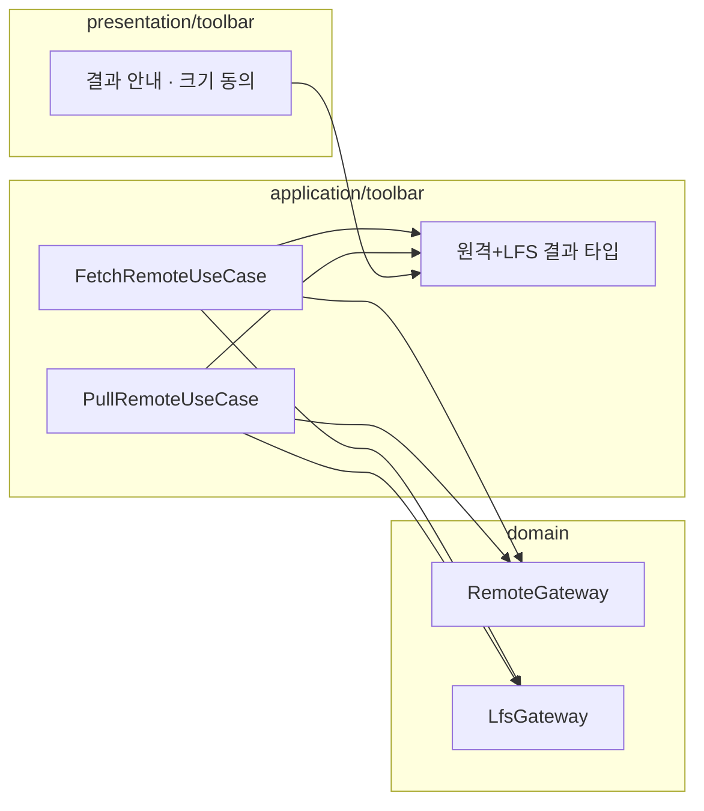

# [UND-93] fetch/pull 뒤 LFS 객체 동반 다운로드

> wave 15 · 사이즈 M · 의존 UND-61 · 소유 `application/toolbar/FetchRemoteUseCase.kt` · `application/toolbar/PullRemoteUseCase.kt` · `presentation/toolbar/`

## 작업 내용 (설계 의도)

### 왜 이 티켓이 있는가

**UND-61 이 남긴 미완이다.** UND-61 은 `LfsGateway` 에 **독립적인** 객체 다운로드 계약
(총 크기 조회 · 진행률 · 취소)까지 만들었지만, 원격 작업 경로에는 **연결하지 않았다**
(UND-61 결정 D8).

연결하지 않은 이유가 이 티켓의 과제다 — **원격과 LFS 는 따로 실패한다.**

| 원격 | LFS | 사용자에게 무엇을 말해야 하는가 |
|---|---|---|
| 성공 | 성공 | 평소대로 |
| 실패 | 시도 안 함 | 원격 실패 (지금 동작) |
| **성공** | **실패** | **여기가 설계되지 않은 자리다** |
| 성공 | 미설치 | ? |

세 번째 줄이 핵심이다. 커밋은 다 받았는데 큰 파일만 포인터로 남은 상태는
**"fetch 실패" 도 "fetch 성공" 도 아니다.** 이걸 성공으로 접으면 사용자는 파일이 깨진 줄 알고,
실패로 접으면 이미 받은 커밋까지 못 쓴 것으로 오해한다.

### 이 티켓이 정하는 것

**1. 부분 성공을 세 번째 값으로 표현한다**

원격 결과를 성공/실패 불리언으로 두고 LFS 를 곁가지로 붙이지 않는다.
"원격은 됐고 LFS 는 못 받았다" 를 **자기 값으로 갖는 결과 타입**으로 올린다 —
불리언에 세 번째 상태를 끼워 넣으면 호출부마다 다르게 해석된다.

**2. LFS 실패가 원격 결과를 되돌리지 않는다**

이미 받은 커밋은 그대로 둔다. LFS 다운로드 실패로 fetch 를 롤백하지 않는다 —
받은 것을 버리는 것은 사용자가 원한 적 없는 파괴적 동작이다.

**3. 미설치는 실패가 아니다**

`git-lfs` 가 없으면 LFS 객체를 못 받는 것이 **정상 경로**다. 오류로 띄우지 않고
"LFS 객체는 받지 않았다" 는 사실만 남긴다 (UND-61 이 미설치를 시작 실패와 구분해 보고한다).

**4. 큰 다운로드는 사전 확인을 거친다**

UND-61 의 크기 조회 계약을 여기서 처음 쓴다. fetch 뒤 받을 LFS 객체의 총 크기를 먼저 알리고,
사용자가 동의해야 받는다 — LFS 대역폭은 유료 한도가 있는 서비스가 많다.
동의하지 않으면 원격 결과는 그대로 유지하고 LFS 만 건너뛴다.

**5. 취소가 원격 결과를 훼손하지 않는다**

LFS 다운로드 도중 취소해도 이미 받은 커밋과 이미 받은 LFS 객체는 그대로 둔다.

### 이 티켓이 하지 않는 것

- `LfsGateway` 계약 변경 — UND-61 이 만든 것을 그대로 쓴다.
- push 시 LFS 객체 업로드 — 별도 범위.
- 자동 다운로드 정책(설정으로 항상 받기 등) — 먼저 수동 동의 흐름을 세운다.

### 롤백

원격 경로에 LFS 연동을 끼우는 변경이다. 되돌릴 때는 연동 호출을 제거하면 원격 동작이
UND-61 이전 상태로 돌아간다 — `LfsGateway` 는 독립 계약이라 남아도 무해하다.

## 의존

- UND-61

## 다이어그램

### 처리 흐름

### 클래스 의존

## 테스트 케이스

- 원격과 LFS 가 모두 성공하면 전체 성공으로 보고된다
- 원격이 실패하면 LFS 다운로드를 시도하지 않는다
- 원격은 성공하고 LFS 가 실패하면 부분 성공으로 보고되고 **받은 커밋은 유지된다**
- `git-lfs` 미설치는 오류가 아니라 "LFS 객체 미수신" 사실로 보고된다
- 받을 총 크기가 사용자에게 먼저 안내된다
- 사용자가 동의하지 않으면 LFS 를 건너뛰고 원격 결과는 그대로 유지된다
- LFS 다운로드를 취소해도 이미 받은 커밋과 이미 받은 객체가 남는다
- LFS 를 쓰지 않는 저장소에서는 크기 안내 없이 평소대로 끝난다
- pull 경로도 fetch 와 같은 규칙으로 동작한다
