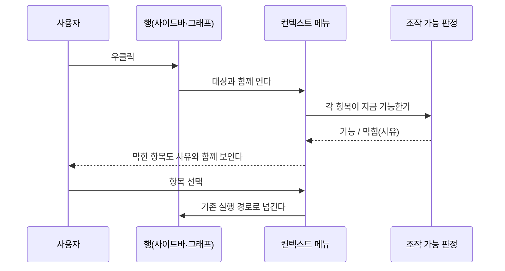
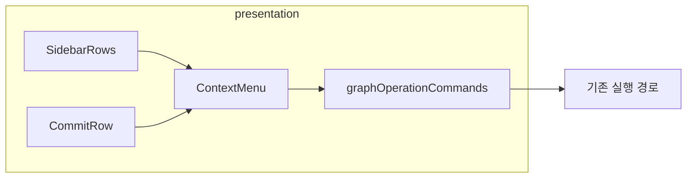

# [UND-94] 우클릭으로 조작에 닿게 한다

> wave 16 · 사이즈 L · 의존 UND-42 · UND-51 · 소유 `presentation/contextmenu/`(신규) ·
> `presentation/sidebar/SidebarRows.kt` · `presentation/sidebar/SidebarState.kt` ·
> `presentation/sidebar/SidebarTree.kt`(병합 배선 파라미터) ·
> `presentation/sidebar/SidebarMergeBinding.kt`(신규 — 병합 항목의 가용성·실행 통로) ·
> `presentation/graph/CommitRow.kt` · `presentation/graph/RefChip.kt` · `presentation/graph/CommitGraphView.kt` ·
> `presentation/graph/CommitRefIndex.kt` · `presentation/graph/GraphTags.kt` ·
> `presentation/graph/GraphOperationCommands.kt` · `presentation/App.kt` · `presentation/AppCommands.kt` ·
> `presentation/AppDestinationScreens.kt` · `presentation/i18n/ContextMenuStrings.kt`(신규) ·
> `presentation/i18n/BuiltInStrings.kt`(등록 한 줄) ·
> `domain/graphops/GraphDragDrop.kt`(거부 사유 `NO_CURRENT_BRANCH` 추가) ·
> `presentation/graph/GraphDragDropState.kt`(그 사유의 문구 분기) ·
> `presentation/i18n/GraphDragDropStrings.kt`(그 사유의 한·영 문구)

## 작업 내용 (설계 의도)

### 왜 이 티켓이 있는가

**기능은 다 있는데 닿는 길이 숨어 있다.** 진입 경로를 실제로 훑은 결과다:

| 조작 | 우클릭 | 툴바 | 사이드바 `...` | 팔레트 | 드래그&드롭 |
|---|---|---|---|---|---|
| fetch · pull · push | ✗ | ✓ | ✗ | ✗ | ✗ |
| checkout · 이름변경 · 삭제 | ✗ | ✗ | ✓ | ✗ | ✗ |
| merge | ✗ | ✗ | ✓ | ✓ | ✓ |
| rebase · cherry-pick · reset · 태그 이동 | ✗ | ✗ | ✗ | ✓ | ✓ |

**우클릭 처리가 코드 어디에도 없다.** `presentation/` 전체에 컨텍스트 메뉴·secondary 클릭 핸들러가 0건이다.

그래서 rebase·cherry-pick·reset 은 **드래그&드롭을 알거나 팔레트 명령 이름을 알아야** 닿는다.
둘 다 사용자가 **먼저 알아야** 쓸 수 있는 경로다. GitKraken 에서 온 사람은 브랜치를 우클릭해 보고,
아무 일도 일어나지 않으면 **기능이 없다고 판단한다** — 구현은 되어 있는데도.

### 이 티켓이 하는 것

**새 기능을 만들지 않는다.** 이미 있는 조작을 우클릭으로도 닿게 하는 배선이다.

1. **사이드바 브랜치 행 우클릭** — 지금 `...` 버튼이 여는 것과 **같은 메뉴**를 연다.
   두 진입점이 다른 목록을 보이면 사용자는 어느 쪽이 전부인지 알 수 없다.
   (태그 행은 낼 항목이 없어 만들지 않는다 — 결정 D11.)
2. **그래프 커밋 행·참조 칩 우클릭** — 그 대상으로 만들 수 있는 그래프 조작(merge·rebase·
   cherry-pick·reset·태그 이동)을 낸다. 산출은 `graphOperationsFor(대상, 현재 선택)` **순수 함수
   하나**가 하고 팔레트도 같은 함수를 쓴다 — 판정이 두 벌이 되면 하나가 곧 틀린다 (결정 D10).
3. **막힌 항목은 숨기지 않고 사유와 함께 비활성**으로 보인다. 사라지면 사용자는 그 조작이
   존재하지 않는다고 읽는다 — 이 티켓이 고치려는 바로 그 오해다.

### 동작하지 않는 진입점 둘도 함께 고친다

조사에서 드러났다. 메뉴를 붙이면서 "있는데 안 눌리는" 상태를 남기면 같은 문제가 반복된다.

- **사이드바 merge 가 no-op** — `AppDestinationScreens.kt` 가 `onMergeSourceSelected` 를 넘기지 않아
  기본값 `{}` 가 쓰인다. 주석은 "UND-26 이 연결한다" 고 적었으나 그 배선이 되지 않았다.
- **팔레트의 그래프 명령 넷이 영원히 막힘** — `selectedGraphOperation` 이 `CherryPick` 만 반환해
  `graph.merge`·`rebase`·`resetBranch`·`moveTag` 가 언제나 비활성이다. 주석이 "나머지 넷은 출발 ref 가
  필요해 컨텍스트 메뉴가 제공한다" 고 적었는데, **그 메뉴가 없어서** 넷이 드래그 전용이 됐다.

조작 산출을 **목록을 돌려주는 순수 함수 하나**로 모아 둘을 함께 푼다 — 메뉴는 목록 전체를 내고,
팔레트는 같은 함수를 써서 브랜치를 골랐을 때 merge·rebase 가 활성이 된다.

### 이 티켓이 하지 않는 것

- 새 Git 연산 추가. 메뉴에 내는 것은 **이미 실행 가능한 조작뿐**이다.
- 드래그&드롭·팔레트 제거. 세 경로가 공존한다.
- 브랜치 지목 pull/push — [UND-95](UND-95-branch-scoped-remote-ops.md) 가 다룬다 (wave 17).
- 사이드바 태그 행 메뉴 — 낼 항목이 없다 (태그 생성·삭제가 아직 없다).

### 롤백

배선이라 revert 로 되돌아간다. 되돌리면 기존 진입점(`...`·팔레트·드래그)이 그대로 남는다.

### 소유 경로가 왜 이만큼인가

배선이 닿는 지점을 실제로 열어 본 결과다 (결정 D8·D12).

| 파일 | 왜 |
|---|---|
| `graph/CommitGraphView.kt` | 행·칩에 메뉴 배선을 내려보내고 메뉴 오버레이를 목록 위에 얹는다 |
| `graph/CommitRefIndex.kt` | 칩이 로컬/원격을 구분해야 reset 을 가를 수 있다 (`isRemote` 한 필드) |
| `graph/GraphTags.kt` | 화면 테스트가 참조 칩을 집을 태그 |
| `sidebar/SidebarState.kt` | 우클릭은 여는 동작이라 토글이 아닌 `showMenu(branch)` 가 필요하다 |
| `AppCommands.kt` | 팔레트 명령이 조작 **하나**가 아니라 목록을 받도록 시그니처가 바뀐다 (D10) |
| `i18n/BuiltInStrings.kt` | 새 네임스페이스 등록 한 줄 |

## 의존

- UND-42 · UND-51

## 다이어그램

### 처리 흐름

### 클래스 의존

## 테스트 케이스

- 사이드바 브랜치를 우클릭하면 `...` 버튼이 여는 것과 같은 항목이 나온다
- 그래프 커밋을 우클릭하면 그 대상으로 가능한 조작이 나온다
- 지금 실행할 수 없는 항목은 사라지지 않고 사유와 함께 비활성으로 보인다
- 원격 브랜치 행에는 이름 변경·삭제가 나오지 않는다 (로컬 전용 조작)
- 메뉴를 열고 ESC 를 누르면 아무것도 실행되지 않고 닫힌다
- 메뉴 밖을 누르면 닫히고 그 클릭이 아래 행에 전달되지 않는다
- 우클릭으로 실행한 조작이 드래그&드롭으로 실행한 것과 같은 결과·같은 Undo 기록을 남긴다
- 메뉴 항목 문구는 카탈로그에서 읽고 로케일을 따른다
- **사이드바에서 고른 병합 대상이 실제로 병합 화면에 도달한다** (지금은 no-op 이다)
- **브랜치를 고르면 팔레트의 `graph.merge`·`graph.rebase` 가 활성이 된다** (지금은 언제나 막혀 있다)
- 커밋을 고르면 팔레트에서 cherry-pick 만 활성이고 나머지는 사유와 함께 막힌다
- 원격 브랜치 대상 메뉴에는 reset 이 나오지 않는다 (로컬 전용 조작)
- 키보드로 메뉴를 열고 항목을 고를 수 있다
- detached HEAD 면 cherry-pick·merge·rebase 가 브랜치가 없다는 사유와 함께 비활성이고 눌러도 실행되지 않는다
- detached HEAD 여도 reset·태그 이동은 이름으로 지목한 조작이라 그대로 실행할 수 있다
- **컨텍스트 메뉴·팔레트·사이드바 병합이 실제로 실행하는 조작이 공용 판정이 허용한 것과 정확히 같다** (한 진입점만 가드를 우회하면 빨간불이 된다)
