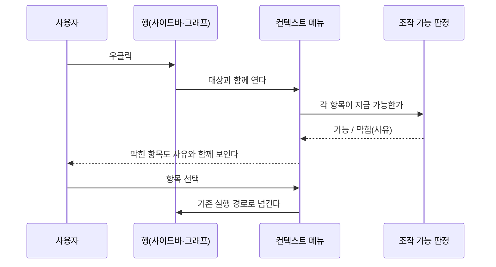
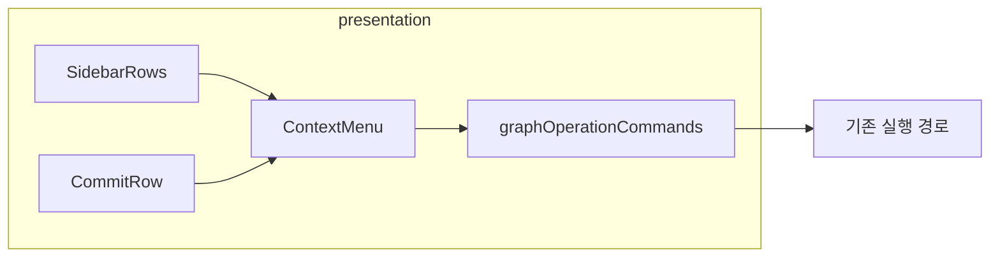

# [UND-94] 우클릭으로 조작에 닿게 한다

> wave 16 · 사이즈 M · 의존 UND-42 · UND-51 · 소유 `presentation/contextmenu/`(신규) · `presentation/sidebar/SidebarRows.kt` · `presentation/graph/CommitRow.kt` · `presentation/i18n/ContextMenuStrings.kt`(신규)

## 작업 내용 (설계 의도)

### 왜 이 티켓이 있는가

**기능은 다 있는데 닿는 길이 숨어 있다.** 진입 경로를 실제로 훑은 결과다:

| 조작 | 우클릭 | 툴바 | 사이드바 `...` | 팔레트 | 드래그&드롭 |
|---|---|---|---|---|---|
| fetch · pull · push | ✗ | ✓ | ✗ | ✗ | ✗ |
| checkout · 이름변경 · 삭제 | ✗ | ✗ | ✓ | ✗ | ✗ |
| merge | ✗ | ✗ | ✓ | ✓ | ✓ |
| rebase · cherry-pick · reset · 태그 이동 | ✗ | ✗ | ✗ | ✓ | ✓ |

**우클릭 처리가 코드 어디에도 없다.** `presentation/` 전체에 컨텍스트 메뉴·secondary 클릭 핸들러가 0건이다.

그래서 rebase·cherry-pick·reset 은 **드래그&드롭을 알거나 팔레트 명령 이름을 알아야** 닿는다.
둘 다 사용자가 **먼저 알아야** 쓸 수 있는 경로다. GitKraken 에서 온 사람은 브랜치를 우클릭해 보고,
아무 일도 일어나지 않으면 **기능이 없다고 판단한다** — 구현은 되어 있는데도.

### 이 티켓이 하는 것

**새 기능을 만들지 않는다.** 이미 있는 조작을 우클릭으로도 닿게 하는 배선이다.

1. **사이드바 브랜치·태그 행 우클릭** — 지금 `...` 버튼이 여는 것과 **같은 메뉴**를 연다.
   두 진입점이 다른 목록을 보이면 사용자는 어느 쪽이 전부인지 알 수 없다.
2. **그래프 커밋 행·참조 칩 우클릭** — 그 대상으로 만들 수 있는 그래프 조작(merge·rebase·
   cherry-pick·reset·태그 이동)을 낸다. 지금 팔레트가 `selectedOperation` 으로 판정하는 것과
   **같은 판정**을 쓴다 — 판정이 두 벌이 되면 하나가 곧 틀린다.
3. **막힌 항목은 숨기지 않고 사유와 함께 비활성**으로 보인다. 사라지면 사용자는 그 조작이
   존재하지 않는다고 읽는다 — 이 티켓이 고치려는 바로 그 오해다.

### 이 티켓이 하지 않는 것

- 새 Git 연산 추가. 메뉴에 내는 것은 **이미 실행 가능한 조작뿐**이다.
- 드래그&드롭·팔레트 제거. 세 경로가 공존한다.
- 브랜치 지목 pull/push — [UND-95](UND-95-branch-scoped-remote-ops.md) 가 다룬다.

### 롤백

배선이라 revert 로 되돌아간다. 되돌리면 기존 진입점(`...`·팔레트·드래그)이 그대로 남는다.

## 의존

- UND-42 · UND-51

## 다이어그램

### 처리 흐름

### 클래스 의존

## 테스트 케이스

- 사이드바 브랜치를 우클릭하면 `...` 버튼이 여는 것과 같은 항목이 나온다
- 그래프 커밋을 우클릭하면 그 대상으로 가능한 조작이 나온다
- 지금 실행할 수 없는 항목은 사라지지 않고 사유와 함께 비활성으로 보인다
- 원격 브랜치 행에는 이름 변경·삭제가 나오지 않는다 (로컬 전용 조작)
- 메뉴를 열고 ESC 를 누르면 아무것도 실행되지 않고 닫힌다
- 메뉴 밖을 누르면 닫히고 그 클릭이 아래 행에 전달되지 않는다
- 우클릭으로 실행한 조작이 드래그&드롭으로 실행한 것과 같은 결과·같은 Undo 기록을 남긴다
- 메뉴 항목 문구는 카탈로그에서 읽고 로케일을 따른다
- 키보드로 메뉴를 열고 항목을 고를 수 있다
