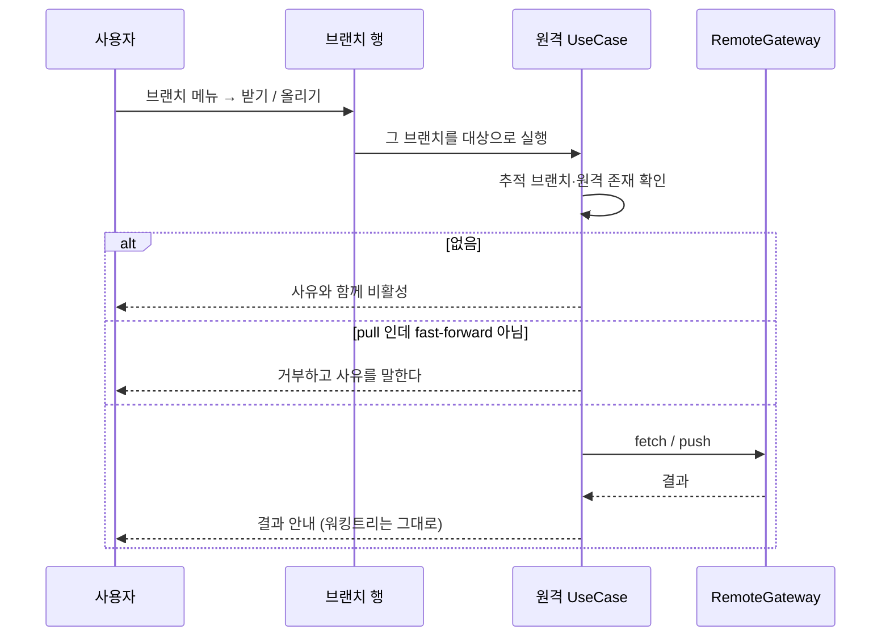
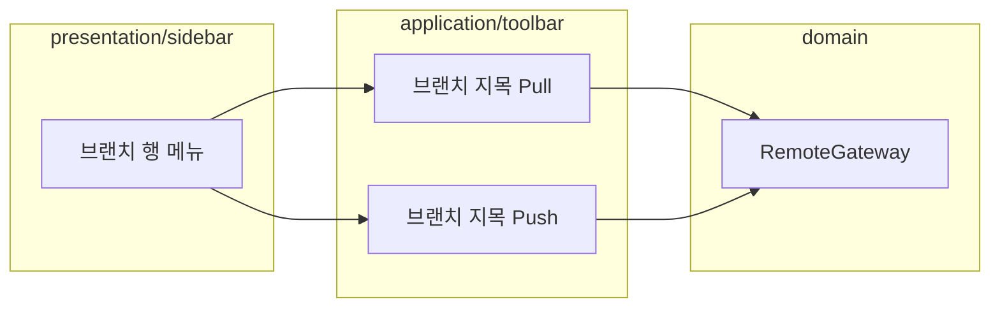

# [UND-95] 브랜치를 지목해 pull·push 한다

> wave 16 · 사이즈 M · 의존 UND-08 · UND-57 · 소유 `application/toolbar/`(브랜치 지목 경로) · `presentation/sidebar/SidebarRows.kt` · `presentation/i18n/SidebarStrings.kt`

## 작업 내용 (설계 의도)

### 왜 이 티켓이 있는가

**원격 조작의 진입점이 툴바 하나뿐이다.** `가져오기`·`가져와 병합`·`올리기` 는 언제나
**현재 체크아웃된 브랜치**를 대상으로 한다. 사이드바에서 다른 브랜치를 보고 있어도
그 브랜치를 지목해 받거나 올릴 방법이 없다.

GitKraken 은 브랜치를 우클릭해 그 브랜치로 pull·push 한다. 지금 Undine 에서 같은 일을 하려면
**먼저 체크아웃해야 한다** — 워킹트리를 바꾸는 조작을, 원격 동기화를 하려고 강요받는다.
로컬 변경이 있으면 체크아웃부터 막힌다.

### 이 티켓이 하는 것

사이드바 브랜치 메뉴(그리고 [UND-94](UND-94-context-menu-entry-points.md) 가 붙이는 우클릭 메뉴)에
**그 브랜치를 대상으로 하는** pull·push 를 낸다.

**대상이 명시적인 것이 이 티켓의 핵심이다.** 지금 툴바 버튼은 "무엇을 올리는지" 를 화면이 말하지
않는다 — 사용자가 HEAD 를 기억해야 한다. 브랜치 행에서 시작하면 대상이 그 행 자체다.

### 안전 조건

1. **체크아웃하지 않는다.** 다른 브랜치를 지목해도 워킹트리를 건드리지 않는다. 이 티켓의 존재
   이유가 "체크아웃 없이 하는 것" 이므로, 편의로라도 체크아웃을 끼워 넣지 않는다.
2. **fast-forward 가 아니면 pull 을 거부한다.** 체크아웃돼 있지 않은 브랜치는 병합 충돌을 사용자가
   해결할 화면이 없다. 거부하고 **왜** 인지 말한다 — 조용히 병합하지 않는다.
3. **push 거부(non-fast-forward)는 강제하지 않는다.** 확인을 거치고 기본은 거부다
   (기존 툴바 경로와 같은 규칙 — 두 경로가 다른 안전 기준을 가지면 안 된다).
4. **원격이 없거나 추적 브랜치가 없으면** 항목이 사유와 함께 비활성이다.

### 이 티켓이 하지 않는 것

- 새 원격 프로토콜·인증 방식. 기존 `RemoteGateway` 경로를 그대로 쓴다.
- 여러 브랜치 일괄 pull/push.
- 툴바 버튼 제거. 현재 브랜치 대상 조작은 그대로 남는다.

### 롤백

메뉴 항목 추가라 revert 로 되돌아간다. 되돌리면 툴바 경로가 그대로 남는다.

## 의존

- UND-08 · UND-57

## 다이어그램

### 처리 흐름

### 클래스 의존

## 테스트 케이스

- 체크아웃하지 않은 브랜치를 지목해 push 하면 그 브랜치가 원격에 올라간다
- 지목해 pull 해도 **워킹트리와 HEAD 가 바뀌지 않는다**
- fast-forward 가 아닌 pull 은 거부되고 사유가 보인다
- non-fast-forward push 는 확인을 거치고 기본은 거부다
- 추적 브랜치가 없는 로컬 브랜치는 항목이 사유와 함께 비활성이다
- 원격이 하나도 없으면 두 항목 모두 비활성이다
- 인증 실패는 네트워크 실패와 구분되어 보고된다
- 지목 조작의 결과가 툴바 경로와 같은 형태로 실행 이력에 남는다
