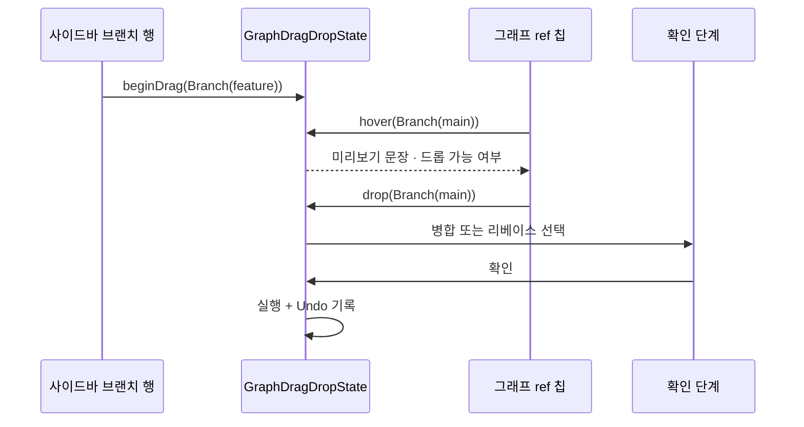
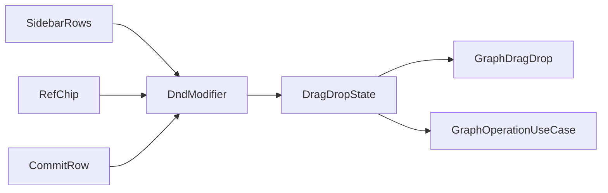

# [UND-96] 사이드바 브랜치를 끌어다 놓게 한다

> wave 18 · 사이즈 M · 의존 UND-42 · UND-94 · 소유 `presentation/dnd/`(신규 — 드래그 modifier 이전) ·
> `presentation/sidebar/SidebarRows.kt` · `presentation/sidebar/SidebarTree.kt` ·
> `presentation/sidebar/SidebarDragBinding.kt`(신규) · `presentation/sidebar/SidebarTags.kt` ·
> `presentation/graph/RefChip.kt`(import 경로) · `presentation/graph/CommitRow.kt`(import 경로) ·
> `presentation/AppDestinationScreens.kt`(사이드바 배선) ·
> `app/src/test/.../presentation/sidebar/SidebarDragDropSpec.kt`(신규) ·
> `app/src/test/.../presentation/graph/GraphDragGestureSpec.kt`(신규)

## 작업 내용 (설계 의도)

### 왜 이 티켓이 있는가

**GitKraken 은 왼쪽 패널의 브랜치를 끌어다 놓는 것이 주된 사용 방식인데, 그 경로가 없다.**
드래그&드롭(UND-42)은 **그래프 안에서만** 배선돼 있다:

| 끄는 자리 | 배선 |
|---|---|
| 그래프의 ref 칩 | ✓ `presentation/graph/RefChip.kt:56-57` |
| 그래프의 커밋 행 | ✓ `presentation/graph/CommitRow.kt:65-66` |
| **사이드바 브랜치 행** | **✗ `presentation/sidebar/` 12개 파일에 드래그 배선 0건** |

UND-42 본문이 범위를 "그래프에서 브랜치를 다른 브랜치 위로"라고 적어 둔 결과다 —
구현 누락이 아니라 **범위 누락**이다. 사용자는 사이드바에서 끌어 보고 아무 일도 일어나지 않는 것을 본다.

그래프 칩끼리 끄는 경로도 실제로는 쓰기 어렵다. 칩은 **브랜치 tip 이 로드된 페이지 안에 있을 때만**
그려지므로(`presentation/graph/CommitRefIndex.kt:65-73`), 원격 브랜치가 많고 tip 이 흩어진 저장소에서는
한 화면에 칩이 한둘뿐이다. 끌 대상이 화면에 없으면 기능이 있어도 닿지 않는다.

### 무엇을 하는가

1. **사이드바 브랜치 행을 드래그 소스로 만든다.** 끄는 값은 그래프 칩과 같은 `GraphDragSource.Branch`.
2. **사이드바 브랜치 행을 드롭 대상으로도 만든다.** 그래프에서 끈 브랜치·커밋을 사이드바에 놓을 수 있어야
   양방향이 성립한다 — 한쪽만 되면 사용자는 규칙을 예측할 수 없다.
3. **판정·미리보기·확인·Undo 는 만들지 않는다.** 전부 `GraphDragDropState` 가 이미 답한다.
   이 티켓은 **그 상태 홀더에 사이드바를 연결만** 한다.

**같은 판단을 두 곳에 두지 않는다.** 드롭 가능 여부·결과 문장·거부 사유는 `domain/graphops/GraphDragDrop.kt`
하나가 정하고, 사이드바는 그 결과를 읽기만 한다 (UND-94 결정 D17 과 같은 원칙 — 진입점마다 다시 판정하면
한 곳을 고쳤을 때 나머지가 조용히 남는다).

### 드래그 modifier 를 `presentation/dnd/` 로 옮긴다

`graphDragSource`·`graphDropTarget` 은 지금 `presentation/graph/` 에 있다. 사이드바가 그래프 패키지를
import 하면 "그래프 전용"이라는 이름과 실제 사용처가 어긋난다. 화면 공용 자리로 옮기고 그래프·사이드바가
같은 것을 쓴다. **동작 변경 없는 이동**이며, 옮긴 뒤 그래프 쪽 import 만 갱신한다.

### 제스처 테스트가 0건이다 — 함께 메운다

**드래그 제스처를 실제로 수행하는 테스트가 하나도 없다.** 확인한 것:

- `GraphDragDropStateSpec` 은 `FunSpec` 이고 `beginDrag`·`hover`·`drop` 을 **직접 호출**한다 — UI 를 지나지 않는다.
- Compose 테스트에서 드래그를 하는 것은 스플리터(`AppShellSpec`)뿐이다.
- 즉 **modifier 가 칩에 실제로 붙어 동작하는지 아무도 확인한 적이 없다.** UND-94 가 찾아낸 죽은 진입점과 같은 형태다.

그래서 이 티켓은 사이드바 배선과 함께 **그래프 칩끼리의 드래그에 대한 제스처 테스트도 추가한다**.
사이드바만 테스트하면 기존 경로는 여전히 커버리지 0 으로 남는다.

> **제스처 테스트가 Compose 테스트 하네스에서 불가능하다고 판명되면**, 그 사실과 근거를 티켓에 기록하고
> 대체 수단(수동 검증 체크리스트 또는 modifier 조립을 검증하는 테스트)을 남긴다. **조용히 빼지 않는다** —
> "테스트할 수 없었다" 와 "테스트하지 않았다" 는 다르다.

### 범위 밖

- 새 조작 추가 금지. 지원 조합은 `GraphOperation` 다섯 가지 그대로다.
- `domain/graphops/` · `application/graphops/` · `application/undo/` 수정 금지 — 판정과 실행은 이미 있다.
- 칩이 안 보이는 문제(브랜치 tip 이 로드 범위 밖)의 해결은 별도 티켓이다. 이 티켓은 **사이드바라는
  항상 보이는 목록**에서 끌 수 있게 하는 것으로 그 문제를 우회한다.

## 의존

- UND-42 — 드래그&드롭 판정·상태 홀더·확인·Undo
- UND-94 — 사이드바가 그래프 조작에 닿는 통로(`SidebarMergeBinding`)와 가용성 판정 단일화

## 다이어그램

### 처리 흐름

### 클래스 의존

## 테스트 케이스

- 사이드바 브랜치를 그래프의 다른 브랜치 칩에 놓으면 병합·리베이스 선택이 있는 확인 단계가 뜬다
- 그래프의 커밋을 사이드바 브랜치 행에 놓으면 cherry-pick 확인 단계가 뜬다
- 사이드바 브랜치를 자기 자신에게 놓으면 `SAME_REF` 로 거부되고 확인 단계가 뜨지 않는다
- 원격 추적 브랜치를 커밋에 놓으면 reset 이 거부된다 (로컬 브랜치 전용)
- 드래그 중 놓을 수 없는 대상은 흐리게 그려진다 — 놓기 전에 구분된다
- 확인 단계를 취소하면 어떤 조작도 실행되지 않는다
- 그래프 ref 칩을 다른 ref 칩으로 끄는 **기존 경로**가 제스처 수준에서 동작한다 (회귀 — 현재 커버리지 0)
- 사이드바와 그래프가 같은 대상에 대해 **같은 거부 사유**를 낸다 (판정 단일화 확인)
